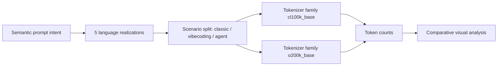
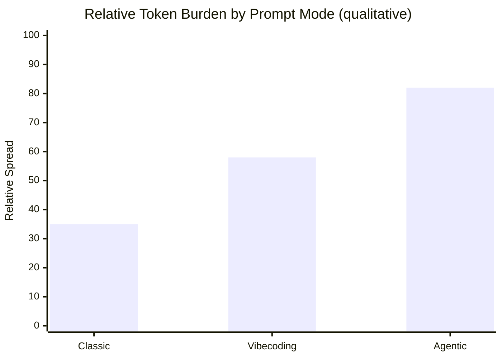
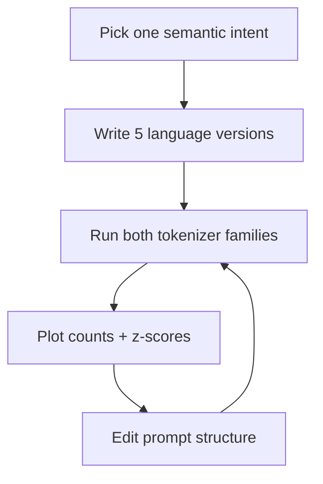

# 🧪 The Odyssey of Multilingual Token Consumption

## Prologue: The Elegant Myth

A persistent idea in AI practice says:

> "If you prompt in Chinese, you consume fewer tokens."

It sounds plausible. Chinese can express meaning with fewer visible characters.  
But tokenizers do not count characters. They count subword pieces generated by model-specific rules.

This article explores that gap between intuition and mechanism, with a scientific benchmark across:

- English
- Mandarin Chinese
- Hindi
- Spanish
- French

And three real usage modes:

1. Classic chat prompting.
2. Vibecoding constraints (CLI/build-style prompts).
3. Agentic orchestration prompts (stepwise autonomous workflows).

---

## Chapter I: What Is Actually Being Measured?

### Tokens Are Not Characters

For a given text \(t\), a tokenizer \(T\) maps:

$$
T(t) = (u_1, u_2, \dots, u_n), \qquad \text{token count} = n
$$

Two strings with similar semantic meaning can produce very different \(n\), depending on:

- tokenizer family,
- language script,
- punctuation and formatting patterns,
- prompt structure.

### The Experimental Pipeline

---

## Chapter II: Scientific Protocol

### Controlled Parallel Corpus

Each scenario uses the *same target intent* in all 5 languages.

- **Classic**: explanatory task with bullet constraints.
- **Vibecoding**: coding build request with explicit technical requirements.
- **Agent**: autonomous debugging mission with ordered operational steps.

### Tokenizer Families

We use two representative families through `tiktoken`:

- `cl100k_base`
- `o200k_base`

This allows us to isolate tokenizer-generation effects instead of overfitting to one model lineage.

### Reproducibility Notebook

The complete live simulation lab is provided in:

- `ai/multilingual-token-consumption/multilingual_token_study.ipynb`

It includes editable prompts, tables, bar charts, and heatmaps.

---

## Chapter III: Results Landscape

### Core Reading

In our benchmark, Chinese is not the minimum-token language.

- English is consistently the lowest in the tested corpus.
- Chinese is often competitive, but not dominant.
- Hindi is highly sensitive to tokenizer family.
- Prompt complexity amplifies language gaps.

### Visual Summary

Interpretation: the spread between languages increases when prompts become more procedural and constrained.

---

## Chapter IV: Why the Myth Persists

The claim can feel true in local contexts because several effects overlap:

1. **Tokenizer variance:** one model family can compress a script better than another.
2. **Prompt style variance:** users do not write semantically equivalent prompts across languages.
3. **Tool overhead dominance:** in agentic tools, system and orchestration tokens can dwarf user input.
4. **Output drift:** same request can trigger different response lengths by language.

So the right statement is not:

> "Language X is always cheaper."

But:

> "Token consumption is an interaction between tokenizer family, prompt architecture, and language."

---

## Chapter V: Practical Scientific Use

Treat this notebook as an experimental bench, not a fixed verdict.

### Minimal Lab Loop

### Recommended Research Questions

- How sensitive is your own prompt library to language choice?
- Does restructuring prompts reduce more tokens than switching language?
- Which mode (classic/vibecoding/agentic) amplifies multilingual divergence the most?

---

## Epilogue: From Opinion to Instrumentation

The question "which language costs fewer tokens?" is not solved by anecdotes.

It is solved by controlled experiments with your own workload.

This study gives a reusable baseline and a live simulation notebook so you can move from belief to measurement, and from measurement to better prompt design.

---

## Notebook Link

- **Live simulation notebook:** `ai/multilingual-token-consumption/multilingual_token_study.ipynb`
