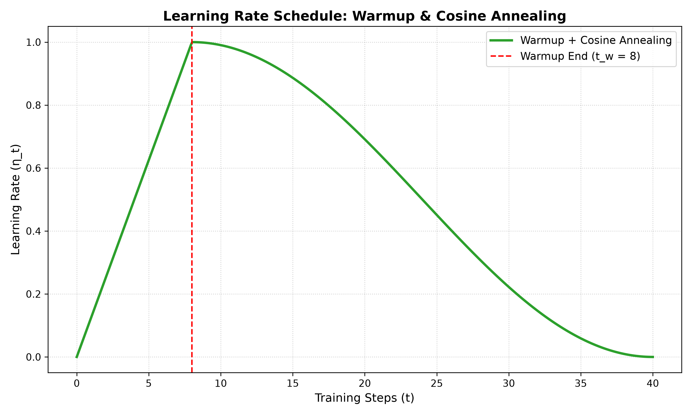

# RegNet: Designing Network Design Spaces

> 🧠 **A complete theoretical and structural exploration** — the transition from finding single networks to designing search spaces, the mathematical quantization of channel widths, group convolution dynamics, Squeeze-and-Excitation attention, and training optimization recipes.
>
> 📅 Date: 2026-08-03
> 👤 Author: KπX × Explore agent
> 📚 Based on the original papers (see [References](#references))

> 🔗 **Prequel:** [ResNet — Deep Residual Learning](../resnet/resnet.md) — no RegNet without the residual bottleneck.

---

## 📋 Table of Contents

1. [The Preoccupation: The Hyperparameter Jungle](#-1-the-preoccupation-the-hyperparameter-jungle)
2. [The Intuition: The Quantized Line](#-2-the-intuition-the-quantized-line)
3. [The Mathematical Derivation of RegNet Widths](#-3-the-mathematical-derivation-of-regnet-widths)
4. [Anatomy of the RegNetY Bottleneck Block](#-4-anatomy-of-the-regnety-bottleneck-block)
5. [The Group Convolution: Parameter and Computational Savings](#-5-the-group-convolution-parameter-and-computational-savings)
6. [Squeeze-and-Excitation (SE): Mathematical Attention](#-6-squeeze-and-excitation-se-mathematical-attention)
7. [The Stem: Custom Channel Adaptation Weight Surgery](#-7-the-stem-custom-channel-adaptation-weight-surgery)
8. [Training Optimization Recipes & Schedulers](#-8-training-optimization-recipes--schedulers)
9. [Limitations & Drawbacks of RegNets](#-9-limitations--drawbacks-of-regnets)
10. [References](#references)

---

## 🧩 1. The Preoccupation: The Hyperparameter Jungle

### 📉 The Design Bottleneck

After the success of ResNet, deep learning entered an era of intense hyperparameter complexity. Researchers realized that convolutional networks had too many architectural dimensions to tune manually:

- **Stage Depths:** How many layers should reside in each stage? \( [d_1, d_2, d_3, d_4] \)
- **Stage Widths:** How many channels should each stage contain? \( [w_1, w_2, w_3, w_4] \)
- **Block Hyperparameters:** Should we squeeze channels in the middle (bottleneck ratio \( b \))? Should we use group convolutions, and if so, what group width \( g \)?

This created an infinite, high-dimensional search space:

```
        Hyperparameter Knobs:
        ┌───┐    ┌───┐    ┌───┐    ┌───┐
        │ d │    │ w │    │ g │    │ b │
        └───┘    └───┘    └───┘    └───┘
          │        │        │        │
          ▼        ▼        ▼        ▼
        [     Jungle of Infinite Models     ]
```

### 🔴 The Failure Modes of Existing Paradigms

1. **Manual Guessing (e.g., ResNet-50):** Researchers used simple heuristics, such as doubling the channel count whenever the spatial resolution was halved, and hardcoding stage depths (e.g., \( [3, 4, 6, 3] \)). While clean, this was not mathematically optimized.
2. **Black-Box Neural Architecture Search (NAS):** Reinforcement learning or genetic algorithms searched for the single best model (e.g., EfficientNet). This resulted in highly irregular, complex, and non-standardized networks that were difficult to scale and offered zero general scientific insight.

### 🟢 The RegNet Paradigm: Designing Design Spaces

Instead of searching for a single best *network*, the authors of RegNet (Radosavovic et al., 2020) proposed a new paradigm: **designing a design space**. They wanted to discover the general mathematical laws governing all high-performing convolutional networks, simplifying the design space step-by-step.

---

## 💡 2. The Intuition: The Quantized Line

The core discovery of the RegNet paper is that the channel widths of the best-performing neural networks follow a **simple linear rule** across blocks. 

Rather than choosing arbitrary channel counts for each stage, we can model the channel count of every block using a straight line in index space, which is then quantized to create discrete stages.

```
Continuous Channels (u_j)                 Quantized Channels (w_j)
  ▲                                         ▲
  │                       /                 │                                     ┌─ Stage 4 (w=1512)
  │                      /                  │                                     │
  │                     /   ──► Quantize ──►│                      ┌──────────────┘ Stage 3 (w=576)
  │                    /                    │                      │
  │  ┌────────────────/                     │         ┌────────────┘ Stage 2 (w=216)
  │  │               /                      │         │
  └──┴──────────────┴──────► Block (j)      └──┴──────┴─────────────────────────────► Block (j)
```

---

## 📐 3. The Mathematical Derivation of RegNet Widths

Let \( d \) be the total depth of the network (number of bottleneck blocks). The channel width progression is parameterized using only four values:
*   \( w_0 \): Starting width (channels at block 0)
*   \( w_a \): Width slope (channels added per block)
*   \( w_m \): Width parameter multiplier
*   \( Q \): Quantization factor (typically \( Q = 8 \))

### 🪜 Step 3.1: The Continuous Width Line
We define the continuous width \( u_j \) of each block \( j \) (where \( 0 \le j < d \)) as:

$$
u_j = w_0 + w_a \cdot j
$$

### 🪜 Step 3.2: Log-Space Quantization into Stage Indices
To group these continuous widths into flat stages, we calculate a continuous stage index \( s_j \) for each block:

$$
u_j = w_0 \cdot w_m^{s_j} \implies s_j = \frac{\ln(u_j / w_0)}{\ln(w_m)}
$$

We round \( s_j \) to the nearest integer to get the quantized stage index \( \tilde{s}_j \):

$$
\tilde{s}_j = \text{round}\left( \frac{\ln(u_j / w_0)}{\ln(w_m)} \right)
$$

### 🪜 Step 3.3: Computing Block Widths
The quantized block width \( w_j \) is computed as:

$$
w_j = w_0 \cdot w_m^{\tilde{s}_j}
$$

To optimize memory operations on GPU hardware accelerators, we round \( w_j \) to the nearest multiple of \( Q = 8 \):

$$
w_j = 8 \cdot \text{round}\left( \frac{w_0 \cdot w_m^{\tilde{s}_j}}{8} \right)
$$

Any blocks that share the same quantized width \( w_j \) are automatically grouped into the same stage.

---

### 📝 Example: Complete Calculations for RegNetY-3.2GF

Let's compute the parameters for the last block (index \( j = 20 \)) of the \( d = 21 \) block trunk of RegNetY-3.2GF:
*   Parameters: \( w_0 = 80 \), \( w_a = 42.63 \), \( w_m = 2.66 \), \( Q = 8 \)

#### Part A: Compute the continuous width \( u_{20} \)

$$
u_{20} = w_0 + w_a \cdot 20 = 80 + 42.63 \cdot 20 = 932.6
$$

#### Part B: Compute the continuous stage index \( s_{20} \)

$$
s_{20} = \frac{\ln(932.6 / 80)}{\ln(2.66)} = \frac{\ln(11.6575)}{\ln(2.66)} \approx \frac{2.4559}{0.9783} \approx 2.5104
$$

#### Part C: Round \( s_{20} \) to get the quantized index \( \tilde{s}_{20} \)

$$
\tilde{s}_{20} = \text{round}(2.5104) = 3
$$

#### Part D: Compute the raw width \( w'_{20} \)

$$
w'_{20} = 80 \cdot (2.66)^3 = 80 \cdot 18.8211 \approx 1505.69
$$

#### Part E: Quantize to the nearest multiple of \( 8 \)

$$
w_{20} = 8 \cdot \text{round}\left( \frac{1505.69}{8} \right) = 8 \cdot \text{round}(188.21) = 8 \cdot 188 = 1504
$$

Thus, the mathematical formula yields a stage width of **\( 1504 \) channels**.

---

### 🔀 The Group Compatibility Adjustment Constraint

In `regnet_y_3_2gf`, the group width parameter is \( g = 24 \) channels. For the group convolutions inside the blocks to function without fractional channels, the stage width \( w \) must be perfectly divisible by \( g \):

$$
w \pmod g = 0
$$

The network initialization code adjusts the raw widths to enforce this divisibility:

$$
w_{\text{final}} = g \cdot \text{round}\left( \frac{w_{\text{raw}}}{g} \right)
$$

Applying this to Stage 4:

$$
w_{\text{final}} = 24 \cdot \text{round}\left( \frac{1504}{24} \right) = 24 \cdot 63 = 1512 \text{ channels}
$$

This explains why Stage 4 has exactly **\( 1512 \)** channels instead of \( 1504 \).

---

## 🧬 4. Anatomy of the RegNetY Bottleneck Block

The building block of a RegNetY model is a **ResNeXt Bottleneck Block with Squeeze-and-Excitation (SE)**. The bottleneck ratio is \( b = 1.0 \) (meaning the bottleneck channel width \( w_b \) equals the block output width \( w_{\text{out}} \)), and the SE ratio is \( \text{se\_ratio} = 0.25 \).

```
                       📥 Input Tensor X: (B, w_in, H, W)
                                │
             ┌──────────────────┴──────────────────┐
             │                                     │
             ▼ (Main Branch)                       ▼ (Shortcut Branch)
   ┌──────────────────┐                  ┌───────────────────────────────────┐
   │ Conv 1x1         │                  │ If w_in == w_out and Stride == 1: │
   │ (In: w_in)       │                  │    Direct identity connection    │
   │ (Out: w_b)       │                  │    h(x) = x                       │
   │ (BN + ReLU)      │                  │                                   │
   └──────────────────┘                  │ Else (Dimension change):          │
             │                           │    Projection Conv 1x1            │
             ▼ Tensor: (B, w_b, H, W)    │    (Stride=stride, BN only)       │
   ┌──────────────────┐                  │    h(x) = W_s * x                 │
   │ Conv 3x3 Group   │                  └───────────────────────────────────┘
   │ (In: w_b, Out:w_b)│                                   │
   │ (Stride=stride)  │                                   │
   │ (Groups = w_b/24)│                                   │
   │ (BN + ReLU)      │                                   │
   └──────────────────┘                                   │
             │                                            │
             ▼ Tensor U: (B, w_b, H/s, W/s)               │
   ┌─────────────────────────────────────────┐            │
   │ SQUEEZE-AND-EXCITATION (SE) BLOCK       │            │
   │                                         │            │
   │  1. Spatial Squeeze:                    │            │
   │     GAP -> Tensor shape: (B, w_b, 1, 1) │            │
   │                                         │            │
   │  2. Channel Reduction:                  │            │
   │     Conv 1x1 -> (B, w_se_out, 1, 1)     │            │
   │     where w_se_out = round(0.25 * w_in) │            │
   │     (ReLU activation)                   │            │
   │                                         │            │
   │  3. Channel Restoration:                │            │
   │     Conv 1x1 -> (B, w_b, 1, 1)          │            │
   │     (Sigmoid activation -> scales s)    │            │
   │                                         │            │
   │  4. Dynamic Scaling:                    │            │
   │     Output = s * U                      │            │
   └─────────────────────────────────────────┘            │
             │                                            │
             ▼ Tensor: (B, w_b, H/s, W/s)                 │
   ┌──────────────────┐                                   │
   │ Conv 1x1         │                                   │
   │ (In: w_b)        │                                   │
   │ (Out: w_out)     │                                   │
   │ (BN only)        │                                   │
   └──────────────────┘                                   │
             │                                            │
             ▼ Tensor F(x): (B, w_out, H/s, W/s)          ▼ Tensor h(x): (B, w_out, H/s, W/s)
             └──────────────────────┬─────────────────────┘
                                    │
                                    ▼ Element-Wise Addition
                       ┌─────────────────────────┐
                       │      F(x) + h(x)        │
                       └─────────────────────────┘
                                    │
                                    ▼
                       ┌─────────────────────────┐
                       │     ReLU Activation     │
                       └─────────────────────────┘
                                    │
                                    ▼
             📤 Block Output Tensor: (B, w_out, H/s, W/s)
```

---

## 📉 5. The Group Convolution: Parameter and Computational Savings

A standard convolutional layer connects every input channel to every output channel. A **Group Convolution** splits the channels into \( G \) independent groups, performing separate spatial convolutions within each group.

For Stage 4 blocks, where \( w_b = 1512 \) and the group width is \( g = 24 \), the number of groups is:

$$
G = \frac{w_b}{g} = \frac{1512}{24} = 63 \text{ groups}
$$

Let's calculate the parameters for a \( 3 \times 3 \) spatial convolution in both designs:

### 🔴 Standard Convolution Parameters

$$
P_{\text{std}} = C_{\text{out}} \times C_{\text{in}} \times K_H \times K_W
$$

$$
P_{\text{std}} = 1512 \times 1512 \times 3 \times 3 = 20,576,064 \text{ parameters}
$$

### 🟢 Group Convolution Parameters
Each of the \( G = 63 \) groups operates on only \( g = 24 \) channels:

$$
P_{\text{group}} = G \times \left( g_{\text{out}} \times g_{\text{in}} \times K_H \times K_W \right)
$$

$$
P_{\text{group}} = 63 \times (24 \times 24 \times 3 \times 3) = 1512 \times 24 \times 3 \times 3 = 326,592 \text{ parameters}
$$

### 📊 Parameter Reduction Ratio

$$
\text{Savings Ratio} = \frac{P_{\text{std}}}{P_{\text{group}}} = \frac{C_{\text{in}}}{g} = \frac{1512}{24} = 63
$$

This reduces the parameter footprint and FLOP count of this spatial layer by **\( 63\times \)**, allowing RegNetY to remain wide and representative while running exceptionally fast on parallel hardware.

---

## 🔊 6. Squeeze-and-Excitation (SE): Mathematical Attention

The Squeeze-and-Excitation block acts as a dynamic channel-attention mechanism. It evaluates global context to determine which channels are relevant for the current input, scaling them up and damping noisy background channels.

### 🪜 Step 6.1: The Squeeze (Global Spatial Aggregation)
We compress the spatial resolution \( H \times W \) of the intermediate tensor \( U \in \mathbb{R}^{C \times H \times W} \) using Global Average Pooling:

$$
z_c = \frac{1}{H \times W} \sum_{i=1}^{H} \sum_{j=1}^{W} U_{c, i, j}
$$

This outputs a channel descriptor vector \( z \in \mathbb{R}^C \).

### 🪜 Step 6.2: The Excitation (Non-linear Relationship Modeling)
The vector \( z \) is projected through a bottleneck to calculate attention scales:

$$
s = \sigma(W_2 \cdot \delta(W_1 \cdot z))
$$

Where:
*   \( W_1 \in \mathbb{R}^{r C \times C} \) projects down to the bottleneck. In RegNetY, the reduction ratio is \( r = 0.25 \), squeezing the dimensions to \( \frac{C}{4} \).
*   \( \delta \) is the ReLU activation function: \( \delta(a) = \max(0, a) \).
*   \( W_2 \in \mathbb{R}^{C \times r C} \) projects back up to \( C \) channels.
*   \( \sigma \) is the Sigmoid activation, mapping values to scale factors \( s_c \in [0, 1] \):
    
    $$
    \sigma(a) = \frac{1}{1 + e^{-a}}
    $$

### 🪜 Step 6.3: Scaling
The original feature maps are multiplied by their computed scale factors:

$$
\tilde{U}_c = s_c \cdot U_c
$$

> 🛡️ **Gradient Safety:** The non-linearities (ReLU and Sigmoid) in the SE block are safe and do not cause gradient collapse because the attention branch is located *inside* the block's residual branch. The main identity shortcut of the block bypassed the SE layer entirely, preserving the clean backward gradient flow.

---

## 🧪 7. The Stem: Custom Channel Adaptation Weight Surgery

Torchvision's pretrained RegNet weights are trained on 3-channel RGB images. In downstream tasks, we often need to process other channel counts \( C_{\text{in}} \) (e.g., RGB + binary mask = 4 channels, or grayscale + mask = 2 channels). 

To adapt the stem convolution \( W_{\text{old}} \in \mathbb{R}^{32 \times 3 \times 3 \times 3} \) without losing the pretrained ImageNet weights, we perform tensor surgery:

### 🟢 Case A: Channel Widening (\( C_{\text{in}} > 3 \))
We copy the pretrained 3-channel weights to the first 3 planes of our new tensor, and initialize the remaining planes to zero:

$$
W_{\text{new}}[:, :3, :, :] = W_{\text{old}}
$$

$$
W_{\text{new}}[:, 3:, :, :] = 0
$$

This ensures that at step zero of training, the extra channels have **zero influence** on the output:

$$
\text{Out}_{i, j} = \sum_{c=0}^{2} W_{\text{old}}[:, c, :, :] * X[:, c, i, j] + \sum_{c=3}^{C_{\text{in}}-1} 0 * X[:, c, i, j] = \text{Out}_{\text{old}, i, j}
$$

The network starts in a numerically identical state to the ImageNet model, and gradually learns to incorporate the extra channels via backpropagation.

### 🟢 Case B: Channel Collapsing (\( C_{\text{in}} < 3 \))
For grayscale inputs, the 3 RGB channels are averaged over the input channel axis to preserve the aggregate luminance feature detection:

$$
W_{\text{new}}[:, 0, :, :] = \frac{1}{3} \sum_{c=0}^{2} W_{\text{old}}[:, c, :, :]
$$

$$
W_{\text{new}}[:, 1:, :, :] = 0
$$

---

## 📅 8. Training Optimization Recipes & Schedulers

Torchvision's modern **V2 training recipe** (`IMAGENET1K_V2`) improves the Top-1 validation accuracy of RegNetY-3.2GF from \( 78.95\% \) to **\( 81.98\% \)** by incorporating modern optimization primitives.

### 8.1 Linear Warmup + Cosine Annealing

During training, the learning rate \( \eta_t \) is scheduled in two phases:
1. **Warmup Phase (Linear, \( 0 \le t < t_w \)):** Ramps the rate from \( 0 \) to the target \( \eta_0 \) to allow Batch Normalization and momentum statistics to stabilize.
2. **Annealing Phase (Cosine, \( t_w \le t \le T \)):** Decays the learning rate smoothly to zero following a half-cosine curve:

$$
\eta_t = \eta_{\min} + \frac{1}{2} (\eta_0 - \eta_{\min}) \left( 1 + \cos\left( \pi \frac{t - t_w}{T - t_w} \right) \right)
$$

Here is the plotted curve generated and exported directly from the environment:



### 8.2 Decoupled Weight Decay (AdamW)

In standard L2 regularization, the weight penalty is coupled to the gradient update, causing adaptive optimizers (like Adam) to scale the weight decay inversely with gradient magnitudes. 

**AdamW** decouples this decay, applying it directly to the parameters:

$$
\theta_{t+1} = \theta_t - \eta \lambda \theta_t - \frac{\eta}{\sqrt{v_t} + \epsilon} m_t
$$

This allows the decay rate to remain uniform across all weights. The V2 recipe uses a decoupled decay parameter of \( \lambda = 10^{-2} \).

### 8.3 Label Smoothing
To prevent the model from becoming overconfident, label smoothing adjusts the one-hot target targets. For a smoothing factor \( \epsilon = 0.1 \) and \( K \) classes:

$$
y^{\text{smooth}}_k = (1 - \epsilon) y_k + \frac{\epsilon}{K}
$$

This bounds the logits, preventing gradients from pushing weights toward infinity, and increases robustness against labeling errors.

---

## 🚫 9. Limitations & Drawbacks of RegNets

Despite its speed and performance, RegNet (like all CNNs) possesses distinct limitations when compared to Vision Transformers (ViTs):

1. **Low Shape Bias (Local Texture Bias):** Because RegNet uses local convolutional kernels, it is biased toward local textures (e.g., classifying a cat with elephant skin textures as an elephant). ViTs, using self-attention, aggregate global context in their early layers, developing a high shape bias.
2. **Receptive Field Constraints:** In RegNet, the receptive field is local and grows slowly (linearly with depth). In ViTs, self-attention allows the receptive field to adjust dynamically to include the entire image starting at the very first layer.
3. **Data Scaling Saturation:** While CNNs perform well on small datasets due to strong inductive biases (spatial locality and translation equivariance), their performance plateaus when scaled to massive datasets (e.g., \( >100 \text{M} \) images). ViTs scale much better under large data regimes, outperforming RegNet as pretraining size increases.

---

## 📚 References

1. **I. Radosavovic, R. P. Kosaraju, R. Girshick, K. He, P. Dollár.** *"Designing Network Design Spaces."* IEEE/CVF Conference on Computer Vision and Pattern Recognition (CVPR), 2020. arXiv:2003.13678.
   - [CVPR paper (open access)](https://openaccess.thecvf.com/content_CVPR_2020/papers/Radosavovic_Designing_Network_Design_Spaces_CVPR_2020_paper.pdf)
   - [arXiv](https://arxiv.org/abs/2003.13678)

2. **I. Loshchilov, F. Hutter.** *"Decoupled Weight Decay Regularization."* International Conference on Learning Representations (ICLR), 2019. arXiv:1711.05101.
   - [arXiv](https://arxiv.org/abs/1711.05101)

3. **J. Hu, L. Shen, G. Sun.** *"Squeeze-and-Excitation Networks."* IEEE/CVF Conference on Computer Vision and Pattern Recognition (CVPR), 2018. arXiv:1709.01507.
   - [CVPR paper](https://openaccess.thecvf.com/content_cvpr_2018/papers/Hu_Squeeze-and-Excitation_Networks_CVPR_2018_paper.pdf)

4. **A. Zhang, Z. C. Lipton, M. Li, A. J. Smola.** *"Dive into Deep Learning" (D2L), Chapter 7.6: Training Recipes.*
    - [d2l.ai](https://d2l.ai/chapter_convolutional-modern/training-recipes.html)

---

**Navigate:** ⬅ [ResNet](../resnet/resnet.md) · [🏠 Home](../../README.md)
