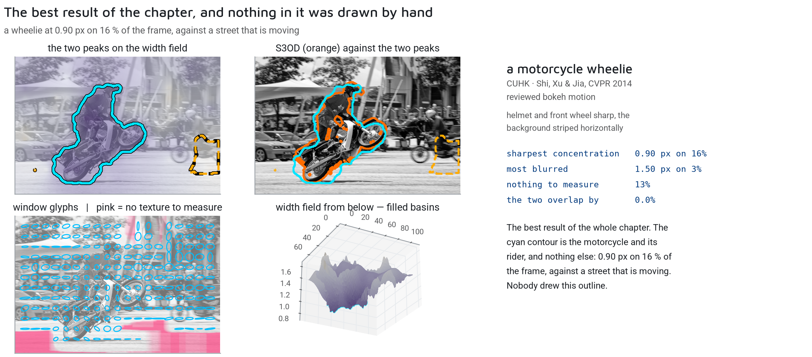

# 🌫️ Blur: From Scalar Scores to Spatial Fields

> 🧠 **Making blur inspectable** — the journey from classical variance metrics to deep neural networks, and why plotting a "sharpness window" on the image beats a black-box percentage.
>
> 📅 Date: 2026-09-05
> 👤 Author: KpihX
> 📚 Code & Repo: [GitHub](https://github.com/KpihX/culling-presentation) · [GitLab](https://gitlab.com/kpihx/culling-presentation)

> 🔗 **Prequel:** [Eye Status: Geometry vs Deep Learning](eye-status.md)

---

## 📋 Table of Contents

1. [The Preoccupation: The Subjective Nature of Blur](#-1-the-preoccupation-the-subjective-nature-of-blur)
2. [Phase I: The Classical Bank](#-2-phase-i-the-classical-bank)
3. [Phase II: The Window Field Approach](#-3-phase-ii-the-window-field-approach)
4. [References](#references)

---

## 🧩 1. The Preoccupation: The Subjective Nature of Blur 

Blur is not a binary state. It is a spatial, directional, and highly subjective phenomenon. 
- **Defocus:** The camera missed the focal plane.
- **Motion Blur:** The camera shook (global) or the subject moved (local).
- **Bokeh:** Intentional, artistic background blur.

If a culling algorithm simply returns "86% blurry", what does that mean? Did it detect the beautiful bokeh and penalize the photo? We need a system that locates and explains the blur.

<video width="100%" controls>
  <source src="assets/blur_moto.mp4" type="video/mp4">
  Your browser does not support the video tag.
</video>

*(Above: detecting local subject blur while ignoring background bokeh).*

## 📉 2. Phase I: The Classical Bank 

Historically, blur detection relied on global image statistics. We implemented a "bank" of classical metrics:

1. **Variance of the Laplacian:** Convolve the image with a Laplacian filter (second derivative) and compute the variance. Sharp images have high variance (many edges); blurry images have low variance.
2. **Structure Tensors:** Analyze the eigenvalues of the local gradient matrix to distinguish flat regions, edges, and corners.
3. **Phase Coherence:** Analyze the frequency domain.

While extremely fast and interpretable, these metrics suffer from a fatal flaw: they are global scalars. They cannot easily distinguish between a sharp subject on a blurry background (good) and a blurry subject on a sharp background (bad).

## 🧠 3. Phase II: The Window Field Approach 

To solve the spatial problem, we divide the image into a grid of overlapping windows. A deep neural network processes each window independently, predicting not just "sharp" or "blurry", but a **vector of parameters**:

1. **Magnitude:** How blurry is it?
2. **Orientation:** Is it a directional motion blur? If so, along what angle?

Instead of a single scalar, the output is a **vector field** drawn directly over the image. 

- A sharp region gets a small dot.
- A motion-blurred region gets an elongated ellipse pointing in the direction of the motion.
- A defocused region gets a large circle.

### The Power of Inspectability

When the photographer reviews the culling AI's decision, they don't see a black-box score. They see the vector field overlay. If the AI flags a photo as "motion blurred", the photographer can literally see the ellipses drawn over the subject's face indicating the exact angle of the blur. 

If the AI makes a mistake, it is immediately obvious *why* it made the mistake. The signal is inspectable, verifiable, and therefore, trustworthy.

---

**Navigate:** ⬅ [Eye Status](eye-status.md) · 🏠 [Home](../../README.md)
