# 🌫️ Blur: From Scalar Scores to Spatial Fields

> 🧠 **Making blur inspectable** — a rigorous mathematical breakdown from global metrics to spatial vector fields, addressing the dataset bias traps of CNNs, and utilizing the physics of diffusion to build true assisted culling.
>
> 📅 Date: 2026-09-05
> 👤 Author: KpihX
> 📚 Code & Repo: [GitHub](https://github.com/KpihX/culling-presentation) · [GitLab](https://gitlab.com/kpihx/culling-presentation)

> 🔗 **Prequel:** [Eye Status: Geometry vs Deep Learning](cross/culling/eye-status.md)

---

## 📋 Table of Contents

1. [II.A: The Classical Bank (Global Metrics)](#-1-iia-the-classical-bank-global-metrics)
2. [II.B: Dataset Constitution & The Cheater Model](#-2-iib-dataset-constitution--the-cheater-model)
3. [II.C: The Learned Approach & The Fusion Judge](#-3-iic-the-learned-approach--the-fusion-judge)
4. [II.D: The Window-Based Approach (Physics)](#-4-iid-the-window-based-approach-physics)
5. [Diffusion & The Final Fields](#-5-diffusion--the-final-fields)
6. [References](#references)

---

## 📉 1. II.A: The Classical Bank (Global Metrics) 

Unlike eye status, which has a discrete, nameable answer, blur does not. A photograph can have global motion blur (camera shake), global defocus (missed focus), local motion (subject moving), or bokeh (background defocus). Is a picture blurred? The answer must distinguish a ruined photo from artistic intent. 

We start by extracting the maximum amount of signal using classic image processing. 

### Why Grayscale?
Every kernel in this section evaluates the derivative of intensity. Two hues of equal luminance return the same derivative, making the kernels blind to color by construction (color repeatedly failed in this project as a blur cue).

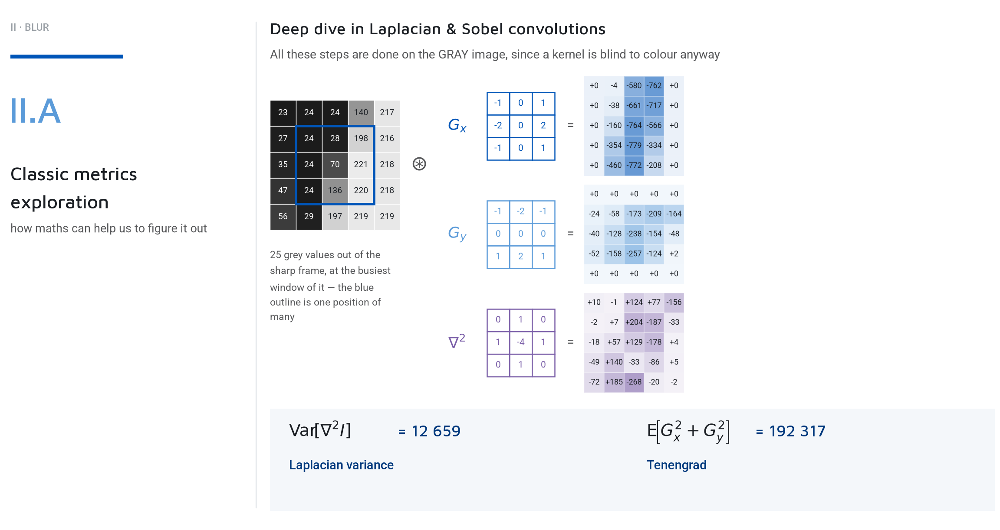

Everything in this classical bank is a 3x3 window slid over the grayscale image:
- **Sobel X and Y ($ G_x, G_y $):** First derivatives. They measure how fast intensity changes horizontally and vertically. 
- **Laplacian:** The sum of the two second derivatives. It answers a different question: *"How much curvature is left?"*

By collapsing these maps to scalars, we get two focus measures: the **Variance of the Laplacian**, and **Tenengrad** ($ E[G_x^2 + G_y^2] $). Both fall from sharp to motion to defocus by a factor of about 25. They answer the question *"how much?"* perfectly.

### The Structure Tensor ($ T $)

The magnitude of a gradient says *how much*; the asymmetry between the $ G_x $ and $ G_y $ gradients says *which way*.

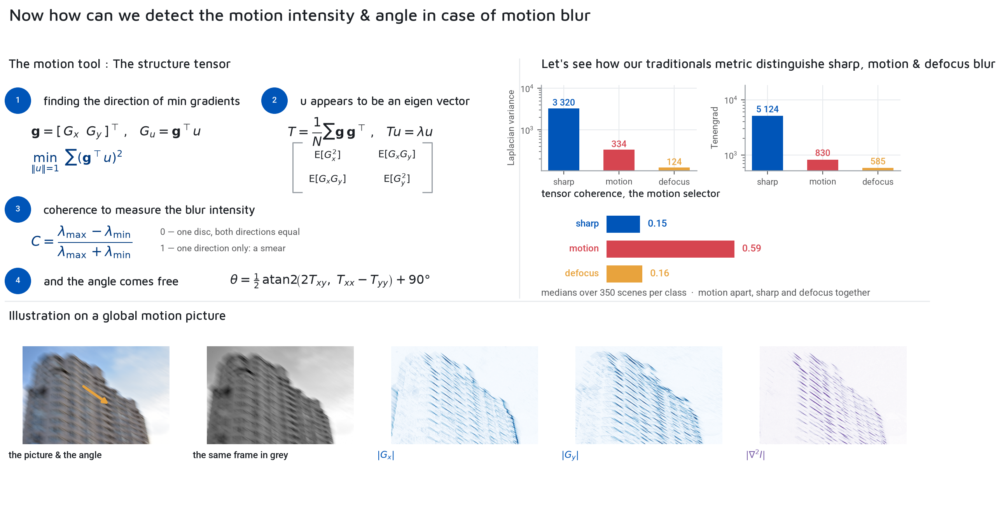

A gradient is a vector $ g = [G_x, G_y]^T $. To find the direction with the most gradient energy, we maximize the squared projection $ (g^T u)^2 $ over a unit vector $ u $. Writing out this maximization directly yields the eigenvalue problem for $ T $, the mean of $ g g^T $:

$$
T = \overline{g g^T} = \begin{bmatrix} \overline{G_x^2} & \overline{G_x G_y} \\ \overline{G_x G_y} & \overline{G_y^2} \end{bmatrix}
$$

The eigenvalues $ \lambda_1, \lambda_2 $ are not proxies for the directional energies; they *are* them.

From them, we compute the **Coherence ($ \rho $)**:

$$
\rho = \frac{(\lambda_1 - \lambda_2)^2}{(\lambda_1 + \lambda_2)^2}
$$

Coherence is 0 when the two directions carry the same energy — a disc, which characterizes both a defocus and a sharp frame. It is 1 when everything is in a single direction — a smear. This is the categorical axis that separates motion from everything else, something no scalar measure of "how blurred" can achieve.

Two magnitudes and one axis. The classical bank carries a real signal.

---

## 🏗️ 2. II.B: Dataset Constitution & The Cheater Model 

Since the classical bank carries a strong signal, the next obvious step is to feed it to a classifier to separate the five classes (`sharp`, `global_motion`, `global_defocus`, `local_motion`, and `bokeh`).

But here lies a devastating trap. If we combine only two datasets (e.g., Kwentar, which has global states, and CUHK, which has local states), the classifier sees two disjoint blocks. `local_motion` means CUHK and `global_defocus` means Kwentar. The class and the archive become the exact same fact.

A lazy model will just learn the dataset signature — the sensor noise, the resolution, the color rendering, the typical framing of that archive — without learning anything about blur. You cannot solve a dataset problem with an architecture.

### 8 Archives and Contingency

We had to aggressively audit and curate 8 different archives (DPDD, RealBlur, RealBokeh, OMoBlur, BID, Wikimedia Commons harvests) to ensure no single source dominated, achieving a matrix of 4,728 rows with at least three sources per class.

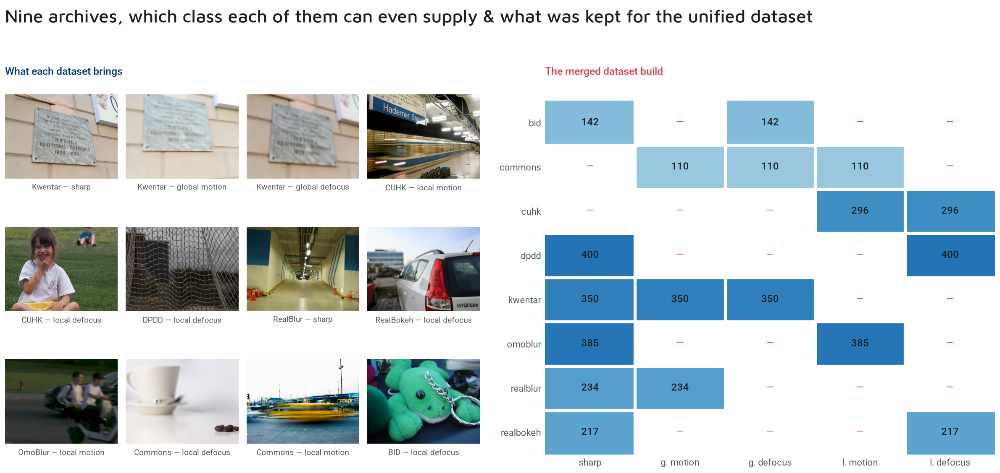

Read the dashes rather than the numbers: most sources do not contain most classes, and it is not an oversight. On the left, one frozen frame per source — nobody would confuse a Kwentar tripod phone shot with a CUHK street frame. Each protocol leaves its signature all over the pixels: noise, resolution, lighting, framing. But even with 8 archives, if you look at the contingency table, most sources do not contain most classes. A defocus dataset has no camera shake; a blur-detection archive has no sharp control. 

### The Cheater Model

To measure the severity of this skew, we built a **Cheater Model**. This classifier is shown one thing: the *name of the archive* the photograph came from. It is given no pixels and no features.

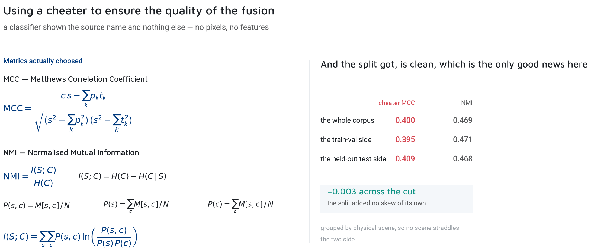

The Cheater Model scores an MCC (Matthews Correlation Coefficient) of **0.400** and an NMI (Normalized Mutual Information) of 0.469. Nearly half the information about the class is determined solely by provenance!

Any model we train will pick up some of that for free because provenance is written into the pixels. Thus, a raw accuracy score is meaningless. What is meaningful is the **lift**: the model's MCC minus the Cheater's MCC, measured on the exact same rows. 

Crucially, the drift between the train and test split for the Cheater was merely -0.003. The test side is exactly as provenance-readable as the train side, proving the dataset split did not add any skew. Every score from this point on must beat the cheater.

---

## 🧠 3. II.C: The Learned Approach & The Judges 

With the 8-source corpus validated and the cheater's baseline established, we train a CNN model to classify the five blur states.

### The CNN Architecture: Hybrid Lite

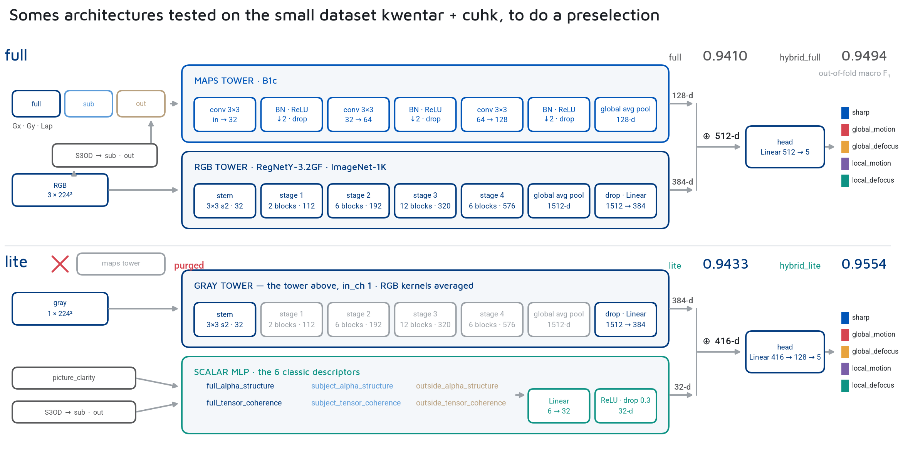

We started with a massive architecture evaluating 33 classical scalars per image alongside a visual tower. But through rigorous ablation, we stripped it down to `hybrid_lite`.

The RGB tower is rebuilt for one input channel (the three color kernels averaged into one, taking a pre-trained color backbone to gray without throwing the priors away). 
We handed the network only 6 classical scalars (Structure tensor coherence and Alpha-structure, computed on the whole frame, the subject, and the outside). 

The result of the ablation was striking: every removal of the 27 other classical features either kept the score or improved it. The classical maps, handed to a network as extra channels, bought nothing at all — the CNN tower successfully recovers whatever they carried from the gray frame by itself.

### The Cost Matrix Loss

Just like with Eye Status, standard cross-entropy assumes every mistake costs the same. But confusing `bokeh` with `sharp` is a minor disagreement; confusing `global_motion` with `sharp` is catastrophic (a bad photo is kept).
We fitted 2D Gaussians per class on the classical `tensor_coherence` and `log1p(lap_var)` (the exact two axes II.A ended on). The Bhattacharyya distance between them determines the penalty in the loss function: confusing overlapping classes is cheap, confusing distant classes is severely punished.

### The Fusion Judge: Subject vs Background

When the tower predicts a local class, we still need to know: is the subject sharper than the background (a keeper, like bokeh) or is the background sharper (a reject, like missed focus)? 

We use an off-the-shelf salient-object mask (S3OD) to split the frame into **Subject** and **Outside**.

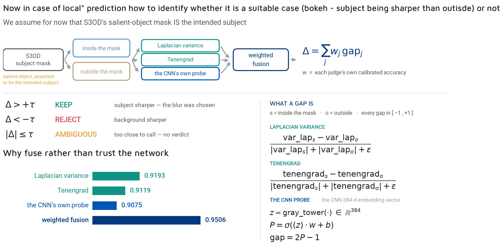

We run 3 independent probes on these two regions:
1. Laplacian Variance
2. Tenengrad
3. The CNN Embedding gap (using the very tower we just trained)

Each probe computes a normalized differential bounded between -1 and +1:

$$
\text{Score} = \frac{\text{Subject} - \text{Outside}}{|\text{Subject}| + |\text{Outside}| + \epsilon}
$$

Positive means the subject is the sharper side. Negative means the background is. 
Surprisingly, the learned CNN probe alone is the *weakest* of the three (0.908 accuracy). But the weighted fusion of all three reaches **0.951** accuracy (a 4-point jump over the network's own reading). The fusion is not a hedge; it is the result. The three probes fail on different frames (classical ones fail on low contrast, the learned one fails on subjects it has never seen), so averaging them makes the judge robust.

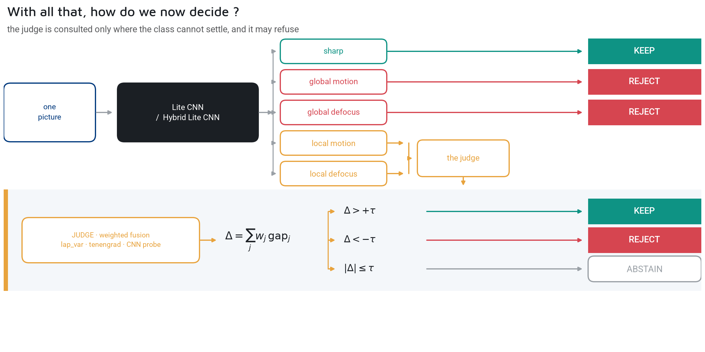

Finally, we ship an abstention band $ \tau $. If the frame's fusion score is too close to 0, the module refuses to decide, passing the vector field map to the photographer rather than executing a coin toss.

---

## 📐 4. II.D: The Window-Based Approach 

Everything so far produced a global score. But blur is spatial. A network that outputs `local_motion` tells you what the picture is, but it doesn't tell you *where* the motion is or *why* it decided that.

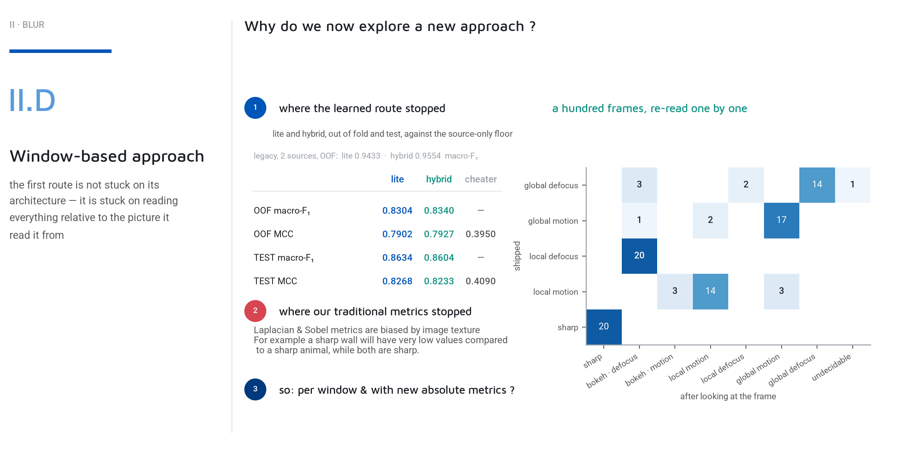

We need a map. We cut the image into overlapping windows. The side of a window is a fraction of the frame's short edge (e.g., 2% of a 24-megapixel file). Local vs. global is precisely a question about shares, so the measuring unit has to scale with the frame.

### The Undecidability Problem (Log Linear)

A window looking at a flat white wall has no high-frequency energy. A system forced to predict a blur width per window would falsely call the wall "blurry". We must acknowledge **undecidability**: a window with no texture measures *nothing*, not *zero*. If a window carries less than 200 edge pixels, it is marked as EMPTY (the pink areas later). Calling a clear sky blurred is the first false positive of this entire problem.

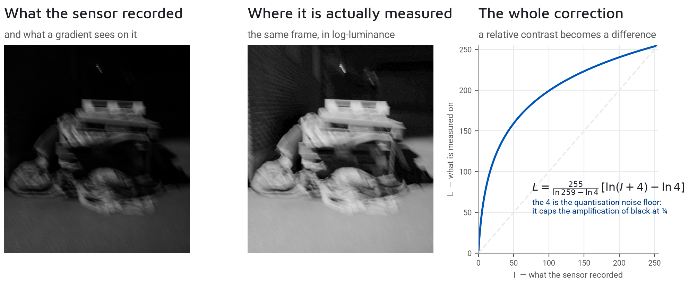

*(Above: Switching to log-luminance allows us to stretch the dynamic range of dark scenes. Detail that was compressed in a handful of gray levels is revealed without inventing false information).*

### The Reblurring Math (Zhuo & Sim)

How do we measure the blur width $ \sigma $ of an edge without knowing the original sharp image? We follow Zhuo & Sim (2011): we blur the image *again* on purpose.

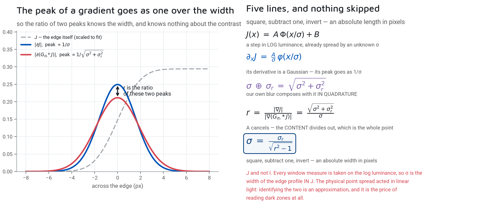

Do not compare an edge to anything else in the image; compare it to itself after a blur you chose. 
Model the edge as a step, already spread by an unknown Gaussian of width $ \sigma $. Its derivative is a Gaussian of that same width. The peak of the gradient is the edge contrast $ A $ divided by $ \sigma $, times a constant.

We blur it ourselves with a Gaussian we choose ($ \sigma_r $). Two Gaussians compose **in quadrature**, so the new width is $ \sqrt{\sigma^2 + \sigma_r^2} $. 
Take the ratio $ R $ of the two peaks. The constant cancels, and crucially, **the contrast $ A $ cancels too**. We are left with a closed-form solution for the absolute width in pixels:

$$
\sigma = \frac{\sigma_r}{\sqrt{R^2 - 1}}
$$

We run this with needle-like anisotropic kernels in 4 directions. An isotropic probe cannot answer this: a motion trail only destroys gradients perpendicular to itself and leaves parallel ones untouched.

### The Local Structure Tensor

We adapt the Structure Tensor from Step II.A, but instead of an unweighted mean over the whole frame, we use a weighted mean over a window.

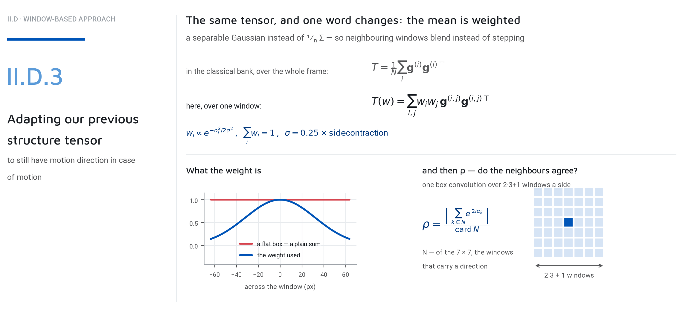

A separable Gaussian weight is used instead of a flat box ($ \frac{1}{N} \sum $). A box would make each window a hard cell, causing neighboring windows to disagree by a step. The Gaussian tapers to the edge, so the field of angles is continuous from one window to the next.

### Before Diffusion: The Raw Windows

This is what the mechanisms produce before a single pixel has been interpolated. The glyphs are not a drawing of the measurement; they **are** the measurement. The 2x2 symmetric tensor is an ellipse, its axes the eigenvectors.

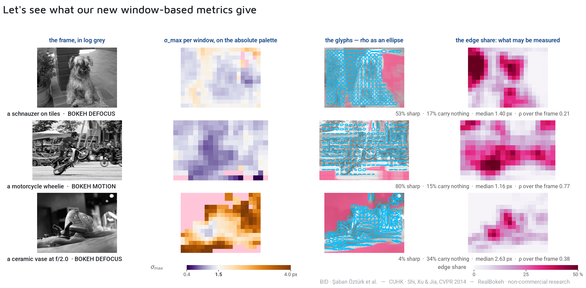

Read the rows:
1. **The Schnauzer (Control):** Every window is sharp. Ellipses are small and round. Round matters as much as small: it means no preferred direction.
2. **The Wheelie (Panning shot):** The rider is sharp (small round dots), but the street is smeared horizontally (flat segments). One frame, two answers. A global median width would call this photograph sharp and say nothing about the half of it that is moving.
3. **The Vase (Bokeh):** The background is flat and out of focus. Look at how much of that map is pink. There is nothing to measure. A system forced to produce a verdict per window would call it blurred. This system says nothing, and saying nothing is the correct answer.

---

## 🌊 5. Diffusion & The Final Climb 

The grid gives a sparse, reliable field, but we need a dense one. We must fill the pink gaps.

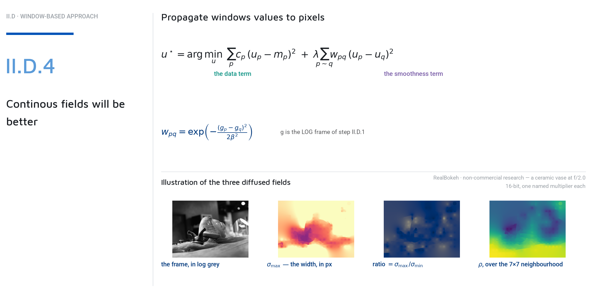

The solve is not a step-by-step algorithm; it is a minimization. We minimize an energy functional with two terms:
- **The Data Term:** Pulls the field $ u $ toward the measurement wherever a window made one.
- **The Smoothness Term:** Asks two neighboring pixels to agree. The price of disagreeing is a weight $ w_{pq} $ guided by the original log-luminance frame. 

Think of it as an electrical circuit: inside a flat wall, the luminance guide barely changes, conductance is high, and the blur measurement propagates freely. Across a sharp contour, the guide jumps, conductance collapses, and the propagation stops. 

The result is a dense, continuous map of the focal plane, drawn directly over the image.

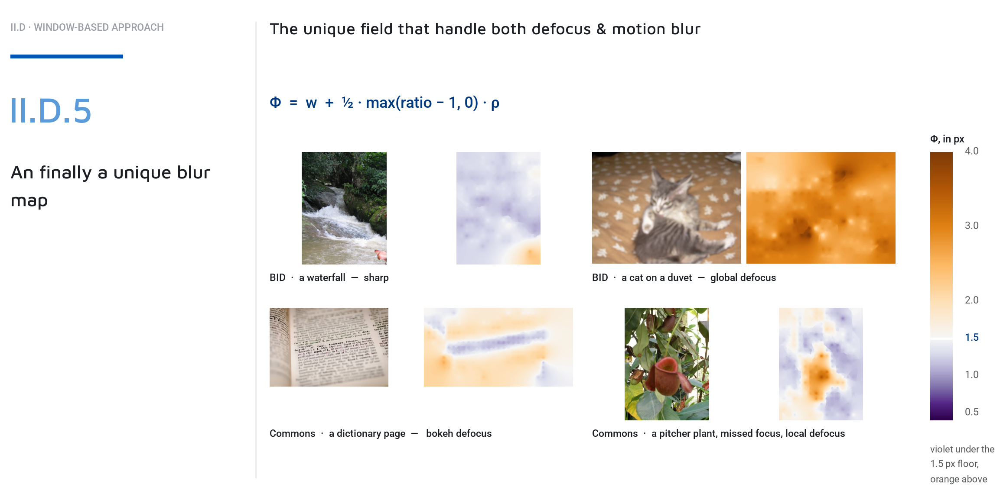

### The Final Climb

What if we could detect bokeh versus a missed subject not by a hard threshold, but by the way the subject is integrated?

<video width="100%" controls>
  <source src="cross/culling/assets/a23_pair.mp4" type="video/mp4">
  Your browser does not support the video tag.
</video>

*(Above: Left, a wheelie the camera followed. Right, a subject that missed focus. The climb keeps the level where $ S $ peaks, measuring the solidity of the structure rather than relying on a single arbitrary cut).*

The photographer looks at the screen, sees the ellipses, understands the machine's reasoning instantly, and clicks Keep or Reject. 
That is the core philosophy of this pipeline: a signal, not a verdict.
EOF