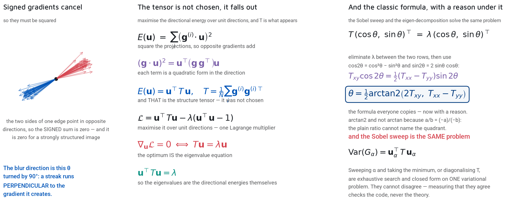
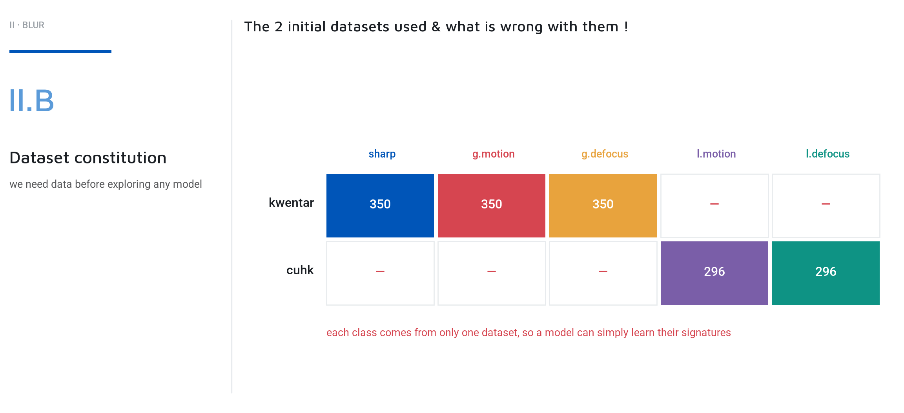

# 🌫️ Blur: From Scalar Scores to Spatial Fields

> 🧠 **Making blur inspectable** — why global scalar metrics fail to distinguish bokeh from motion, the dataset trap of CNNs, the mathematics of reblurring, and how modeling blur as a continuous vector field bridges the gap between deep learning and physics.
>
> 📅 Date: 2026-09-05
> 👤 Author: KpihX
> 📚 Code & Repo: [GitHub](https://github.com/KpihX/culling-presentation) · [GitLab](https://gitlab.com/kpihx/culling-presentation)

> 🔗 **Prequel:** [Eye Status: Geometry vs Deep Learning](eye-status.md)

---

## 📋 Table of Contents

1. [The Preoccupation: Is this picture sharp?](#-1-the-preoccupation-is-this-picture-sharp)
2. [II.A: The Classical Bank (Global Metrics)](#-2-iia-the-classical-bank-global-metrics)
3. [II.B & II.C: The Corpus Trap and The Learned Judge](#-3-iib--iic-the-corpus-trap-and-the-learned-judge)
4. [II.D: The Window-Based Approach (Physics)](#-4-iid-the-window-based-approach-physics)
5. [Diffusion & The Final Fields](#-5-diffusion--the-final-fields)
6. [References](#references)

---

## 🧩 1. The Preoccupation: Is this picture sharp? 

Unlike eye status, which has a discrete, nameable answer, blur does not. 
A photograph can have global motion blur (camera shake), global defocus, local motion (subject moving), or bokeh (background defocus). A culling system must distinguish a ruined photo from artistic intent. 

---

## 📉 2. II.A: The Classical Bank (Global Metrics) 

We start by running the log-luminance frame through classical operators. Why log-luminance? Because the gradient of $\log(I)$ is $\frac{\nabla I}{I}$, which is invariant to exposure. A dark night scene should not be penalized simply for being dark; we measure where light is fair, and decide where noise is fair.

1. **Laplacian Variance and Tenengrad:** Both fall by a factor of 25 from sharp to motion to defocus. They answer the question *"how much?"* perfectly.
2. **The Structure Tensor ($ T $):** A gradient is a vector $ g = [\nabla_x, \nabla_y]^T $. To find the direction with the most gradient energy, we maximize the projection $ (g^T u)^2 $ over a unit vector $ u $. This is the eigenvalue problem for $ T $, the mean of the outer product $ g g^T $:

$$
T = \overline{g g^T} = \begin{bmatrix} \overline{G_x^2} & \overline{G_x G_y} \\ \overline{G_x G_y} & \overline{G_y^2} \end{bmatrix}
$$

3. **Coherence ($ \rho $):** The normalized difference of the two eigenvalues $ \lambda_1, \lambda_2 $ of $ T $. 

$$
\rho = \frac{(\lambda_1 - \lambda_2)^2}{(\lambda_1 + \lambda_2)^2}
$$

Coherence approaches 1 for a streak (motion) and 0 for a disc (defocus or sharp). This is the categorical axis that separates motion from everything else.

Two magnitudes and one axis. The classical bank carries a real signal.

---

## 🧠 3. II.B & II.C: The Corpus Trap and The Learned Judge 

Since the classical bank carries a signal, the obvious next step is to put it into a classifier. We define classes like `local_motion` and `global_defocus`.

But here lies the trap. We combined Kwentar (global states) and CUHK (local states). The network quickly realized that `local_motion` *only* existed in the CUHK dataset. The network stopped looking for blur and started looking for the sensor noise, color profile, and lens characteristics of the specific cameras used in those datasets. You cannot solve a dataset problem with an architecture.

### The Fusion Judge
When predicting if a local blur ruins the shot (e.g., subject vs background), we use a salient-object mask (S3OD) to split the frame into **Subject** and **Outside**.

We use 3 probes: Laplacian Variance, Tenengrad, and a lightweight CNN (`gray_tower`). Each computes a normalized differential bounded between -1 and +1.
The CNN probe alone is actually the *weakest* of the three (0.908 accuracy). But the weighted fusion of all three reaches 0.951. The fusion is not a hedge; it is the result.

Finally, we ship an abstention band $ \tau $. If the frame is too close to call, the module refuses to decide, passing the map to the photographer.

---

## 📐 4. II.D: The Window-Based Approach (Physics) 

A global CNN outputs a black-box class label. If it predicts `local_motion`, the photographer cannot see *where* the motion is. We need a continuous spatial field. We divide the image into overlapping windows. 

But a window looking at a flat white wall has no high-frequency energy. A system forced to predict blur width per window would falsely call the wall "blurry". We must acknowledge **undecidability**: a window with no texture measures *nothing*, not *zero*.

### The Reblurring Math
How do we measure blur width $ \sigma $ without knowing the original sharp image? We follow Zhuo & Sim (2011): we blur the image *again* on purpose.

Assume an edge is spread by an unknown Gaussian $ \sigma $. If we reblur it with a known Gaussian $ \sigma_r $, the new width is $ \sqrt{\sigma^2 + \sigma_r^2} $ (Gaussians compose in quadrature).
If we take the ratio of the gradient peaks before and after reblurring, the edge contrast $ A $ entirely cancels out. We are left with a closed-form solution for the absolute width in pixels:

$$
\sigma = \frac{\sigma_r}{\sqrt{R^2 - 1}}
$$

We run this with needle-like anisotropic kernels (to measure trails) in 4 directions, at two different reaches ($ \sigma_r = 1.0 $ and $ \sigma_r = 2.5 $). 

### Before Diffusion: The Raw Windows
The structure tensor of each window is a 2x2 symmetric matrix, geometrically representing an ellipse.

Read the rows:
1. **The Schnauzer (Control):** Every window is sharp. Ellipses are small and round.
2. **The Wheelie (Panning shot):** The rider is sharp (small dots), but the street is smeared horizontally (flat segments). A frame-level median width would average this and be useless.
3. **The Vase (Bokeh):** The background is flat and out of focus. The system says nothing (the pink areas), which is the physical truth. There is nothing to measure here.

---

## 🌊 5. Diffusion & The Final Fields 

The grid gives a sparse, reliable field, but we need a dense one. We must fill the pink gaps.

The solve is not a step-by-step algorithm; it is a minimization. We minimize an energy functional with two terms:
- **The Data Term:** Pulls the field $ u $ toward the measurement wherever a window made one.
- **The Smoothness Term:** Asks two neighboring pixels to agree. The price of disagreeing is a weight $ w_{pq} $ guided by the original log-luminance frame. 

Think of it as an electrical circuit: inside a flat wall, the luminance guide barely changes, conductance is high, and the blur measurement propagates freely. Across a sharp contour, the guide jumps, conductance collapses, and the propagation stops. 

The result is a dense, continuous map of the focal plane, drawn directly over the image.

<video width="100%" controls>
  <source src="assets/blur_moto.mp4" type="video/mp4">
  Your browser does not support the video tag.
</video>

*(Above: The vector field overlay. Notice the large circles in the bokeh, and the sharp dots on the subject).*

The photographer looks at the screen, sees the ellipses, understands the machine's reasoning instantly, and clicks Keep or Reject. 
That is true **Assisted Culling**.

---

**Navigation :** ⬅ [Eye Status](eye-status.md) · 🏠 [Home](../../README.md)