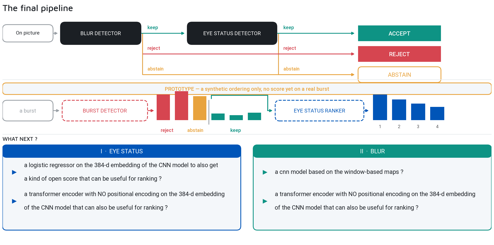

# 📸 Assisted Culling: A Signal is Not a Verdict

> 🧠 **Designing the ultimate photo-sorting assistant** — from local metrics to deep features, why single scalar scores fail, and how an AI can assist photographers without replacing their judgment.
>
> 📅 Date: 2026-09-05
> 👤 Author: KpihX
> 📚 Code & Repo: [GitHub](https://github.com/KpihX/culling-presentation) · [GitLab](https://gitlab.com/kpihx/culling-presentation)

---

## 📋 Table of Contents

1. [The Preoccupation: Assisted, Not Automated](#-1-the-preoccupation-assisted-not-automated)
2. [The Synthesis: On One Photograph](#-2-the-synthesis-on-one-photograph)
3. [The Synthesis: On a Burst](#-3-the-synthesis-on-a-burst)
4. [References](#references)

---

## 🧩 1. The Preoccupation: Assisted, Not Automated 

Culling is the art of selecting good samples from a dataset — in this case, pictures. On a burst of portraits, the fastest way to throw half of them away is a closed eye, and blur is the one feature every product claims to fix but nobody explains. 

The brief is simple: filter out the bad shots. But the execution requires a hard stance on a core principle:

> **A metric is a signal, never a verdict — and a score you cannot read is not a result.**

Culling is a subjective act. A laugh with the eyes shut can be the picture of the wedding. So no model here is allowed to decide alone. Each module can **abstain**, and the abstention rate is printed next to the accuracy rather than hidden inside it.

A classifier that answers `global_defocus` at 86% macro-$ F_1 $ is not something anyone can act on. You cannot tell whether it read the blur or the dataset it came from, you cannot tell a photographer why their picture was flagged, and you cannot improve it. We must push the answer back onto the image: an orientation becomes an ellipse, a smear direction becomes a vector drawn on the frame, a blur width becomes a region drawn on the photograph. Every one of those is a claim somebody can contradict by pointing at the screen.

That is the difference between *automatic* culling and **assisted** culling: the machine narrows and explains, the photographer decides.

---

## 💡 2. The Synthesis: On One Photograph 

To achieve this, the pipeline splits into two sovereign modules: Eye Status and Blur. They do not merge their internal features; they merge their decisions.

When evaluating a single photograph, the system uses a logical **AND** gate. A photo is flagged as a potential reject only if a module explicitly opposes it. 

The tower's five classes and the region judge combine without a single threshold anywhere in the projection. 
- The blur module can act as an absolute veto.
- The eye module reads the faces.
- Crucially, if a module is uncertain (e.g., severe glare on glasses), it outputs `u` (Unknown) or `n` (Not an eye). Nothing is thrown away on a `u` — the crop is handed back. An abstention is a decision the model makes, not an absence of one.

---

## 🥇 3. The Synthesis: On a Burst 

On a single photograph, the answer has to be absolute. But photographers shoot in bursts. Over a burst, the composition and lighting are nearly identical.

The logic shifts from filtering to sorting:
1. **The Veto (Blur):** A severely blurred photo in a burst is useless. The blur module acts as an absolute veto, removing the unrecoverable frames.
2. **The Rank (Eyes):** Among the sharp survivors, the eye module ranks them. An open eye is preferred over a half-closed one.

This division of labor mirrors human logic: first ensure the shot is technically viable, then pick the best expression.

---

## 📚 References 

- Internal presentation notes: `culling-presentation/slides/` (Ivann KAMDEM, DxO Image Research Internship, 2026).