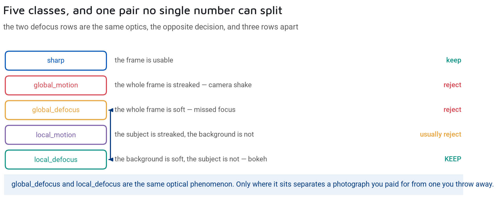

# 📸 Assisted Culling: A Signal is Not a Verdict

> 🧠 **Designing the ultimate photo-sorting assistant** — from local metrics to deep features, why single scalar scores fail, and how an AI can assist photographers without replacing their judgment.
>
> 📅 Date: 2026-09-05
> 👤 Author: KpihX
> 📚 Code & Repo: [GitHub](https://github.com/KpihX/culling-presentation) · [GitLab](https://gitlab.com/kpihx/culling-presentation)

---

## 📋 Table of Contents

1. [The Preoccupation: The Manual Culling Nightmare](#-1-the-preoccupation-the-manual-culling-nightmare)
2. [The Intuition: Assisted vs Automated](#-2-the-intuition-assisted-vs-automated)
3. [The Final Pipeline Synthesis](#-3-the-final-pipeline-synthesis)
4. [References](#references)

---

## 🧩 1. The Preoccupation: The Manual Culling Nightmare 

In modern digital photography, a single session can yield hundreds or thousands of photos. The process of sorting these — discarding the blinks, the misfocuses, and the motion blurs to keep only the pristine shots — is called **culling**. 

Traditionally, culling is a tedious, entirely manual process. As deep learning matured, the natural reflex was to fully automate it: train a model to output a "keep" or "discard" score. However, this black-box approach quickly hits a wall:

- **Artistic Intent:** A photo with a blurry background (bokeh) or intentional motion blur might be the best shot of the day.
- **The "Laughing Blink":** A photo where the subject's eyes are closed because they are laughing genuinely is a keeper, not a reject.
- **Uninterpretable Scores:** A score of "86% blurry" offers no actionable feedback. Where is the blur? Is it the face or the background?

## 💡 2. The Intuition: Assisted vs Automated 

The core philosophy of this project is a paradigm shift: **a metric is a signal, never a verdict.** 

Instead of an AI that deletes photos behind the scenes, we build an **Assisted Culling** system. The AI's job is to extract highly interpretable signals and project them onto the image so the photographer can make lightning-fast, informed decisions.

1. **Abstention over Guessing:** The network must have the right to say "I don't know" (abstain) rather than forcing a low-confidence prediction.
2. **Visual Inspection:** The answer must be readable on the image itself. An orientation becomes an ellipse; a blur width becomes a colored region.

To achieve this, the problem is divided into two sovereign modules:
- 👁️ **Eye Status:** Are the eyes open, closed, or blinking?
- 🌫️ **Blur Detection:** Is the image sharp, and if not, what kind of blur is it?

## 🧬 3. The Final Pipeline Synthesis 

The two modules (Eye Status and Blur) operate in parallel. How do they combine to help the photographer?

### On a Single Image: The Logical AND
When evaluating a single photograph, the system uses a logical **AND** gate. A photo is flagged as a potential reject only if a module explicitly opposes it. Crucially, because the modules can abstain, we know *exactly* which module triggered the flag. 

### On a Burst: Veto and Rank
Photographers often shoot in bursts (e.g., 5 frames per second). Over a burst, the composition and lighting are nearly identical. 
1. **The Veto (Blur):** A severely blurred photo in a burst is useless. The blur module acts as an absolute veto.
2. **The Rank (Eyes):** Among the sharp survivors, the eye module ranks them. An open eye is preferred over a half-closed one.

---

**Navigate:** 🏠 [Home](../../README.md) · [Eye Status ➡](eye-status.md)
