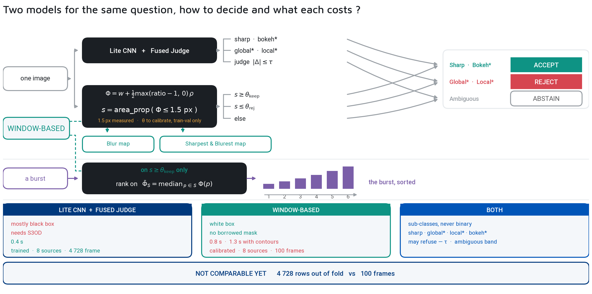

# 📸 Assisted Culling

> 🧠 **The entry point** — a photographer takes thousands of shots per session; most are flawed (blinks, missed focus, motion smear). This suite builds an AI that narrows the field and explains itself, instead of deleting blindly: a signal, not a verdict.
>
> 📅 Date: 2026-09-05
> 👤 Author: KpihX
> 📚 Code & Repo: [GitHub](https://github.com/KpihX/culling-presentation) · [GitLab](https://gitlab.com/kpihx/culling-presentation)

---

## 📋 Table of Contents

1. [The Problem](#the-problem)
2. [The Two Parts](#the-two-parts)
3. [The Final Pipelines](#the-final-pipelines)

---

## 🧩 The Problem 

Culling is the art of selecting good samples from a dataset — here, pictures. Two signals discard the most frames the fastest: **eye status** (a blink ruins a portrait) and **blur** (a missed focus ruins everything). Both are easy to get confidently wrong, which is why every module below can **abstain** instead of guessing, and every answer is drawn back onto the image where a human can contradict it.

## 🗺️ The Two Parts 

- [👁️ Eye Status](cross/culling/eye-status.md) — geometric EAR ($EAR_g$ vs $EAR_r$) then a 6-class network that learns when to stay silent.
- [🌫️ Blur Detection](cross/culling/blur.md) — classical bank, the 8-archive corpus trap, the CNN judge, then per-window vector fields with diffusion.

## 🧬 The Final Pipelines 

How each part decides once measured:

One photograph in, a readable verdict out — and nothing thrown away on an abstention.
