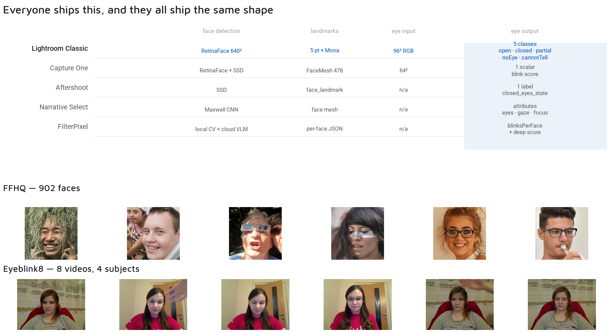
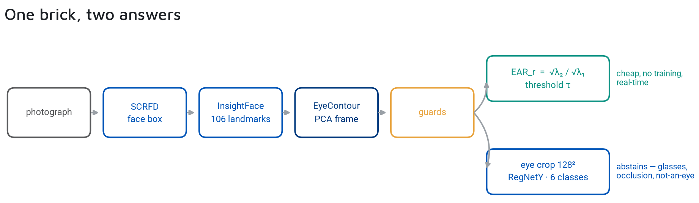
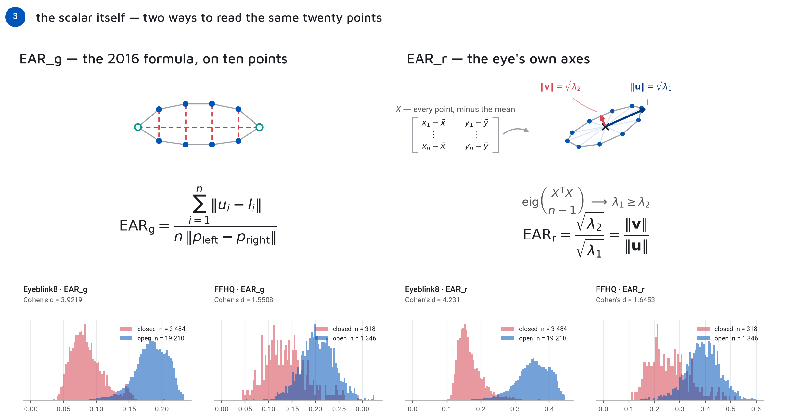
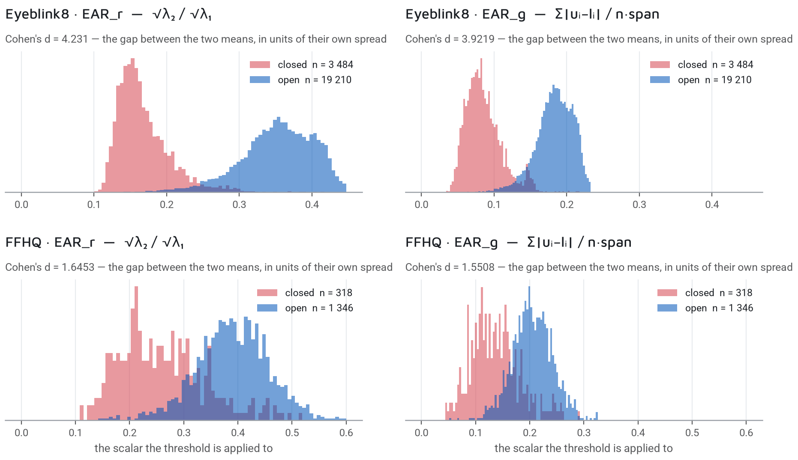
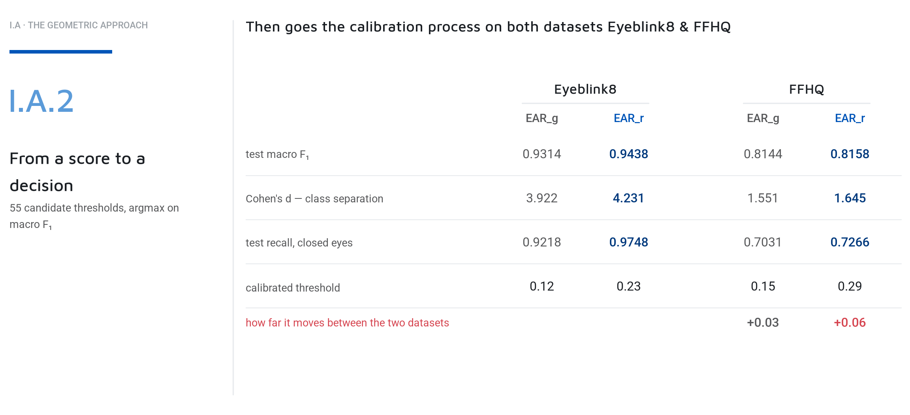
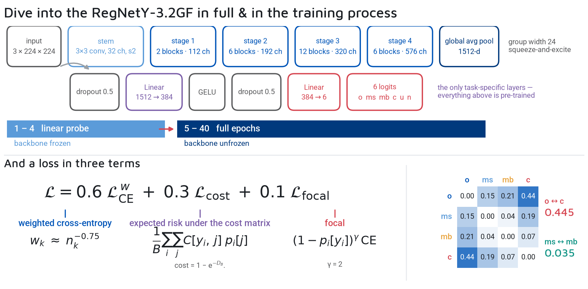
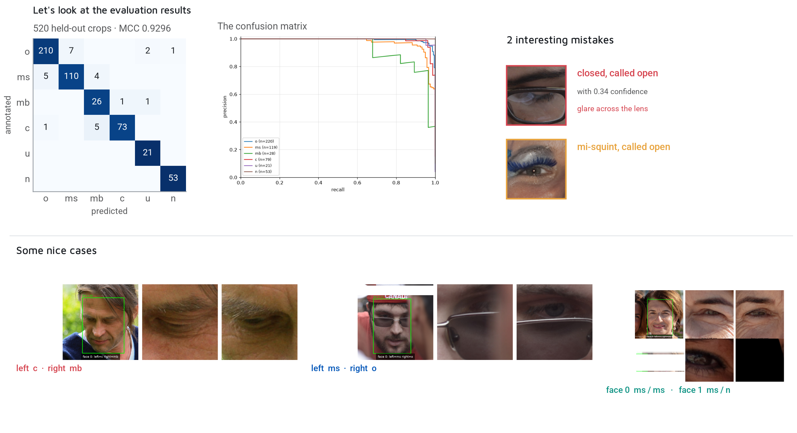
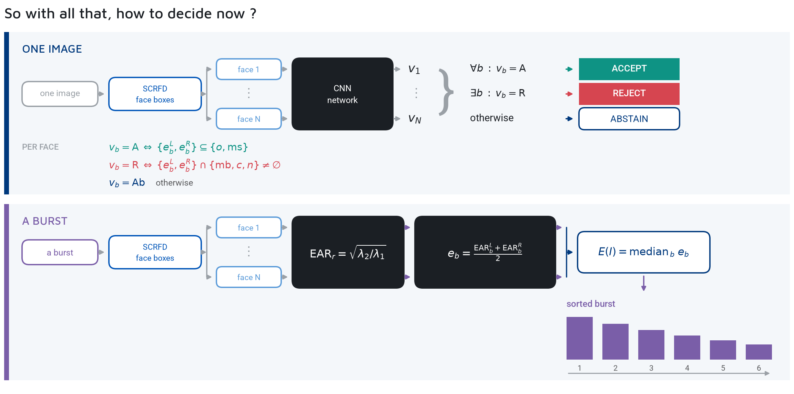

# 👁️ Eye Status: Geometry vs Deep Learning

> 🧠 **Deconstructing the eye** — why geometric heuristics are fast but fragile, the derivation of the Eye Aspect Ratio (EAR), the necessity of a 6-class taxonomy, and how abstention saves the pipeline.
>
> 📅 Date: 2026-09-05
> 👤 Author: KpihX
> 📚 Code & Repo: [GitHub](https://github.com/KpihX/culling-presentation) · [GitLab](https://gitlab.com/kpihx/culling-presentation)

> 🔗 **Sequel:** [Blur: From Scalar Scores to Spatial Fields](blur.md)

---

## 📋 Table of Contents

1. [The Dataset Foundation](#-1-the-dataset-foundation)
2. [The Pipeline](#-2-the-pipeline)
3. [The Geometric Approach ($ EAR_g $ vs $ EAR_r $)](#-3-the-geometric-approach-ear_g-vs-ear_r)
4. [The Failure of the Scalar Threshold](#-4-the-failure-of-the-scalar-threshold)
5. [The Learned Approach: The 6-Class Network](#-5-the-learned-approach-the-6-class-network)
6. [Confusion Cost and Decision](#-6-confusion-cost-and-decision)
7. [References](#references)

---

## 🏗️ 1. The Dataset Foundation 

Everyone ships an eye detection pipeline, and they all converge on the same architecture: detect the face, put landmarks on it, cut an eye crop from those landmarks, and run a small classifier on the crop. Nobody ships an end-to-end model on the whole frame. 

But what data do they train on?

Look at the two datasets before looking at any results:
- **FFHQ:** 70,000 faces, one photograph each, nothing repeats. Age, pose, make-up, spectacles, hair across the eye. It is exactly the variety a culling product meets. But it ships with **no eye labels at all**.
- **Eyeblink8:** One webcam, 8 videos, 4 subjects, thousands of frames of the same few faces. Every blink is annotated frame by frame. It has labels, but almost no variety.

Anything measured on Eyeblink8 is measured on four people. Anything measured on FFHQ has to have its labels made first. Neither dataset can do the other's job.

---

## 🗺️ 2. The Pipeline 

The map of the whole part, before it splits: Detector, landmarks, then a PCA frame on the eye contour, then guards that can refuse the geometry before anything is scored.

And then it forks deliberately. The geometric branch costs nothing and runs anywhere. The learned branch is the one that can say "I cannot read this". They are not competitors.

---

## 📐 3. The Geometric Approach ($ EAR_g $ vs $ EAR_r $) 

Everything in the geometric approach is arithmetic on ten points per eye. No training, no weights. 

### $ EAR_g $ — The 2016 Formula
The classic Eye Aspect Ratio (Soukupová & Čech, 2016) uses vertical distances between the lids over the horizontal distance between the corners. Because every distance lives on the same eye, a resize multiplies both by the identical factor and the quotient does not move. No calibration per camera. But it has a weakness: the pairing has to be right. Near a closed eye, the decision of which point is "upper" is a coin toss on landmark noise.

### $ EAR_r $ — The Eye's Own Axes
Stop asking which point pairs with which and treat the eye as a cloud of ten points. Subtract the mean. The eigenvectors of the covariance matrix are the two directions in which the cloud spreads most and least. 
Their lengths are the square roots of the eigenvalues. $ u $ is the eye's width, $ v $ is its opening. $ EAR_r $ is simply the ratio of these two arrows. No ordering, immune to head roll, and robust to single stray landmarks.

---

## 📉 4. The Failure of the Scalar Threshold 

We have two scalars. Let's look at their densities over eyes that are open (blue) and shut (red) on both datasets.

On **Eyeblink8**, both scalars separate the two populations well and both valleys are deep.
But on **FFHQ** (real portraits), the two populations overlap. There is no valley — there is a slope. FFHQ contains every light, every pose, and a great many eyes that are genuinely halfway. Both scalars hit the same wall, which tells you the wall is not made of arithmetic.

We ran a calibration sweeping 55 candidate thresholds, taking the argmax on macro-$ F_1 $. 

The summary is not that one scalar is strictly better. $ EAR_r $ separates the classes better but its optimum threshold is highly volatile across datasets. 

More fundamentally, a single scalar fails on real-world edge cases. Make-up moves the contour (the landmarks sit on the painted lid, not the eye). And worse, the decision boundary runs *through* the data: two eyes on the same face in the same photograph can straddle the threshold. A single scalar cannot express what "open" means.

---

## 🧠 5. The Learned Approach: The 6-Class Network 

To survive real portraits, we turn to a learned model. First, the crop: feeding a 64px crop of the whole face scored 0.03 macro-$ F_1 $. The state of an eyelid is simply not in the signal anymore. We switched to a 128px crop of the eye alone, cut in the PCA frame, and the score jumped to 0.81. *Before touching a model, check that the evidence is physically present in its input.*

We use a **RegNetY-3.2GF** (19M parameters) trained on 1,733 annotated crops. With so little data, the schedule is the answer:
1. **Linear Probe (Epoch 1-4):** Backbone is frozen. The randomly initialized head trains at a high learning rate.
2. **The Switch (Epoch 5):** The backbone is unfrozen, and the optimizer is *thrown away and rebuilt*. AdamW's momentum estimates were accumulated over the head; handing that state to 19 million new parameters would destroy them.
3. **Cosine Annealing:** The learning rate drops 17-fold and decays to zero. The shipped checkpoint is the EMA of epoch 40, not the best epoch.

---

## ⚖️ 6. Confusion Cost and Decision 

Standard cross-entropy says every mistake is the same. Calling an open eye mi-squint is a boundary disagreement. Calling an open eye closed is a semantic inversion that throws away a good photograph. Those should not cost the same.

We fitted Gaussians per class on the $ EAR_r $ distribution (a geometric measure the network never sees). The Bhattacharyya distance between them determines the penalty: confusing overlapping classes is cheap, confusing distant classes is expensive.

The errors sit exactly next to the diagonal. The dangerous direction (ground truth closed, prediction open) happened exactly *once* in the 520 held-out crops. And on that single error, the model's confidence was 0.34.

This leads to the final decision architecture:

Six words to predict. We keep `o` (open) and `ms` (mi-squint), reject `mb` (mi-blink) and `c` (closed). And crucially, we **abstain on `u` (unknown)** and `n` (not an eye). If glasses catch the light and the crop is unreadable, nothing is thrown away.

---

## 📚 References 

- Internal presentation notes: `culling-presentation/slides/` (Ivann KAMDEM, DxO Image Research Internship, 2026).
- Soukupová, T., & Čech, J. (2016). *Real-Time Eye Blink Detection using Facial Landmarks*. CVWW.
- NVIDIA. *FFHQ Dataset*. (CC BY-NC-SA 4.0).