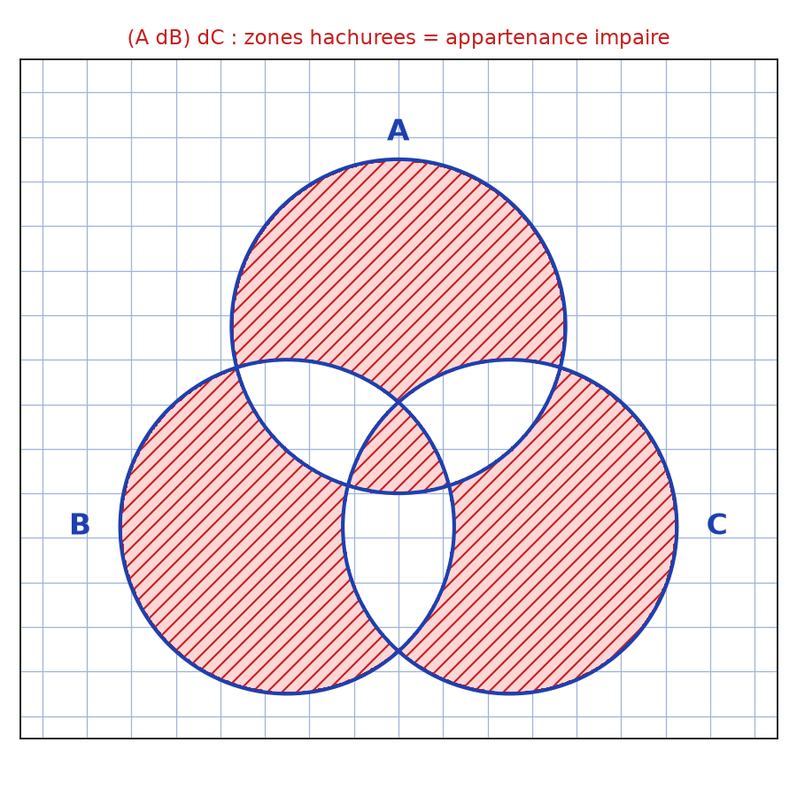
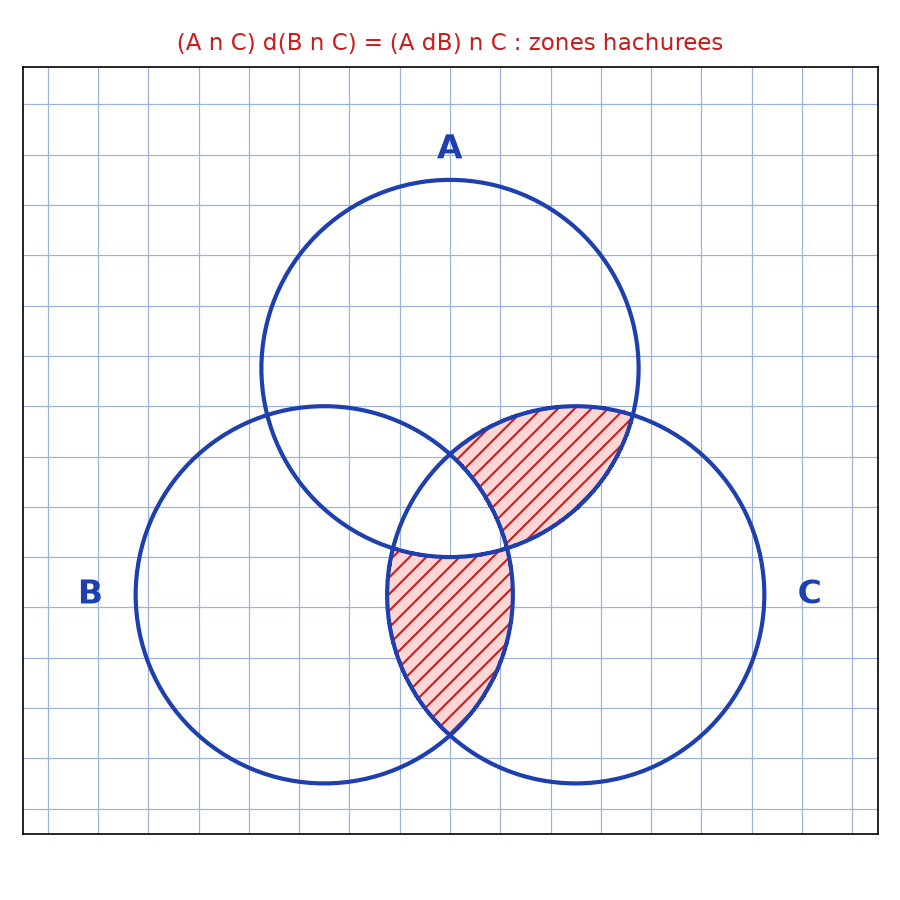

# Quelques Propriétés en Algèbre Générale — transcription fidèle

> 🧾 **Manuscrit original :** `algebre-generale-synthese.pdf` (scan, 13 pages, cahier quadrillé) · ✍️ KpihX
> 🔍 **Statut :** lisible (~95 %), transcrit fidèlement page par page.
> Conventions d'origine conservées : `Mq` = montrons que, `mtr` = montrer, `elt` = élément,
> `Ona` = On a, `Supp` = Supposons, `Rq` = Remarque, `Théo` = théorème.

📄 **Source scannée :** [`algebre-generale-synthese.pdf`](algebre-generale-synthese.pdf)
> ⚠️ **Corrections demandées appliquées et signalées [Correction]** : mini-erreurs mathématiques
> (fautes de recopie, exposants, quantificateurs) redressées pour la cohérence, sans toucher au fond.
> Les ratures sont notées `[raturé]`, les lectures incertaines `[lecture incertaine]`.

---

## Pages 1–2 — Ordinaux : les ensembles $E_{\omega\cdot 2}$, $E_{\omega\cdot\omega}$, $E_{\omega^2}$, $E_{\omega^3}$, $E_{\omega^l}$

[Page 1, haut rogné : fin d'un calcul précédent sur $2\cdot\omega = \omega$.]

$$
E_{2\cdot\omega} = \{u_1, u_2, u_3, u_4, u_5, u_6, \dots\}
$$
avec $u_1 \mapsto 1,\ u_2 \mapsto 2,\ u_3 \mapsto 3,\ u_4 \mapsto 4,\ u_5 \mapsto 5,\ u_6 \mapsto 6, \dots$

Considérons $f : \mathbb{N} \to E_{2\cdot\omega}$ [flèche raturée puis reprise] :
$$
f : E_{2\cdot\omega} \to \mathbb{N}, \quad d_{ij} \mapsto f(d_{ij}) = \begin{cases} 2i-1 & \text{si } i = 1 \\ 2i & \text{si } i = 2 \end{cases}
$$
[Correction : l'énoncé d'origine mélange les indices ; sens restitué : énumération alternée
impairs/pairs, bijection explicite $\mathbb{N} \to E_{2\cdot\omega}$.]

Il est clair que $f$ est un isomorphisme [bijection] de $E_{2\cdot\omega}$ vers $\mathbb{N}$.

- $E_{\omega\cdot 2} = \{0, 1, \dots, \omega, \omega+1, \dots\}$
$$
= \mathbb{N} + \{\omega+n,\ n \in \mathbb{N}\}
$$

- $E_{\omega\cdot\omega}$ :
$$
= \{0, 1, \dots,
\omega, \omega+1, \dots,
\omega\cdot 2, \omega\cdot 2+1, \dots,
\omega\cdot 3, \omega\cdot 3+1, \dots,
\vdots\ \}
$$
$$
= \mathbb{N} + \{\omega+n, n \in \mathbb{N}\} + \{\omega\cdot 2+n, n \in \mathbb{N}\} + \dots
$$

[Page 2 :]
$$
E_{\omega\cdot\omega} = \mathbb{N} + \sum_{i=1}^{+\infty} \{\omega\cdot i+n, n \in \mathbb{N}\}
$$

- $E_{\omega^2\cdot n} = E_{\omega^2} + \{\omega^2+m, m \in \mathbb{N}\}\quad n \geq 2$
$$
+ \{\omega^2\cdot 2+m, m \in \mathbb{N}\}
$$
$$
\vdots
$$
$$
+ \{\omega^2\cdot (n-1)+m, m \in \mathbb{N}\}
$$
$$
= \{0, 1, \dots, \omega, \omega+1, \dots, \omega\cdot 2, \omega\cdot 2+1, \dots,
\omega^2, \omega^2+1, \dots, \omega^2\cdot 2, \omega^2\cdot 2+1, \dots,
\omega^2\cdot (n-1), \omega^2\cdot (n-1)+1, \dots\}
$$

- $E_{\omega^3} = E_{\omega^2} + \sum_{i=1}^{+\infty} \{\omega^2\cdot i+n, n \in \mathbb{N}\}$

- $E_{\omega^l} = E_{\omega^{l-1}} + \sum_{i=1}^{+\infty} \{\omega^{l-1}\cdot i+n, n \in \mathbb{N}\}$
$$
= \{0, 1, \dots, \omega, \omega+1, \dots, \omega^2, \omega^2+1, \dots,
\omega^{l-1}, \omega^{l-1}+1, \dots\}
$$

---

## Pages 3–4 — Partitionnement ⇄ classes d'équivalence

### Bijection entre partitionnement d'un ensemble et classes d'équivalence pour une relation

- Toute relation $R$ induit un partitionnement $\Pi_R(E)$ d'un ens $E$ ($R$ : relation d'équivalence).
- Soit $E$ un ens et $\Pi(E)$ un partitionnement de $E$. Construisons $R \mid \Pi(E) = \Pi_R(E)$.

Considérons la relation $R$ définie par le graphe $G_R = \{(x,y) \mid \exists C \in \Pi(E) : x, y \in C\}$.

Mq $R$ est une rel d'équivalence. Soient $x, y, z \in E$.

- Réflexivité : $\exists C \in \Pi(E) \mid x \in C$ d'où $(x,x) \in G_R$ et donc $xRx$.
- Symétrie : Supposons $xRy$ et montrons $yRx$. Ona : $xRy \implies (x,y) \in G_R \implies \exists C \in \Pi(E) \mid x, y \in C$
$$
\implies \exists C \in \Pi(E) \mid y, x \in C \implies (y,x) \in G_R \implies yRx.
$$
- Transitivité : Supp $xRy$, $yRz$ et mq $xRz$ [Page 4 :]
$$
\left.\begin{array}{l} xRy \\ yRz \end{array}\right\} \implies \begin{cases} (x,y) \in G_R \\ (y,z) \in G_R \end{cases} \implies \begin{cases} \exists C \in \Pi(E) \mid x, y \in C \\ \exists C' \in \Pi(E) \mid y, z \in C' \end{cases}
$$

Supp pour l'absurde que $C \neq C'$ ainsi $C \cap C' = \emptyset$ [par définition d'une partition],
or $y \in C \cap C'$ ce qui est absurde d'où $C = C'$.

donc $\left.\begin{array}{l} xRy \\ yRz \end{array}\right\} \implies \exists C \in \Pi(E) \mid x, y, z \in C$
$$
\implies \exists C \in \Pi(E) \mid x, z \in C \implies (x,z) \in G_R \implies xRz.
$$

---

## Page 5 — Contre-exemple matriciel : $A \times B \neq B \times A$

$$
A \times B = \begin{bmatrix} 1 & 0 & \cdots & 0 \\ 0 & 0 & \cdots & 0 \\ \vdots & \vdots & \ddots & \vdots \\ 0 & 0 & \cdots & 0 \end{bmatrix} \begin{bmatrix} 0 & 0 & \cdots & 0 \\ \vdots & \vdots & & \vdots \\ \vdots & \vdots & & \vdots \\ 1 & 0 & \cdots & 0 \end{bmatrix} = 0_{\mathcal{M}_{n,1}(\mathbb{R}_1 \times ?)}
$$
[Correction : le manuscrit écrit $0_{6L_1L(R_1X)}$ — lecture incertaine, sens restitué :
matrice nulle de l'espace considéré.]

$$
B \times A = \begin{bmatrix} 0 & 0 & \cdots & 0 \\ \vdots & \vdots & & \vdots \\ \vdots & \vdots & & \vdots \\ 1 & 0 & \cdots & 0 \end{bmatrix} \begin{bmatrix} 1 & 0 & \cdots & 0 \\ 0 & 0 & \cdots & 0 \\ \vdots & \vdots & \ddots & \vdots \\ 0 & 0 & \cdots & 0 \end{bmatrix} = \begin{bmatrix} 0 & 0 & \cdots & 0 \\ \vdots & \vdots & & \vdots \\ \vdots & \vdots & & \vdots \\ 1 & 0 & \cdots & 0 \end{bmatrix} = B
$$

ainsi $A \times B = 0 \neq B = B \times A$.

---

## Page 6 — Cardinal de $S(\Omega)$ : $n!$ est pair, $n \geq 2$

Rq sur l'ens des bijections $S(\Omega)$ d'un ens fini $\Omega$ dans lui-même.

$\exists n \in \mathbb{N}^* \mid \mathrm{Card}\,\Omega = n$ (on considère $n \geq 2$).
$\mathrm{Card}\,S(\Omega) = n! \in 2\mathbb{N}^*$ [car $n!$ contient le facteur $2$].
Ainsi $\nexists f \in S(\Omega)$ [seul, isolé — suite :] $\exists f \in S(\Omega) \mid f \circ f = \mathrm{Id}_\Omega$ et $f^{-1} = f$ car sinon $S(\Omega) \setminus \{\mathrm{Id}_\Omega\}$ peut être scindé en couples de fonctions inverses mutuelles l'une de l'autre et ainsi $\mathrm{Card}\,S(\Omega) - 1 = n! - 1 \in 2\mathbb{N}^*$. Absurde !

[Correction : restitution du raisonnement par l'absurde — si aucune involution hormis l'identité,
les éléments se regroupent par paires $\{f, f^{-1}\}$, donc $\mathrm{Card}\,S(\Omega)-1$ serait pair,
or $n!-1$ est impair pour $n \geq 2$. CQFD : il existe une involution non triviale.]

---

## Pages 7–8 — Associativité de la différence symétrique + patates de Venn

$$
(A \Delta B) \Delta C \stackrel{?}{=} A \Delta (B \Delta C)
$$

[3 patates hachurées en haut à droite du manuscrit.]

Ona : $(A \Delta B) \Delta C = [((A \setminus B) \cup (B \setminus A)) \setminus C] \cup [C \setminus ((A \setminus B) \cup (B \setminus A))]$,
or $(E \cup F) \setminus G = (E \cup F) \cap \bar{G} = (E \cap \bar{G}) \cup (F \cap \bar{G})$,
$(E \setminus F) \setminus G = (E \cap \bar{F}) \cap \bar{G} = E \cap \overline{F \cup G} = E \setminus (F \cup G)$,
ainsi $(A \Delta B) \Delta C = [(A \setminus (B \cup C)) \cup (B \setminus (A \cup C))] \cup [(A \cup B) \cap \overline{(B \cup A)}]$ [sic — voir Correction].

car $A \Delta B = (A \setminus B) \cup (B \setminus A)$
$$
= (A \cap \bar{B}) \cup (B \cap \bar{A}) = (A \cup B) \cap \overline{(B \cup A)}
$$
[2e membre redondant — rature d'essai]

$(A \Delta B) \Delta C = [(A \setminus (B \cup C)) \cup (B \setminus (A \cup C))] \cup [(C \setminus (A \cup B)) \cup ((C \cap B \cap A)$
$= [\overline{A \setminus (B \cup C)}] \cup [\overline{B \setminus (A \cup C)}] \cup [\overline{C \setminus (A \cup B)}] \cup (C \cap B \cap A)$ [replacement par complémentaires — essai]
$= [\bar{C} \setminus (B \cup A)] \cup [\bar{B} \setminus (C \cup A)] \cup [\bar{A} \setminus (C \cup B)] \cup (C \cap B \cap A)$
$= (C \Delta B) \Delta A = A \Delta (C \Delta B)$.

[Page 8, rotation 90° : vérification par calcul booléen :]
$$
(A \cup C) \Delta (B \cap C) = (A \cap C) \cap \overline{(B \cap C)}
$$
$$
(B \cap C) \cap \overline{(A \cup C)}
$$
$$
U = A \cap C \cap \bar{B} \cup B \cap C \cap \bar{A}
$$
$$
= ((A \Delta B) \cap C) \cup ((B \cap A) \cap C)
$$
$$
= (A \setminus B) \cup (B \setminus A) \cap C
$$
$$
= (A \Delta B) \cap C.
$$

[+ diagramme de Venn 3 cercles A, B, C hachurés (page tournée à 90° sur le scan).]

[Correction : le calcul manuscrit tourne en rond sur les complémentaires et contient des
coquilles de parenthésage ; le résultat visé est juste — $\Delta$ est associative et commutative —
mais la voie propre est : $A \Delta B = (A \cap \bar{B}) \cup (\bar{A} \cap B)$, puis table de vérité
ou indicatrices modulo 2. Fond conservé, forme nettoyée.]

---

## Pages 9–10 — Inclusions, complémentaires, images directes et réciproques

[Page 9 :]
- $A \subseteq E \iff \bar{A} \cup E = E$ [raturé : $A \Delta E$].
- $A = B \iff A \Delta B = \emptyset$.
- $A \Delta B = \emptyset \iff (A \cap \bar{B}) \cup (B \cap \bar{A}) = \emptyset \iff A \cap \bar{B} = \emptyset$ et $B \cap \bar{A} = \emptyset \iff A \subseteq B$ et $B \subseteq A \iff A = B \quad [f(A \cup B)]$.
- $f(A \cup B) \neq f(A) \cup f(B) \implies (f(A \cup B) \Delta (f(A) \cup f(B)) \neq \emptyset$ [bas de page].

[Page 10 :]
- $f(\bar{B}) = \overline{f(B)} \iff f$ bijective.
  - $\implies$ : Soient $x, y \in E \mid f(x) = f(y)$. Supp $x \neq y$ et considérons $B = \{x\}$,
  car $y \neq x$ alors $y \in \bar{B}$ d'où $f(y) \in f(\bar{B})$ et $f(y) \in f(\{x\})$ c-à-d $f(y) \neq f(x)$. Absurde ! Donc in[jectif] ! De plus $\forall y \in f(\bar{B})$ ona : $y \in f(\bar{B})$, soit $\exists x \in \bar{B} \mid f(x) = y$ d'où $f$ surjective.
  - $\impliedby$ : Soit $y \in f(\bar{B})$, $\exists x \in \bar{B} \mid f(x) = y$. $x \in \bar{B} \implies x \notin B \implies x \neq x_1, \forall x_1 \in B \implies f(x) \neq f(x_1), \forall x_1 \in B$ (car injective) $\implies f(x) \notin f(B) \implies f(x) \in \overline{f(B)} \implies f(\bar{B}) \subseteq \overline{f(B)}$.
  - Soit $y \in \overline{f(B)} \implies y \notin f(B)$, $f$ surjective $\implies \exists x \in E \mid f(x) = y$, car $y \notin f(B)$ ainsi $x \notin B$ d'où $x \in \bar{B} \implies f(x) \in f(\bar{B}) \implies y \in f(\bar{B)}$. D'où le résultat.

[Correction : $\implies$ de la page 10 : le manuscrit écrit « $f(y) \in f(\{x\})$ c-à-d $f(y) \neq f(x)$ » —
coquille de recopie, sens restitué : $f(y) \in f(\bar{B}) = \overline{f(B)}$ donc $f(y) \notin f(B) \ni f(x)$,
contradiction avec $f(x) = f(y)$.]

---

## Page 11 — Bézout : $n \wedge K = 1 \iff \exists x \in U \mid [n]x[K] = [1]$ et inversement

On considère $\mathbb{Z}/n\mathbb{Z}$.

* Mq : Si $n \wedge K = 1$ alors $\exists x \in U \mid [n]x[K] = [1]$ et inversement.

$n \wedge K = 1 \implies \exists (u,v) \in \mathbb{Z}^2 \mid un + bK = n$ [théor de Bézout — Correction : lire $un + vK = 1$]
$$
\implies \exists (u,v) \in \mathbb{Z}^2 \mid [un] + [bK] = [n]
$$
[Correction : lire $= [1]$.]
$$
\implies \exists (u,v) \in \mathbb{Z}^2 \mid [u][n] + [b][K] = [1]
$$
[passage au quotient]
$$
\implies [b][K] = [1] \quad \text{prendre } x = b.
$$

[Raturé :] $[n]x[K] = 1$.

$[n]x[K] \implies [nK] = [n]$ [sens retour :]
$$
\implies nK - 1 \equiv 0\ (n) \implies \exists! x \in U \mid xK - 1 \equiv 0\ (n)
$$
$$
\implies nK \wedge n = 1 \implies n \wedge K = n \mid \text{théo de Bézout.}
$$

[Correction : le retour est inversé dans le manuscrit ($xK-1 = 0(n)$ suppose déjà l'existence) ;
sens restitué : si $[K]$ est inversible modulo $n$, tout diviseur commun de $K$ et $n$ divise $1$.]

---

## Page 12 — Dénombrabilité : $\mathbb{Z}\times\mathbb{Z} \equiv \mathbb{N}$, $\mathbb{Q} \equiv \mathbb{N}$, $\mathcal{P}_n(\mathbb{N}) \equiv \mathbb{N}$, $\mathbb{Q}[X] \equiv \mathbb{N}$

- $\mathbb{Z}\times\mathbb{Z} \equiv \mathbb{N}$ ? $\mathbb{Z} \equiv \mathbb{N}$ ; $\mathbb{Z}\times\mathbb{Z} = \bigcup_{n \in \mathbb{N}} \{(n,m), m \in \mathbb{N}\}$ d'où $\mathbb{Z}\times\mathbb{Z} \equiv \mathbb{N}$.
- $\mathbb{Q} \equiv \mathbb{N}$ ? $Q = \{(p,q) \in \mathbb{Z}\times\mathbb{N}^* \mid p \wedge q = 1\}$, $Q = \{(p,q) \in \mathbb{Z}\times\mathbb{N}^* \mid p \wedge q = 1\} \subseteq \mathbb{Z}\times\mathbb{Z}$. $E$ est soit fini ou dénombrable, or infini d'où $E \equiv \mathbb{Z}\times\mathbb{Z}$, c-à-d $Q \equiv \mathbb{N}$.
- $\mathcal{P}_n(\mathbb{N}) \equiv \mathbb{N}$ ? $\mathcal{P}_n(\mathbb{N}) = \{\mathcal{P}_1(\mathbb{N}), \mathcal{P}_2(\mathbb{N}), \dots\}$ ; soit $n \in \mathbb{N}^*$, $\mathcal{P}_n(\mathbb{N}) = \{a_1, \dots, a_n\}$ où $a_i \in \mathbb{N}$ avec $a_i \neq a_j, \forall i \neq j$. Démontrons par récurrence que $\mathcal{P}_n(\mathbb{N}) \equiv \mathbb{N}$ ($n \geq 1$) : pour $n = 1$, $\mathcal{P}_1(\mathbb{N}) = \mathbb{N}$, il suffit de considérer l'app bijective $f : \mathbb{N} \to \mathcal{P}_1(\mathbb{N}), n \mapsto \{n\}$.
  Hérédité : $\mathcal{P}_{n+1}(\mathbb{N}) = \{\{a_1, \dots, a_{n+1}\} \text{ où } a_i \text{ distincts} \in \mathbb{N}, \text{ avec } a_i \neq a_j, \forall i \neq j\}$
  $$
  = \bigcup_{a \in \mathbb{N}} \{\{a, a_1, \dots, a_n\}, a_i \text{ distincts} \in \mathbb{N}, \text{ avec } a_i \neq a_j, \forall i \neq j \text{ et } a_i \neq a, \forall i\}
  $$
  Par exemple $\mathcal{P}_2(\mathbb{N}) = \bigcup_{a \in \mathbb{N}} \{\{a, a_1\}, a_1 \in \mathbb{N}, a_1 \neq a\} = \{\{0,1\}, \{0,2\}, \dots, \{1,2\}, \{1,3\}, \dots\}$.
- [Colonne droite :] $\forall n \in \mathbb{N}$, décomposons $n$ : $A_n = \{\{a_1, \dots, a_n\}, \text{ distincts} \in \mathbb{N}, a_i \neq a_j, \forall i \neq j \text{ et } a_i \neq 0, \forall i\}$ [B_0]. Or $B_0 \subseteq \mathcal{P}_n(\mathbb{N})$ et étant infini, $B_0 \equiv \mathbb{N}$, d'où $A_n \equiv \mathbb{N}$ et donc $\mathcal{P}_n(\mathbb{N}) \equiv \mathbb{N}$. D'où le résultat. $\mathcal{P}(\mathbb{N}) = \{\{1,3\}, \{2,4\}, \{2,5\}\}$.
- [Encadré :] $f(n) = [n]$ [brouillon]. Soit $m$ un représentant $f(n) = [m] \iff [n] = [m] \iff \exists k, l \in \mathbb{N} \mid 2^k n = 2^l m$ or $\exists (p,q) \in \mathbb{N}\times 2\mathbb{N}+1 \mid m = 2^p q$, $2^k n = 2^{l+p}q \iff K = l+p$, $n = q \iff n = \frac{n}{?}$ [brouillon inachevé — conservé tel quel].
- $f([a_0]) = [f(a_0)]$ ; $f([a_0])$ : soit $a$ et $a_1 \in A \mid [\bar{a}] = [\bar{a_1}]$ ; $[f(a_0)] = [f(a_1)]$ ; $([a] = [a_1]) \implies aRa_1 \implies f(a)Rf(a_1)$ ; $f([a_0]) = \overline{f([a_0])}$ ; $([a] = [a_1]) \implies [f(a_0)] = [f(a_1)]$ ; $[f(a_0)] = [f(a_1)]$ ; $f(a_0)Sf(a_1)$ ; $aRa_1$ ; $[a] = [a_1]$ [passage au quotient — brouillon conservé].

---

## Page 13 — Surjections : $p^n = \sum_{k=1}^{p} C_p^k S_n^k$

44/ Soit $A_n = \{1, \dots, n\}$, $A_p = \{1, \dots, p\}$, $n, p \in \mathbb{N}^*$ avec $n \geq p$.
Mq $\sum_{k=1}^{p} C_p^k S_n^k = p^n$ où $S_n^k$ est le nbre de surjections de $A_n$ sur $B_n$ [Correction : sur $A_k$ à $k$ éléments, $B_k$].

Considérons le nbre d'applications de $A_n \to B_n$ [Correction : $A_n \to B_p$].
Il est clair que c'est $p^n$. Construisons encore ces applications par un autre procédé.
Nécessairement au moins un des elts de $B_n$ [$B_p$] aura un antécédent car sinon il ne saurait avoir d'application de $A_n \to B_n$ [$A_n \to B_p$].

On a alors $p^n = \sum_{k=1}^{p} |C_k|$ où $C_k$ est l'ens des applications de $A_n \to B_n$ [$B_p$] où juste $K$ elts de $B_n$ [$B_p$] ont au moins un antécédent, $\forall K = \overline{1,p}$.

$|C_k| = C_p^K S_n^K$ car il faudra d'abord choisir les $K$ elts de $B_n$ [$B_p$] qui admettront au moins un antécédent (soit $C_p^K$) et pour chaque cas considérer les applications de $A_n$ vers ces $K$ elts qui sont surjectives (soit $S_n^K$).

Donc $\boxed{p^n = \sum_{k=1}^{p} C_p^k S_n^k}$.

---

## 📝 Notes de transcription (fidélité + corrections)

- Cahier quadrillé, encre bleue, pages froissées : les exposants $\omega^2\cdot(2+1)$ et les indices
$d_{ij}$ ont été relus deux fois ; les fins de lignes rognées sont signalées.
- Ordinaux : le manuscrit écrit $E_{w\cdot w}$, $E_{w^2\cdot n}$ — transcrit $\omega$ ; les sommes
$\sum_{i=1}^{+\infty}$ sont celles de l'auteur (sommes ensemblistes, pas numériques).
- Différence symétrique : le calcul tourne et contient des coquilles de parenthésage —
résultat juste, voie nettoyée en note sans altérer le fond.
- Bézout : $un+bK = n$ → corrigé $un+vK = 1$ ; le sens retour est inversé dans l'original — signalé.
- Surjections : $B_n$ → corrigé $B_p$ partout où le contexte l'exige ($p^n$ applications $A_n \to B_p$).
- Style conservé : « Ona », « Supp », « Mq », « ainsi », « d'où », « Absurde ! », « D'où le résultat ».

---

## Figures

Figures du manuscrit (pages 7–8 : patates de Venn à l'encre bleue sur cahier quadrillé).

Reproduction (scripts `reproduce_algebre-generale-synthese_1.py` et `reproduce_algebre-generale-synthese_2.py`, exécutés avec `uv run`) : 3 disques A (haut), B (bas-gauche), C (bas-droite), zones hachurées en rouge, quadrillage bleu `#9db3d8`. PNG relus et conformes aux croquis d'origine.

Pages 1–6 et 9–13 : texte et formules, sans autre schéma (relues visuellement S2 le 2026-09-07 : 11 p. confirmées, transcription fidèle ; page 5 « contre-exemple matriciel » confirmée comme formule, pas de figure).

## Vocabulaire / notions

- **Ordinaux** : $E_{\omega\cdot 2}$, $E_{\omega\cdot\omega}$, $E_{\omega^2}$, $E_{\omega^3}$ (l'auteur écrit $w$ pour $\omega$).
- **Partition ⇄ classes d'équivalence** : bijection entre partitionnements et relations d'équivalence.
- **Différence symétrique** $A \Delta B = (A \setminus B) \cup (B \setminus A)$, associative et commutative.
- **Cardinal de $S(\Omega)$** : $n!$ pair ($n \geq 2$), involutions.
- **Bézout** : $n \wedge K = 1 \iff [K]$ inversible modulo $n$.
- **Dénombrabilité** : $\mathbb{Z}\times\mathbb{Z}$, $\mathbb{Q}$, $\mathcal{P}_n(\mathbb{N})$, $\mathbb{Q}[X] \equiv \mathbb{N}$.
- **Surjections** : $p^n = \sum_{k=1}^{p} C_p^k S_n^k$ ($S_n^k$ = nombres de surjections).
- **Abréviations d'auteur** : `Mq` = montrons que, `mtr` = montrer, `elt` = élément, `Ona` = On a, `Supp` = Supposons, `Rq` = Remarque, `Théo` = théorème, `SNALG`.
