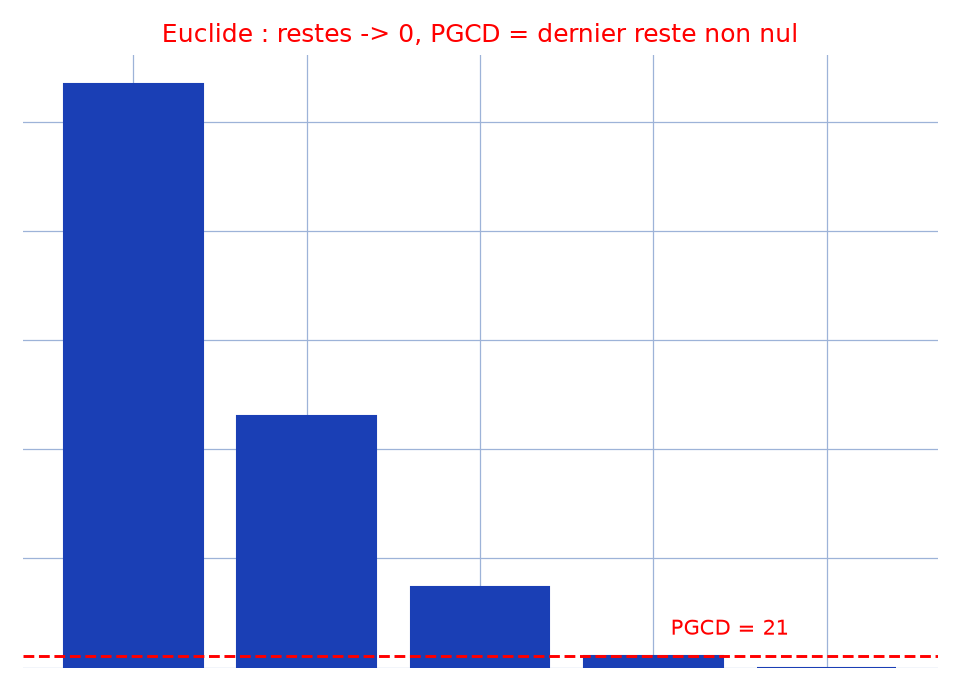

# Algorithme PGCD — transcription fidèle

> 🧾 **Photo originale :** `algorithme-pgcd-euclide.jpg` (607×1080, stylo bleu sur cahier ligné).
> 🔍 **Statut :** lisible (~90 %), transcrit mot à mot, incertitudes signalées.
> 📐 **Contenu :** algorithme du Plus Grand Commun Diviseur (Euclide : `a mod b`, boucle sur `r ≠ 0`).
> 🖼️ **Restauration :** copie de lecture `/tmp/pm/bright_1.png` (×2,22, 1348×2400) — transcription fidèle, rien d'inventé.

## Page 1 — transcription

algorithme Plus grand Commun diviseur [*sic* — casse et accents d'origine]

Var [lecture incertaine — `Var` souligné] $m_1, m, r, a, b$ : Entiers [souligné]

début [souligné]

répéter [souligné]

écrire ("entrer le plus grand nombre"); [lecture incertaine — `écrire` souligné, guillemets manuscrits]

Lire (a); [souligné]

écrire ("entrer le plus petit nombre");

Lire (b);

jusqu'à ($a \geq b$); [souligné]

$r \leftarrow 1$; [lecture incertaine — `1`, flèche longue d'affectation]

Pour ($m = b$; ($r \neq 0$); $m \leftarrow r$) [souligné]

Faire [souligné]

{ $m_1 \leftarrow m$; [accolade ouvrante en marge]

$r \leftarrow a \bmod b$;

$a \leftarrow b$;

$b \leftarrow r$;

} [accolade fermante en marge]

écrire ("le PGCD de ce [*sic* — `ces` au pluriel sur l'original : `des ce nombres`] nombres est:" $m_1$);

fin [souligné]

Nobody [lecture incertaine — signature soulignée d'un paraphe, en bas de page]

## Figures

Pas de schéma géométrique sur la page (organigramme manuscrit début/fin) : illustration du fond — restes d'Euclide qui tombent à 0, PGCD = dernier reste non nul.

Reproduction (script `reproduce_algorithme-pgcd-euclide_1.py`, exécuté avec `uv run`) : barres bleues (restes 1071, 462, 147, 21, 0), seuil rouge (PGCD = 21), quadrillage bleu `#9db3d8`. PNG relu et conforme.

## Vocabulaire / notions

- **Division euclidienne** : $a = bq + r$, $0 \le r < b$, itérée jusqu'au reste nul.
- **`a mod b`** : reste de la division euclidienne, cœur de la boucle.
- **Boucle `r ≠ 0`** : on décale $(a, b) \leftarrow (b, r)$ ; le PGCD est le dernier $r$ non nul (ici $m_1$).
- **Garde `a ≥ b`** : le `répéter…jusqu'à` force la saisie avec le plus grand nombre en premier.
