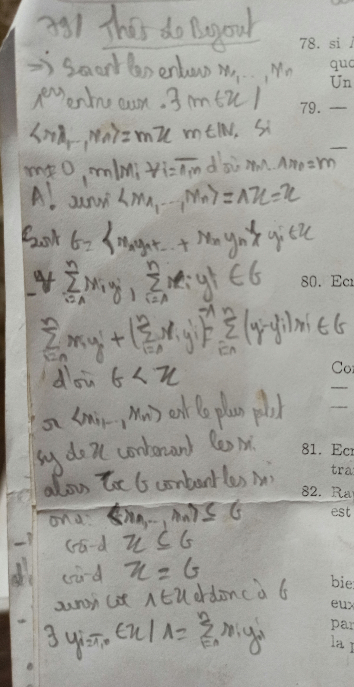
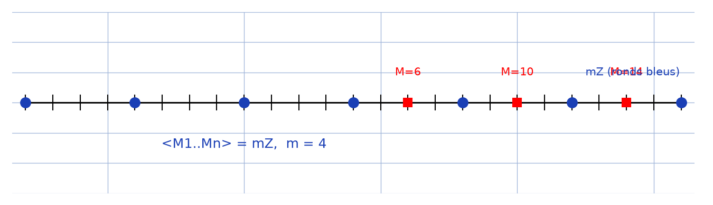

# Théorème de Bézout (hint) — transcription fidèle

> Source : `bezout-hint.jpg` (1 page, crayon, sur imprimé d'exercices 78–82 partiellement visibles à droite).
> Lisibilité ~70 %.

## Page 1 — transcription fidèle

[En-tête] Thm de Bezout [lecture incertaine sur le numéro « 191 » en marge]

$\Rightarrow$ Soient les entiers $M_{1}, \dots, M_{n}$

$1^{ers}$ entre eux. $\exists m \in \mathbb{Z} \mid$

$\langle M_{1}, \dots, M_{n} \rangle = m\mathbb{Z}$, $m \in \mathbb{N}$. Si

$m \neq 0$, $m \mid M_{i} \; \forall i = 1, n$ d'où $M_{1} \wedge \dots \wedge M_{n0} = m$ [lecture incertaine]

A! aussi $\langle M_{1}, \dots, M_{n} \rangle = \Lambda\mathbb{Z} = \mathbb{Z}$ [lecture incertaine]

Soit $G = \{ M_{1}y_{1} + \dots + M_{n}y_{n} \mid y_{i} \in \mathbb{Z} \}$

$\forall \sum_{i=1}^{n} M_{i}y_{i}, \; \sum_{i=1}^{n} M_{i}y'_{i} \in G$

$\sum_{i=1}^{n} M_{i}y_{i} + \left( \sum_{i=1}^{n} M_{i}y'_{i} \right) = \sum_{i=1}^{n} (y_{i} + y'_{i}) M_{i} \in G$ [lecture incertaine]

d'où $G < \mathbb{Z}$

or $\langle M_{1}, \dots, M_{n} \rangle$ est le plus petit

sg de $\mathbb{Z}$ contenant les $M_{i}$.

alors tout $G$ contenant les $M_{i}$

on a : $\langle M_{1}, \dots, M_{n} \rangle \subseteq G$

c-à-d $\mathbb{Z} \subseteq G$

c-à-d $\mathbb{Z} = G$

aussi tout $\Lambda \in \mathbb{Z}$ est donc à $G$

$\exists y_{i=1,n} \in \mathbb{Z} \mid \Lambda = \sum_{i=1}^{n} M_{i}y_{i}$

[Colonne imprimée droite, partielle] 78. si … / 79. — / 80. Ecr … / 81. Ecr … tra … / 82. Ra … est … [lecture incertaine — texte coupé]

## Figures

Pas de schéma sur le manuscrit. Illustration de l'idéal $m\mathbb{Z}$ engendré (ronds bleus) et des générateurs $M_{i}$ (carrés rouges) :

*Script : `~/KpihX-Labs/Explore/lab/scripts/reproduce_bezout-hint_1.py`.*

## Vocabulaire / notions

- Théorème de Bézout généralisé, entiers premiers entre eux.
- Idéal engendré $\langle M_{1}, \dots, M_{n} \rangle$, sous-groupes de $\mathbb{Z}$ ($G < \mathbb{Z}$).
- PGCD ($\wedge$), divisibilité, appartenance $m \mid M_{i}$.
