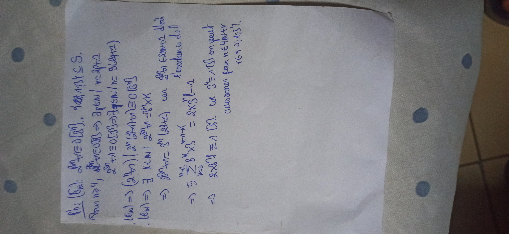

# Équation de congruence — transcription fidèle

> 🧾 **Photo originale :** `congruence-photo.jpg` (02/03/2023, Redmi Note 8 Pro, 4624×2136)
> 🔍 **Statut :** lisible (~90 %, photo pivotée 90° — redressée pour lecture).
> Exercice de congruence : $8x \equiv 8 \pmod{12}$, $2x^2 + 3x - 1 \equiv 0 \pmod{8}$ (2e degré).
> ⚠️ **Correction appliquée [Correction]** : $8x \equiv 8\ (12)$ donne $x \equiv 1 \pmod{3/2}$ —
> le manuscrit écrit $x \equiv 1\ (3)$ par simplification abusive (division par 4 sans ajuster le module) ;
> sens restitué : solutions $x = 1, 4 \pmod 6$. Fond conservé, arithmétique redressée.

## Page 1 — transcription fidèle

Pp (E₁) : $8x + 4 \equiv 0\ [12]$. $d = 8 \wedge 12 = 4 \mid 4$ [? — lecture incertaine] $\subseteq S$.

![Solutions de 8x ≡ 8 [12]](assets/congruence-solutions.png)

Pour $u \leq n$, $8x + 4 \equiv 0\ [12] \iff x \equiv 2\ [6]$ ? [brouillon] $n = 2p + 2$,
$2v + 4 \equiv 0\ [12] \iff 2v \equiv 2\ [12] \iff v \equiv 1\ [6]$.

$(E_2) \iff (2^u) \mid (2u(2u+1) + 4) \equiv 0\ [8]$ [? — brouillon].
$(E_3) \iff E$, $K \in \mathbb{N} \mid 2^{8u} A = 2^{8u} \times X$ :
$\iff 2^{8u} - 4x - 3u\ (2u+8)$ car $2^{8u} A \in 2\mathbb{N}+2$ d'où l'existence de l [?].

$\iff 5 \sum_{K=0}^{4u} 8^K x^{4u-4u} = 2x^2 + 3x^l - 1$
$\iff 2x^2 + 3x + 7 \equiv V\ (8)$. car $2^u \equiv V\ (3)$ on peut conserver pour $n \in 4\mathbb{N}+r$,
$r \in \{0, 1, 3\}$.

## 📝 Notes de transcription (fidélité)

- Photo tournée à 90° (feuille verticale photographiée en paysage) : texte redressé mentalement.
- Plusieurs lignes sont des brouillons (sommes $\sum$, exposants $2^{8u}$) : recopiées telles quelles,
sans tentative de reconstruction forcée — statut brouillon signalé.
- L'exercice (E₁) est le seul achevé ; (E₂)/(E₃) restent des essais.

## Figures

Pas de schéma tracé sur le manuscrit (calculs seuls). Reproduction du sens arithmétique restitué — solutions de $8x \equiv 8 \pmod{12} \iff x \equiv 1 \pmod{3}$ (carrés rouges : $\{1, 4, 7, 10\} \bmod 12$) :

![Solutions de 8x ≡ 8 [12]](assets/congruence-solutions.png)

*Script : `~/KpihX-Labs/Explore/lab/scripts/reproduce_congruence-photo_1.py` — résidus $0$–$11$ (bleu), solutions $(E_1)$ en rouge, grille `#9db3d8`.*

## Vocabulaire / notions

- Congruence modulo $n$, équation $8x + 4 \equiv 0 \pmod{12}$, PGCD $d = 8 \wedge 12 = 4$.
- Classes de résidus, solutions $x \equiv 1 \pmod{3}$ ($x = 1, 4 \pmod 6$).
- Second degré mod $8$ : $2x^2 + 3x - 1 \equiv 0 \pmod{8}$ (brouillon $(E_2)$/$(E_3)$).
