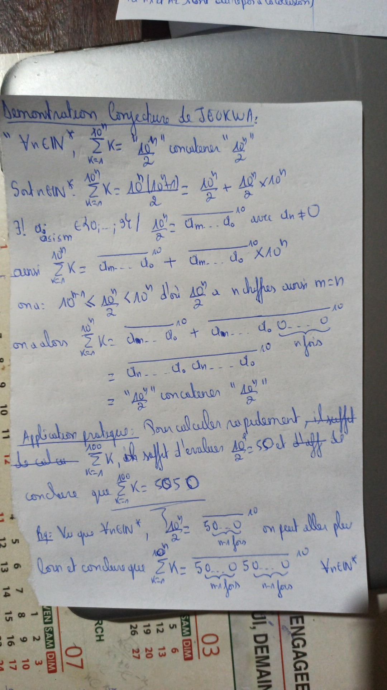
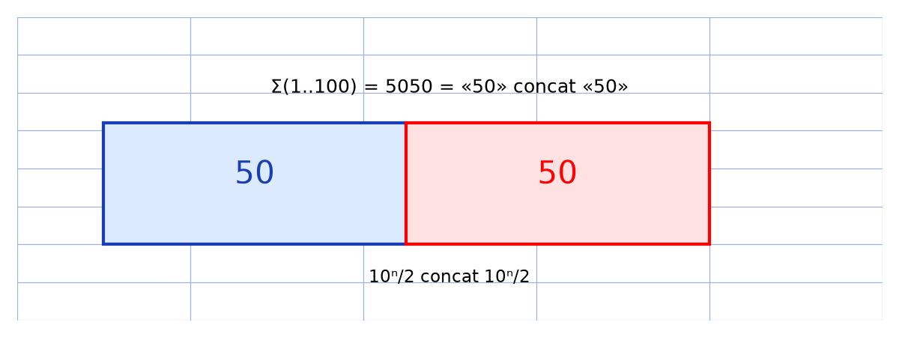

# Conjecture de Jeukwa — transcription fidèle

> Source : `conjecture-jeukwa.jpeg` (1 page, stylo bleu, sur calendrier ; « JEOUKWA » au titre).
> Lisibilité ~90 %.

## Page 1 — transcription fidèle

Démonstration Conjecture de JEOUKWA : [*sic* — « JEOUKWA » ; le dossier dit « jeukwa »]

« $\forall n \in \mathbb{N}^{\ast}, \; \sum_{k=1}^{10^{n}} k = \text{“}\frac{10^{n}}{2}\text{”}$ concaténer [*sic*] “$\frac{10^{n}}{2}$” »

Soit $n \in \mathbb{N}^{\ast}$ : $\sum_{k=1}^{10^{n}} k = \frac{10^{n}(10^{n}+1)}{2} = \frac{10^{n}}{2} + \frac{10^{n}}{2} \times 10^{n}$

$\exists ! \; a_{i \; a_{i} \le i \le m} \in \{0, \dots\} ; 9tq/$ [lecture incertaine] $\frac{10^{n}}{2} = \overline{a_{m} \dots a_{0}}^{10}$ avec $a_{m} \neq 0$

ainsi $\sum_{k=1}^{10^{n}} k = \overline{a_{m} \dots a_{0}}^{10} + \overline{a_{m} \dots a_{0}}^{10} \times 10^{n}$

on a : $10^{m-1}$ [lecture incertaine — $m-1$ ou $m+1$] $\le \frac{10^{n}}{2} < 10^{n}$ d'où $\frac{10^{n}}{2}$ a $n$ chiffres ainsi $m = n$ [lecture incertaine]

on a alors $\sum_{k=1}^{10^{n}} k = \overline{a_{m} \dots a_{0}}^{10} + \overline{a_{m} \dots a_{0} \underbrace{0 \dots 0}_{n \text{ fois}}}^{10}$

$= \overline{a_{n} \dots a_{0} \, a_{n} \dots a_{0}}^{10}$

$= \text{“}\frac{10^{n}}{2}\text{”}$ concaténer “$\frac{10^{n}}{2}$”

Application pratique : Pour calculer rapidement, il suffit

de calculer [raturé] $\sum_{k=1}^{100} k$, il suffit d'évaluer $\frac{10^{2}}{2} = 50$ et … [lecture incertaine] de

conclure que $\sum_{k=1}^{100} k = 5050$

Rq : Vu que $\forall n \in \mathbb{N}^{\ast}$, $\frac{10^{n}}{2} = \overline{50 \dots 0}^{10}$ ($n-1$ fois) on peut aller plus

loin et conclure que $\sum_{k=1}^{10^{n}} k = \overline{50\dots0 \, 50\dots0}^{10}$ ($n-1$ fois) ($n-1$ fois) $\forall n \in \mathbb{N}^{\ast}$

## Figures

Pas de schéma dessiné ; la « figure » est l'opération de concaténation (deux blocs accolés, ex. $5050$). Reproduction :

*Script : `~/KpihX-Labs/Explore/lab/scripts/reproduce_conjecture-jeukwa_1.py` — description précise : deux rectangles (bleu « 50 », rouge « 50 ») accolés, titre « Σ(1..100) = 5050 = « 50 » concat « 50 » », légende « 10ⁿ/2 concat 10ⁿ/2 ».*

## Vocabulaire / notions

- Somme arithmétique $\sum_{k=1}^{N} k = N(N+1)/2$, puissances de 10.
- Écriture décimale $\overline{a_{m}\dots a_{0}}^{10}$, nombre de chiffres, concaténation.
- Application pratique / calcul rapide, remarque (Rq).
