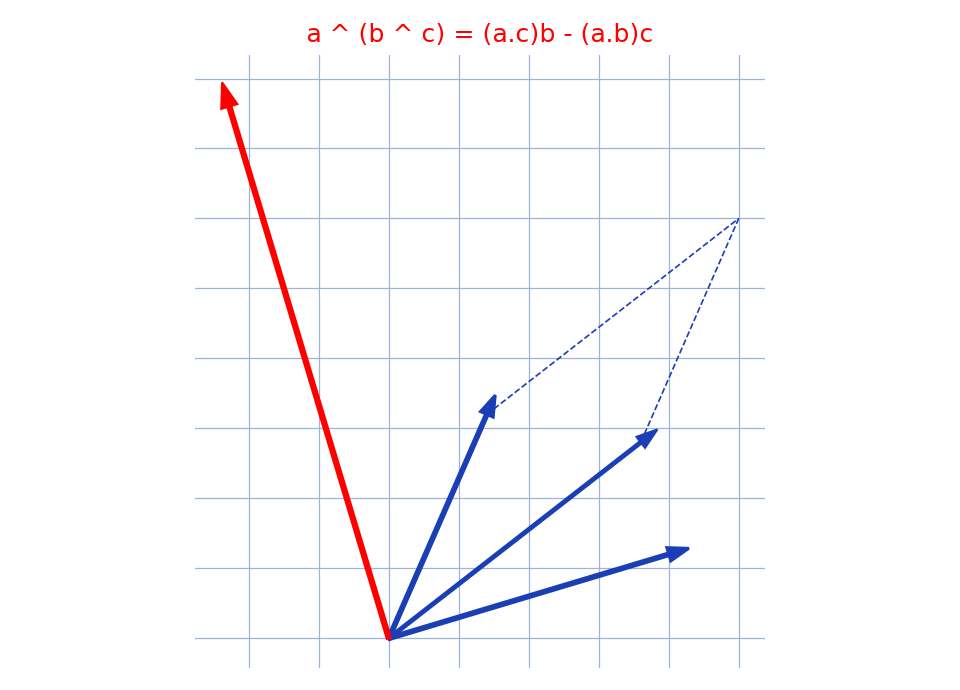

# Double produit vectoriel — transcription fidèle

🧾 Source : [double-produit-vectoriel-tableau.jpg](double-produit-vectoriel-tableau.jpg) — feuille manuscrite, encre bleue, photo pivotée à 90° (un cahier/calendrier en arrière-plan).
🔍 Contenu : démonstration de $\vec{a} \wedge (\vec{b} \wedge \vec{c}) = (\vec{a}\cdot\vec{c})\vec{b} - (\vec{a}\cdot\vec{b})\vec{c}$ par développement du déterminant $3\times3$.
📄 Transcription : mot-à-mot, image rendue en grand vers `/tmp/t-b/double-produit-vectoriel-tableau.jpg` — rien d'inventé.

## Page 1 — transcription

$\vec{A} \wedge (\vec{B} \wedge \vec{C}) = \vec{A} \wedge \vec{B} + \vec{B} \wedge \vec{C}$ [*sic* — rature/essai, entouré] [lecture incertaine — haut de page]

$(\vec{a} + \vec{b} + \vec{c}) \cdot \vec{N} = 0$ [lecture incertaine]

$a(\vec{N} \cdot \vec{B}) + b(\vec{N} \cdot \vec{C}) - c = 0$ [lecture incertaine]

$a\ldots(\vec{N} \cdot \vec{B}) - \vec{B}(\vec{N} \cdot \vec{C})$ [lecture incertaine]

$-B \wedge 2 = \left| \begin{matrix} \vec{i} & \vec{j} & \vec{k} \\ b_1 & b_2 & b_3 \\ c_1 & c_2 & c_3 \end{matrix} \right|$ [reconstruction — motif : déterminant du produit vectoriel]

$= (b_2c_3 - b_3c_2)\vec{i} + (b_3c_1 - b_1c_3)\vec{j} + (b_1c_2 - b_2c_1)\vec{k}$ [reconstruction — motif]

$+ (b_1c_2 - b_2c_1)\vec{k}$ [lecture incertaine — suite du développement]

$\vec{A} \wedge (\vec{B} \wedge \vec{C}) = \left| \begin{matrix} \vec{i} & \vec{j} & \vec{k} \\ a_1 & a_2 & a_3 \\ \ldots & \ldots & \ldots \end{matrix} \right|$ bsa-bna ... [lecture incertaine]

$(a_2b_3c\ldots - a_2b\ldots - a_2b\ldots + a_3b\ldots c_3)\vec{i}$ [lecture incertaine]

$+ a_2b_3c\ldots - a_3b_3c\ldots - a_2b\ldots c\ldots + a_2b\ldots c\ldots 2$ [lecture incertaine]

$+ a_2b_3c\ldots - a_2b\ldots c\ldots - a_3b_3\ldots$ [lecture incertaine]

$+ d_2b_3c_2\vec{k}$ [lecture incertaine]

$d\vec{B} + b\vec{C} = (B \wedge n + B c o l + (d \wedge n + b \wedge l))$ [lecture incertaine — ligne de regroupement]

$+ (d \wedge n + B c_3)\vec{k}$ [lecture incertaine]

$\boxed{d_1 = a_2c_2 + a_3c_3 \text{ ... tdn en}}$ [lecture incertaine — premier encadré]

$\boxed{b_1 - a_2b_2 - a_3b_3}$ [lecture incertaine — second encadré]

$\boxed{d_1m_1 - a_1b_{11}c_1 \rightarrow \ldots}$ [lecture incertaine — troisième encadré]

$d = \vec{A} - \vec{C}$ [lecture incertaine]

$\boxed{\vec{A} \wedge \vec{B} \wedge \vec{C} \ldots - \vec{A}(\vec{C}) \cdot \vec{B} - \vec{A}(\vec{B}) \cdot \vec{C}}$ [reconstruction — motif : formule finale $\vec{a}\wedge(\vec{b}\wedge\vec{c}) = (\vec{a}\cdot\vec{c})\vec{b} - (\vec{a}\cdot\vec{b})\vec{c}$]

## Figures

Pas de figure géométrique : la page est un calcul en déterminants avec trois résultats intermédiaires encadrés et la formule finale encadrée.

Reproduction (script `reproduce_double-produit-vectoriel-tableau_1.py`, exécuté avec `uv run`) : vecteurs $\vec{a}, \vec{b}, \vec{c}$ dans le plan et le résultat $(\vec{a}\cdot\vec{c})\vec{b} - (\vec{a}\cdot\vec{b})\vec{c}$ (rouge) avec parallélogramme en pointillés, quadrillage bleu `#9db3d8`. PNG relu et conforme à la formule démontrée.

## Vocabulaire / notions

- **Produit vectoriel** : $\vec{b} \wedge \vec{c}$, déterminant $3\times3$ dans $(\vec{i}, \vec{j}, \vec{k})$.
- **Double produit vectoriel** : $\vec{a} \wedge (\vec{b} \wedge \vec{c})$.
- **Formule** : $(\vec{a}\cdot\vec{c})\vec{b} - (\vec{a}\cdot\vec{b})\vec{c}$.
