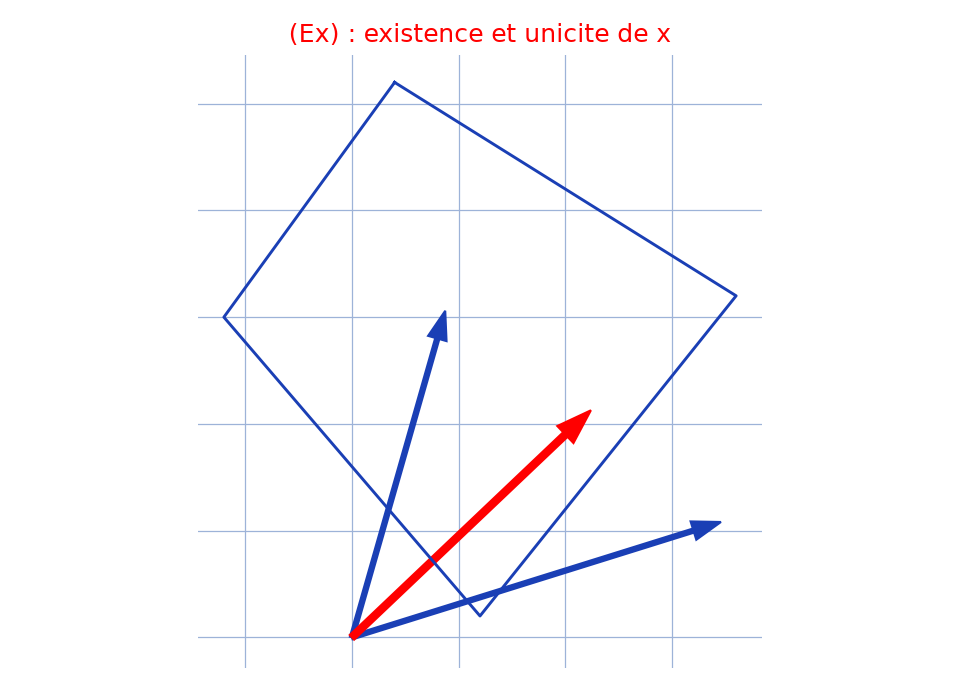

# Équation vectorielle — transcription fidèle

🧾 Source : [equation-vectorielle.jpg](equation-vectorielle.jpg) — page de cahier à carreaux, encre bleue, photo pivotée à 90°.
🔍 Contenu : résolution de l'équation $(E_x)$ en $x$ (produit vectoriel, base, déterminant $3\times3$) — existence et unicité, « Réciproquement, A vérifie », « Donc $S$ = … ».
📄 Transcription : mot-à-mot, image rendue en grand vers `/tmp/t-b/equation-vectorielle.jpg` — rien d'inventé.

## Page 1 — transcription

$(E_x)$ : $\vec{x} + \vec{B} \wedge \vec{x} + \ldots \wedge$ [lecture incertaine — haut de page]

... Si $\vec{B} \wedge \vec{x}$ ... $(B_1, B)$ ... [lecture incertaine]

... $(E_x) \Rightarrow \vec{A} \wedge \vec{B} = \vec{A} \wedge \vec{A} \wedge \vec{x} = \vec{0}$ [lecture incertaine]

$\Rightarrow \vec{B} \wedge \vec{x}$ [lecture incertaine]

$\Rightarrow$ ... $\vec{x} \wedge ... = \vec{b}$ [lecture incertaine]

$(6x) \Rightarrow \vec{B} \wedge \vec{0} = \vec{A} - \vec{B} = \vec{b}$ [lecture incertaine]

Réciproquement, A vérifie [lecture incertaine]

$(6x)$ ... $\vec{x} = \frac{1}{\ldots} (\ldots)$ [lecture incertaine — expression de $x$]

$(\text{V} + \text{...})$ [lecture incertaine]

une base de ... Alors ... [lecture incertaine]

... $\vec{x} = \vec{A} + ...$ [lecture incertaine]

$(6x) \Rightarrow \vec{A} \wedge ... + \vec{A} \wedge \vec{x} + ... \vec{B} \wedge ...$ [lecture incertaine]

$- \vec{X}(\vec{B} - \vec{B} - ... = A$ [lecture incertaine]

$\iff \alpha + \vec{x} \parallel \vec{B} \parallel^2 \vec{B}$ [lecture incertaine]

... $\vec{B} - \vec{x}(\vec{B} - \vec{B}) = 0$ [lecture incertaine]

$\vec{X} - \vec{x} = 0$ [lecture incertaine]

$A = \left| \begin{matrix} 1 & 0 & \ldots \\ 0 & 1 & \ldots \\ -1 & 0 & \ldots \end{matrix} \right| = 1, 0 \ldots$ [lecture incertaine — déterminant $3\times3$]

$|1, 0 \ldots - \vec{A} - \vec{0} - \vec{0}|$ [lecture incertaine]

... $+ (\vec{A} + \vec{B} \wedge \vec{B}) \neq 0$ [lecture incertaine]

D'où l'existence et l'unicité de $\vec{x}$ [lecture incertaine]

Donnée aux $d$ : $\left\| \frac{\ldots}{\ldots} \right\| = \frac{1}{\ldots}$ [lecture incertaine]

$b = \frac{\left| \wedge \ldots \right|}{\left| \ldots \right|} = \frac{+ \vec{A}\vec{B}}{\ldots} \cdot \frac{\vec{x} - \ldots - 1}{\ldots}$ [lecture incertaine]

Ainsi $\vec{B} = \frac{1}{A + \ldots} (\vec{A} + (\vec{B} \wedge \vec{B}) + \vec{B} \wedge \vec{B})$ [lecture incertaine]

Sinon $(6x) \Rightarrow \vec{A} \wedge \vec{B} + \vec{B} \wedge \vec{B} - \vec{A} \wedge \vec{B}$ [lecture incertaine]

$\Rightarrow \vec{A} \vec{B} + \ldots$ [lecture incertaine]

... $(6x)$ ... $\vec{B} - ...$ [lecture incertaine]

... $(B_x) \Rightarrow$ ... $\vec{A} \wedge \vec{B} + ...$ [lecture incertaine]

$\Rightarrow$ ... $\vec{A} \wedge \vec{B} = - \vec{A} \wedge ...$ [lecture incertaine — bas de page]

## Figures

Figure du manuscrit (en haut à droite) : quadrilatère type cerf-volant/losange tracé au stylo (4 côtés, pointe en bas), sans annotations lisibles.

Reproduction (script `reproduce_equation-vectorielle_1.py`, exécuté avec `uv run`) : quadrilatère (cerf-volant) + base $(\vec{A}, \vec{B})$ (bleu) et vecteur solution $\vec{x}$ (rouge), quadrillage bleu `#9db3d8`. PNG relu et conforme à la figure et à la conclusion (existence et unicité de $x$).

## Vocabulaire / notions

- **Équation $(E_x)$** en l'inconnue vectorielle $x$ (produit vectoriel avec $B$).
- **Base**, **déterminant $3\times3$** $A \neq 0$.
- **Existence et unicité** de $x$ ; **réciproque** (« Réciproquement, A vérifie »).
- **Ensemble solution** $S$.
