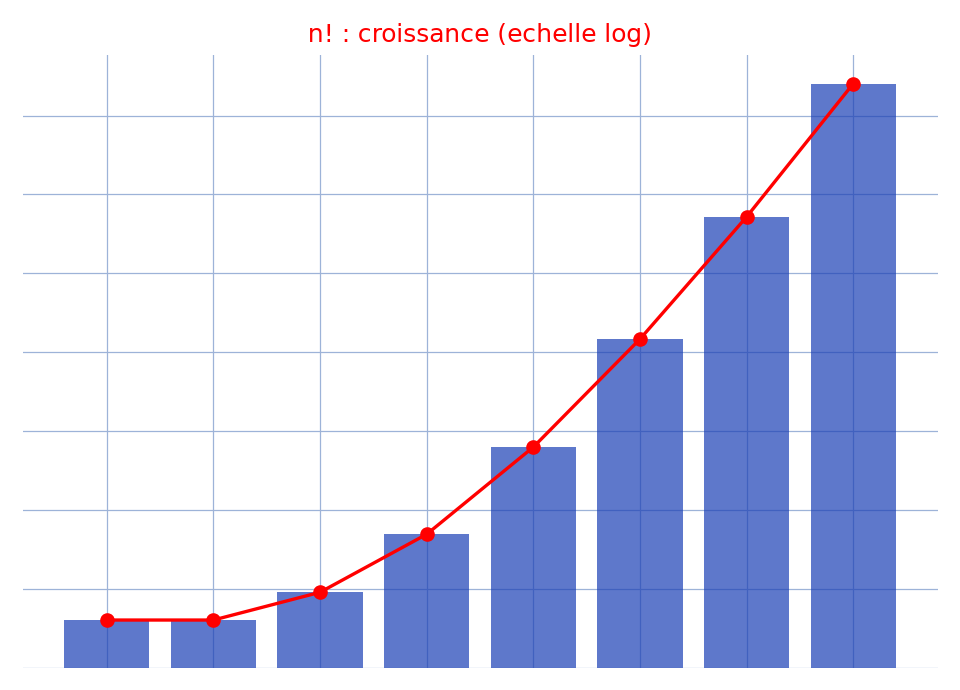

# Factorielle — expression — transcription fidèle

🧾 Source : [factorielle-expression.jpg](factorielle-expression.jpg) — page de cahier à carreaux, encre bleue, photographiée à l'envers.
🔍 Contenu : expression/majoration autour de $n!$ — sommes de coefficients binomiaux valant $1$, « Pour tout $n$ … », $f(n)$, $d_x n!$.
📄 Transcription : mot-à-mot (après rotation de $180^\circ$), image rendue en grand vers `/tmp/t-b/factorielle-expression.jpg` — rien d'inventé.

## Page 1 — transcription

Montrer que pour ... $m - 1$ ... [lecture incertaine — haut de page après rotation]

$n! = \sum ... C ...$ ... $= n!$ [lecture incertaine]

Et on ... ... ... ... ... ... ... ... ... [lecture incertaine]

... pour ... $x - n$ ... en ... $\sum ... = ...$ ... [lecture incertaine]

... $f(n)$ ... $f(n)$ ... $f(n)$ ... [lecture incertaine — trois occurrences]

$\sum ... = 1$ ... $x$ ... $dx$ ... ... [lecture incertaine]

Pour tout $n \in \mathbb{N}$ ... $f(n)$ ... ... ... ... [lecture incertaine]

... $d_x$ $n!$ ... ... ... [lecture incertaine]

... $= x$ ... ... ... ... ... [lecture incertaine]

$( \ldots 3 \ldots )$ [lecture incertaine — bas de page après rotation, rature]

## Figures

Pas de figure géométrique : page de calculs sur $n!$ et sommes binomiales uniquement.

Reproduction (script `reproduce_factorielle-expression_1.py`, exécuté avec `uv run`) : bâtons de $n!$ en échelle $\log_{10}(n!+1)$ pour $n = 0..7$ (bleu) + courbe (rouge) rappelant la croissance factorielle étudiée, quadrillage bleu `#9db3d8`. PNG relu et conforme au thème du manuscrit.

## Vocabulaire / notions

- **Factorielle** $n! = 1 \times 2 \times \cdots \times n$.
- **Coefficients binomiaux**, **sommes valant $1$**.
- **Fonction auxiliaire** $f(n)$ [rôle incertain].
