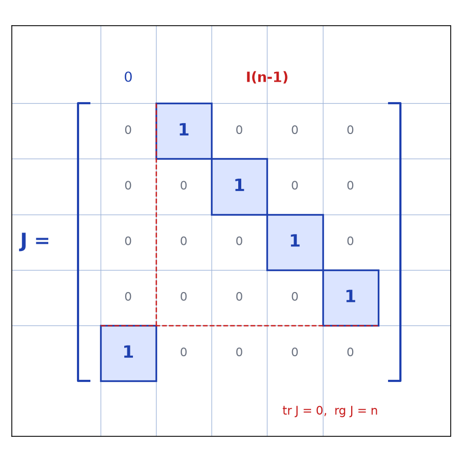
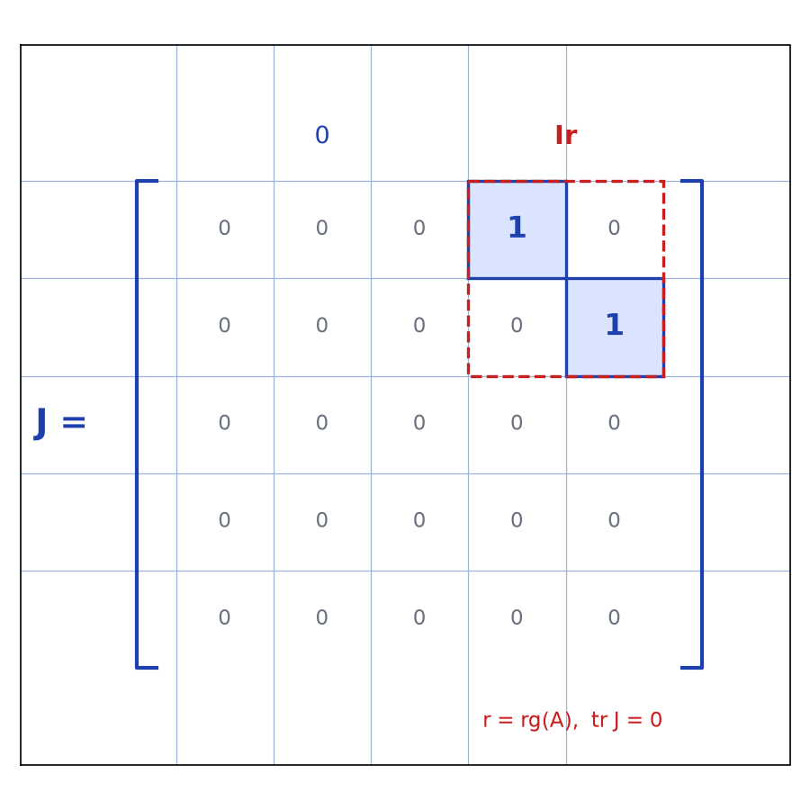

# Rencontre GLn(IK) Hyperplan — transcription fidèle

> 🧾 **Manuscrit original :** `gln-hyperplan.pdf` (scan, 2 pages) · ✍️ KpihX
> 🔍 **Statut :** lisible à 100 %, transcrit mot à mot. Les maths sont conservées telles quelles ;
> seules les coquilles d'orthographe évidentes sont corrigées (signalées). Les schémas matriciels de la page 2 sont décrits fidèlement (reproduits en FORME via `lab/scripts/`, voir ## Figures — COUVERT, rien à créer).
> 📄 **Source scannée :** [`gln-hyperplan.pdf`](gln-hyperplan.pdf) (restaurée depuis `/run/media/kpihx/KpihX-Datas1/Travaux/Documents/PDF/Rencontre_GLn(IK)_Hyperplan.pdf`, vérifiée `pdfinfo`, 2026-09-07)

---

## Page 1

### Théo : pour $n \in \mathbb{N}\ (n \geq 2)$, $Gl_n(\mathbb{K}) \cap \mathcal{H} \neq \varnothing$, $\forall \mathcal{H} \equiv$ hyperplan de $M_n(\mathbb{K})$ ($\mathbb{K} = \mathbb{R}$ ou $\mathbb{C}$)

En effet soit $\mathcal{H} \equiv$ hyperplan de $M_n(\mathbb{K})$. $\mathcal{H}$ est noyau d'une $f$ non nulle sur $M_n(\mathbb{K})$ qu'on notera $f$.

**Lemme :** soit $f \in M_n(\mathbb{K})^*$ ($n \geq 2$), $\exists! A \in M_n(\mathbb{K}) \mid f = f_A$ où $f_A : M_n(\mathbb{K}) \to \mathbb{K},\ M \mapsto \mathrm{tr}(AM)$.

En effet en posant $\Phi : M_n(\mathbb{K}) \to M_n(\mathbb{K})^*,\ A \mapsto f_A$, il suffit de mq $\Phi$ est bijectif. Vu que $\dim M_n(\mathbb{K}) = \dim M_n(\mathbb{K})^* = n^2 < +\infty$, il suffit de montrer que $\Phi$ est injectif.

**Meth1 :** ($\mathbb{K} = \mathbb{R}$ ou $\mathbb{C}$). Soit $A \in \mathrm{Ker}\,\Phi$. Ona : $f_A({}^t\overline{A}) = \mathrm{tr}(A{}^t\overline{A}) > 0$ pour $A \neq 0_{M_n(\mathbb{K})}$. Donc nécessairement $A = 0_{M_n(\mathbb{K})}$. CQFD.

### (cas général)

Soit $r = \mathrm{rg}\,A$. $\exists P, Q \in Gl_n(\mathbb{K}) \mid PAQ = \begin{bmatrix} I_r & 0 \\ 0 & 0 \end{bmatrix}$. Ona : $r = \mathrm{tr}(PAQ) = \mathrm{tr}(AQP) = f_{A}(QP)$ [lue telle quelle]. Vu que $f_A = 0_{M_n(\mathbb{K})^*} $ alors $r = 0$ [lue telle quelle — passage elliptique du manuscrit]. D'où $A = 0_{M_n(\mathbb{K})}$. CQFD.

En revenant au théo initial, vu que $f \in M_n(\mathbb{K})^*$, $\exists! A$, $f = f_A = \mathrm{tr}(A \cdot)$. Le problème revient à trouver $B \in Gl_n(\mathbb{K}) \mid \mathrm{tr}(AB) = 0$ [le symbole ressemble à $\neq$ mais le contexte (matrice $J$ de trace nulle ci-après) impose $= 0$] et ainsi on aurait $B \in \mathrm{Ker}\,f$. En exploitant l'équivalence des matrices, on peut chercher juste une matrice $J$ de trace nulle, de même rang que $A$ car ainsi il existerait $P, Q \in Gl_n(\mathbb{K}) \mid J = PAQ$, et on aurait $0 = \mathrm{tr}\,J = \mathrm{tr}(PAQ) = \mathrm{tr}(AQP)$ et donc il suffirait de prendre $B = QP$.

Comme on veut $\mathrm{tr}(B\dots)$, il suffit d'avoir $\forall i \in [\![1, n]\!]$, $\sum_j \dots = 0$ ; reste plus qu'à gérer le rang [fin de page elliptique].

---

## Page 2

- Pour $\mathrm{rg}(A) = n$ il suffit de prendre $J = [\text{schéma : 1 sur la sur-diagonale et en bas à gauche (permutation cyclique), 0 ailleurs}] = \begin{bmatrix} 0 & I_{n-2} \\ \vdots & \\ 1 & 0 \cdots 0 \end{bmatrix}$ [schéma manuscrit — reproduction en FORME : voir ## Figures ci-dessous].

- Pour $\mathrm{rg}(A) \leq n-1$ il suffit de prendre $J = [\text{schéma : bloc } I_r \text{ en haut à droite}]$ où $r = \mathrm{rg}(A)$ [schéma manuscrit — reproduction en FORME : voir ## Figures ci-dessous].

$$= \begin{bmatrix} 0 & I_r \\ 0 & 0 \end{bmatrix}$$

CQFD.

---

## Figures

Schémas matriciels de la page 2 (encre bleue sur cahier quadrillé).

Reproduction (scripts `reproduce_gln_hyperplan_j_full.py` et `reproduce_gln_hyperplan_j_rang_r.py`, exécutés avec `uv run`, illustration $n = 5$) : cases « 1 » bleues, « 0 » gris, crochets bleu stylo, blocs en rouge pointillé, quadrillage bleu `#9db3d8`. PNG relus et conformes aux schémas d'origine.

## Vocabulaire / notions

- **$Gl_n(\mathbb{K})$** : matrices inversibles ($\mathbb{K} = \mathbb{R}$ ou $\mathbb{C}$).
- **Hyperplan de $M_n(\mathbb{K})$** : noyau d'une forme linéaire non nulle $f$.
- **Trace** : $\mathrm{tr}(AM)$, $f_A : M \mapsto \mathrm{tr}(AM)$, $\Phi : A \mapsto f_A$ bijectif.
- **Rang** $r = \mathrm{rg}\,A$ ; **équivalence** : $PAQ = \mathrm{diag}(I_r, 0)$, $P, Q \in Gl_n$.
- **Matrice $J$** : trace nulle, même rang que $A$ ; $B = QP \in \mathrm{Ker}\,f$.
- **Abréviations d'auteur** : `Ona` = On a, `Mq` = montrons que, `Meth1` = méthode 1.
