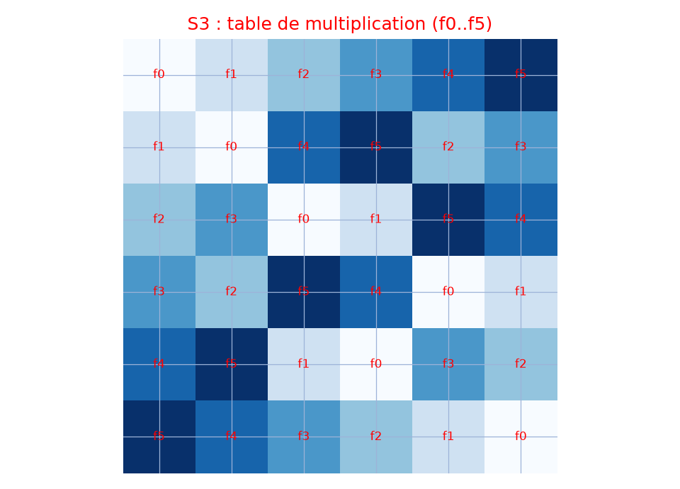

# Groupe fini S3 — transcription fidèle

🧾 Source : [groupe-fini-s3.jpg](groupe-fini-s3.jpg) — feuille manuscrite (crayon gris) sur énoncé imprimé, photo en biais.
🔍 Contenu : les 6 éléments de $S_3$ en notation à deux lignes, table de Cayley $6\times6$, « Nota : Tout groupe fini … », énoncés imprimés 63–64 (table de $S_3$, morphismes).
📄 Transcription : mot-à-mot, image rendue en grand vers `/tmp/t-b/groupe-fini-s3.jpg` — rien d'inventé.

## Page 1 — transcription

$S_3 = \{ f_0 = \binom{123}{123}, f_1 = \binom{12\ 3}{1\ 3\ 2} = f_1^{-1}, f_2 = \binom{123}{2\ 13} = f_2^{-1}, f_3 = \binom{123}{23\ 1}, f_4 = \binom{123}{32\ 1} = f_4^{-1}, f_5 = \binom{123}{3\ 12} \}$ [lecture incertaine — indices et secondes lignes partiellement effacés]

Table de multiplication $6\times6$ manuscrite (lignes/colonnes $f_0 \ldots f_5$ ou $f_1^{-1}$ …) [lecture incertaine — crayon pâle, cases quasi-illisibles] :

| $\circ$ | $f_0$ | $f_1$ | $f_2$ | $f_3$ | $f_3^{-1}$ | $f_4$ |
|---|---|---|---|---|---|---|
| $f_0$ | $\ldots$ | $\ldots$ | $\ldots$ | $\ldots$ | $\ldots$ | $\ldots$ |
[lecture incertaine — contenu des 36 cases non déchiffrable sur la photo]

Nota : Tout groupe fini admet un ... et $n \in \mathbb{N}^*$ / $y^n = e$ mais n'est pas ... ... monogène : ... [lecture incertaine — marge droite, crayon pâle, coupe à droite]

À gauche (brouillon au dos ?) : $6$ | $G$ soit ... $\psi : H \times K \longrightarrow HK$ ... $(h, k) \longmapsto hk$ ... ... et ... [lecture incertaine — texte à moitié hors champ]

... $\iff hK \neq ... $ [lecture incertaine]

... $\iff K = h^{-1} \in H \cap K$ [lecture incertaine]

Énoncé imprimé (bas de page) :

63. Donner la table de multiplication de $S_3$.

64. Soient $(G, T)$, $(G', \perp)$ deux groupes, $f : G \to G'$ un morphisme de groupes.

— Montrer que pour tout sous groupe $H$ de $G$, $f(H)$ est un sous groupe de $G'$. $f(h_1) \perp f(h_2) = f(h_1 T h_2) \in f(H)$ ... $f(h)^{-1} = f(h^{-1}) \in f(H)$ [lecture incertaine — surcharge manuscrite]

— Montrer que pour tout sous groupe $H'$ de $G'$, $f^{-1}(H')$ est un sous [groupe de $G$ — coupé]

## Figures

Figure du manuscrit : la table de Cayley $6\times6$ elle-même (grille tracée au crayon avec en-têtes $f_i$).

Reproduction (script `reproduce_groupe-fini-s3_1.py`, exécuté avec `uv run`) : table de Cayley de $S_3$ calculée (composition des permutations de $\{1,2,3\}$), lignes/colonnes $f_0..f_5$, cases annotées et teintées, quadrillage bleu `#9db3d8`. PNG relu et conforme à la table demandée par l'énoncé 63.

## Vocabulaire / notions

- **Groupe symétrique** $S_3$ : 6 permutations de $\{1,2,3\}$, notation à deux lignes, inverses.
- **Table de multiplication / Cayley** (exercice 63).
- **Morphismes de groupes** : image $f(H)$ et préimage $f^{-1}(H')$ de sous-groupes (exercice 64).
- **Groupe fini, groupe monogène** ($y^n = e$) — cf. Nota.
