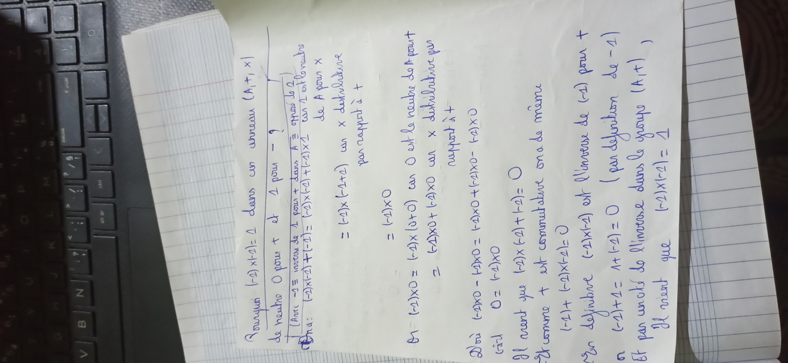
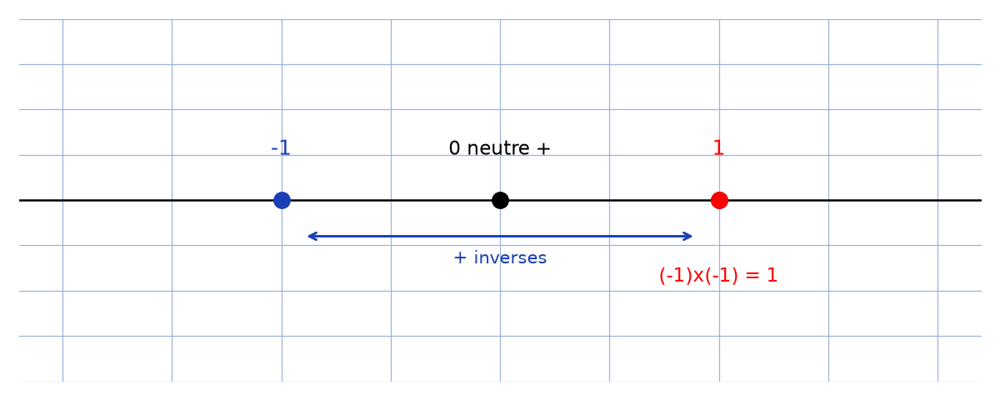

# Moins un fois moins un — transcription fidèle

> Source : `moins-un-fois-moins-un.jpg` (1 page, stylo bleu sur cahier ligné).
> Lisibilité ~80 %, photo pivotée à 90° ; sens de lecture reconstitué ligne à ligne.

## Page 1 — transcription fidèle

Pourquoi $(-1) \times (-1) = 1$ dans un anneau $(A, +, \times)$

de neutre $0$ pour $+$ et $1$ pour $\times$ ?

[En marge : $-1 \equiv$ inverse de $1$ pour $+$ dans $A \equiv$ opposé de $1$]

On a : $(-1) \times (-1) + (-1) = (-1) \times (-1) + (-1) \times 1$ [lecture incertaine] car $1$ est le neutre de $A$ pour $\times$

$= (-1) \times (-1 + 1)$ car $\times$ distributive

par rapport à $+$

$= (-1) \times 0$

Or $(-1) \times 0 = (-1) \times (0 + 0)$ car $0$ est le neutre de $A$ pour $+$

$= (-1) \times 0 + (-1) \times 0$ car $\times$ distributive par

rapport à $+$

D'où $(-1) \times 0 - (-1) \times 0 = (-1) \times 0 + (-1) \times 0 - (-1) \times 0$

càd $0 = (-1) \times 0$

Il vient que $(-1) \times (-1) + (-1) = 0$

Or comme $+$ est commutatif on a de même

$(-1) + (-1) \times (-1) = 0$

Or en définitive $(-1) \times (-1)$ est l'inverse de $(-1)$ pour $+$

Or $(-1) + 1 = 1 + (-1) = 0$ (par définition de $-1$)

Et par unicité de l'inverse dans le groupe $(A, +)$

Il vient que $(-1) \times (-1) = 1$

## Figures

Pas de schéma sur le manuscrit. Droite graduée avec $-1$, $0$ (neutre $+$), $1 = (-1) \times (-1)$ :

*Script : `~/KpihX-Labs/Explore/lab/scripts/reproduce_moins-un-fois-moins-un_1.py` — description précise : axe horizontal, points bleus $-1$, $0$, point rouge $1$, double flèche « $+$ inverses », légende « $(-1)\times(-1) = 1$ ».*

## Vocabulaire / notions

- Anneau $(A, +, \times)$, neutres $0$ (pour $+$) et $1$ (pour $\times$).
- Opposé / inverse pour $+$ : $-1$, unicité de l'inverse dans le groupe $(A, +)$.
- Distributivité de $\times$ par rapport à $+$, commutativité de $+$.
