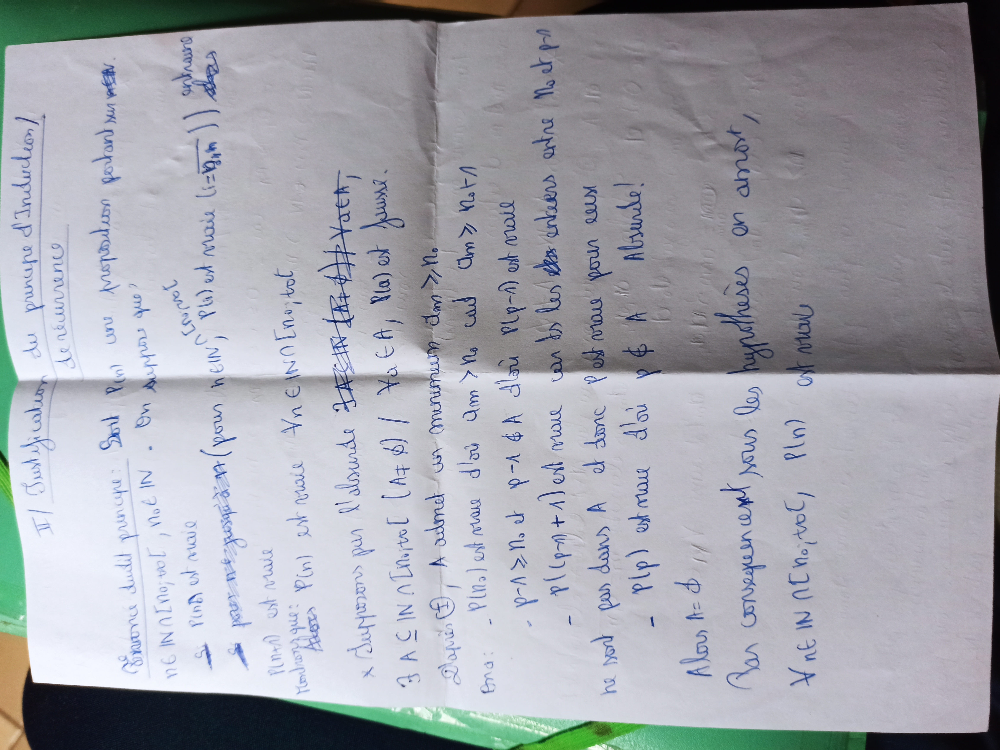
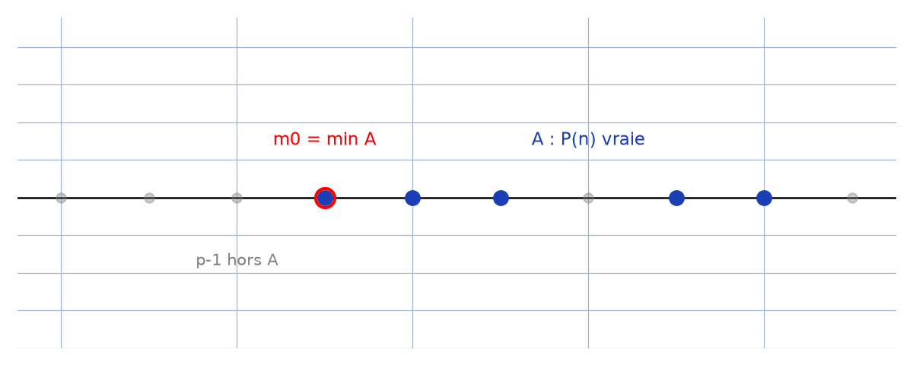

# Récurrence justification — transcription fidèle

> Source : `recurrence-justification.jpg` (1 page, stylo bleu, double feuillet, page pivotée).
> Lisibilité ~80 % ; titre « II/ Justification du principe d'Induction / récurrence ».

## Page 1 — transcription fidèle

II/ Justification du principe d'Induction /

récurrence

Énoncé admis jusqu'ici : Soit $P(n)$ une proposition portant sur un [entier — lecture incertaine]

$n \in \mathbb{N}$ [lu ?] $N_0$, $N_0 \in \mathbb{N}$. On suppose que :

1. $P(N_0)$ est vraie

2. [raturé : « pour $n \ge ...$ »] pour tout $(n \ge N_0)$, $n \in \mathbb{N}$, $P(n) \Rightarrow P(n+1)$ [est vraie — lecture incertaine]

Alors

$P(n+1)$ est vraie

Démontrons que : $P(n)$ est vraie $\forall n \in \mathbb{N} [n_0, +\infty[$ tot [lecture incertaine]

$\times$ Supposons par l'absurde [raturé : « ... »]

$\exists A \subseteq \mathbb{N} \cap [N_0, +\infty[ \mid X_0 \in A$, $P(X_0)$ est fausse.

Notons (?) $A$ admet un minimum $dm \ge N_0$

En a : - $P(n_0)$ est vraie d'où $dm > N_0$ car $dm \ge N_0 \wedge$

- $p - 1 \ge N_0$ et $p - 1 \notin A$ d'où $P(p-1)$ est vraie

- $P((p-1)+1)$ est vraie car les des ... [lecture incertaine] entre $N_0$ et $p-1$

ne sont pas dans $A$ et donc $P$ est vraie pour eux

- $P(p)$ est vraie d'où $p \notin A$ Absurde !

Alors $A = \emptyset$

Par conséquent sous les hypothèses on a mort [lecture incertaine — « on a montré » ?],

$A$ ne vit [lecture incertaine] $N_0$, tot [?], $P(n)$ est vraie

## Figures

Pas de schéma sur le manuscrit. Bon ordre de $\mathbb{N}$ : ensemble $A$, minimum $m_0$, prédécesseur $p-1$ hors $A$ :

*Script : `~/KpihX-Labs/Explore/lab/scripts/reproduce_recurrence-justification_1.py` — description précise : droite graduée $0..9$, points bleus $A = \{3,4,5,7,8\}$, cercle rouge autour de $m_0 = 3$ « $\min A$ », annotation « $p-1$ hors $A$ ».*

## Vocabulaire / notions

- Principe d'induction / récurrence : initialisation $P(N_0)$, hérédité $P(n) \Rightarrow P(n+1)$.
- Raisonnement par l'absurde, ensemble des contre-exemples $A$, bon ordre de $\mathbb{N}$ (minimum $m_0$).
