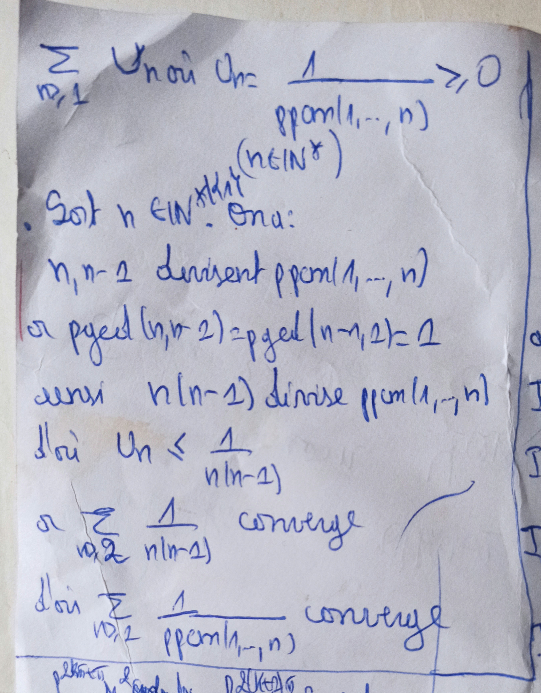
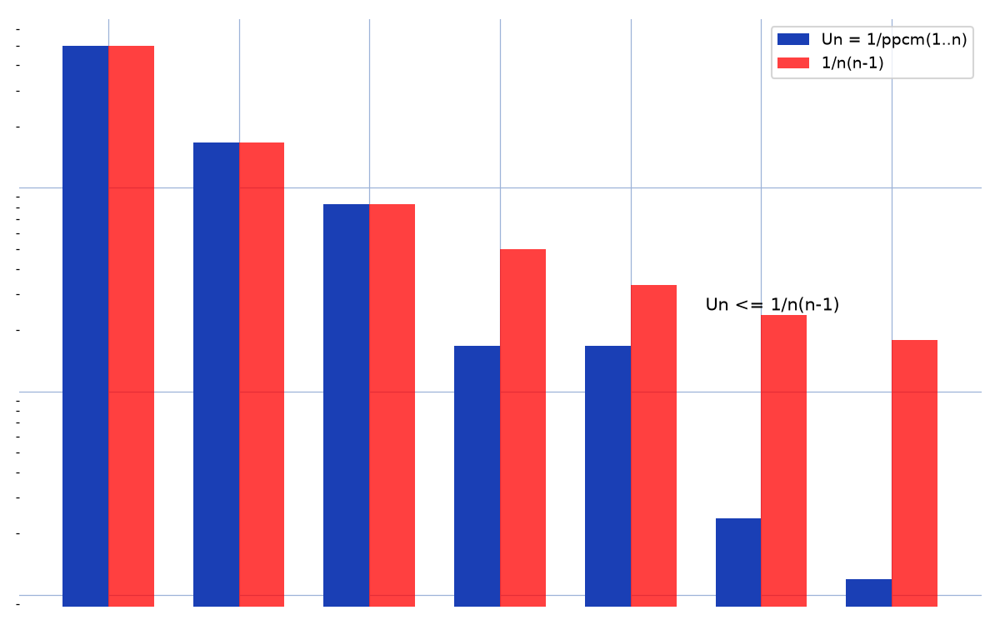

# Série du ppcm — transcription fidèle

> Source : `serie-ppcm.jpg` (1 page).
> Encre bleue sur feuille blanche. Lisibilité ~85 %.

## Page 1 — transcription fidèle

$\sum_{n \geq 1} U_n$ où $U_n = \dfrac{1}{\mathrm{ppcm}(1, \dots, n)} \geq 0 \quad (n \in \mathbb{N}^*)$

. Soit $n \in \mathbb{N}^*$ [1 mot raturé — « t.q. » biffé] [suite illisible — « On a : »] On a :

$n, n-1$ divisent $\mathrm{ppcm}(1, \dots, n)$

or $\mathrm{pgcd}(n, n-1)$ [lecture incertaine — « $(n, n-2)$ » possible sur l'original] $= \mathrm{pgcd}(n-1, 1)$ [lecture incertaine — « $(n-1, 2)$ » possible sur l'original] $= 1$

ainsi $n(n-1)$ divise $\mathrm{ppcm}(1, \dots, n)$

d'où $U_n \leq \dfrac{1}{n(n-1)}$

or $\sum_{n \geq 2} \dfrac{1}{n(n-1)}$ converge

d'où $\sum_{n \geq 2} \dfrac{1}{\mathrm{ppcm}(1, \dots, n)}$ converge

[Bas de page coupé sur la photo : amorce d'une autre question, hors champ.]

## Figures

Pas de schéma géométrique sur le manuscrit (texte seul). Reproduction illustrative du propos (domination de $U_n$ par $1/n(n-1)$) :

*Script : `~/KpihX-Labs/Explore/lab/scripts/reproduce_serie-ppcm_1.py` — barres $U_n = 1/\mathrm{ppcm}(1..n)$ vs $1/n(n-1)$, $n = 2..8$ (échelle log).*

## Vocabulaire / notions

- Série à termes positifs, $\mathrm{ppcm}(1, \dots, n)$, $\mathrm{pgcd}$.
- Divisibilité ($n(n-1) \mid \mathrm{ppcm}$ via coprimalité).
- Critère de comparaison, convergence de $\sum 1/n(n-1)$.
