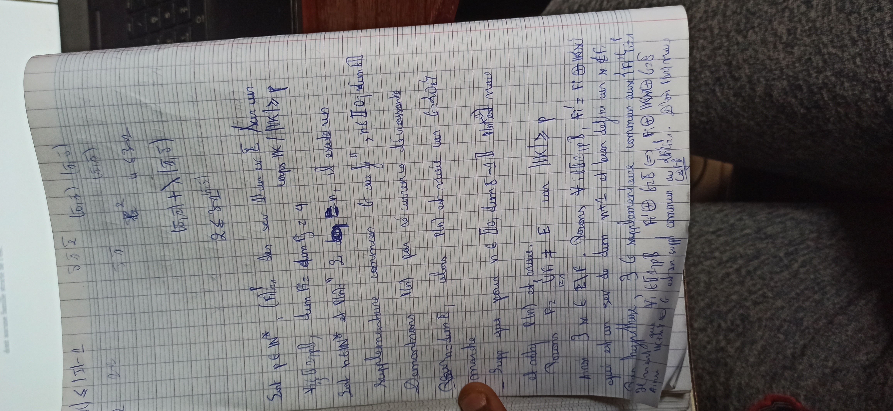
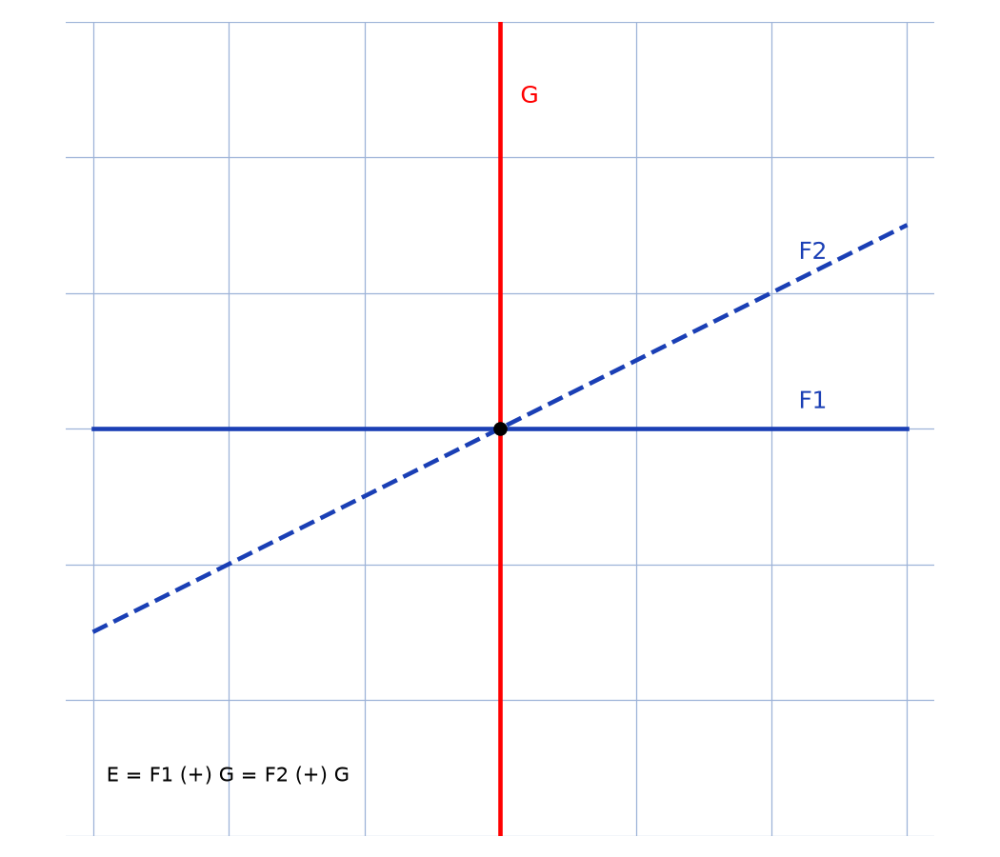

# Supplémentaire commun — transcription fidèle

> Source : `supplementaire-commun.jpg` (1 page, photo pivotée 90° — redressée pour lecture).
> Encre bleue sur papier quadrillé. Lisibilité ~55 % — plusieurs passages très incertains.

## Page 1 — transcription fidèle

[En haut, calculs marginaux d'un autre exercice :] $(5, 2)$ $(5, 3)$ [lecture incertaine] $2 \leqslant 3$ [lecture incertaine] $(5, 2) + (5, 3)$ [lecture incertaine] $2 \leqslant 3$ [lecture incertaine]

Soit $p \in \mathbb{N}^*$, $(F_i)$ [lecture incertaine] des sev ? [lecture incertaine] $E$ sur un corps $\mathbb{K}$ / $\|K\| \geqslant$ [lecture incertaine] $p$ [reconstruction — motif : hypothèse de cardinalité classique de l'exercice]

$\dim E_1$ [lecture incertaine] $= \dim E_2$ [lecture incertaine] $= q$ [lecture incertaine]

Soit $n \in \mathbb{N}^*$ et $P(n)$ : Si [suite très incertaine — « … »], il existe un supplémentaire commun $G$ [à des sev de dimension $n$] [reconstruction — motif : titre du dossier et suite de la preuve], $n \in \mathbb{N}$ [lecture incertaine], $\dim$ [suite illisible]

Supplémentaire commun $G$ [répété — titre de la preuve]

Démontrons $N(n)$ [lecture incertaine — « $P(n)$ » probable] par récurrence décroissante [\*sic\* — « décroissante » ; forme de récurrence descendante sur la dimension]

[Si $n =$] $\dim E$, alors $P(n)$ est vraie car $G =$ [illisible — « $\{0\}$ » probable] [reconstruction — motif : seul supplémentaire en dimension maximale] montre [lecture incertaine]

— Supp que pour $n \in$ [illisible], $\dim E - 1$ [lecture incertaine] [la propriété] est vraie.

et donc $P(n)$ est vraie. [lecture incertaine — articulation de l'hérédité]

Posons $P_2$ [lecture incertaine], $U_{i \ne 1}$ [lecture incertaine] $E$ un $\|K\| \geqslant p$ [lecture incertaine — hypothèse de cardinalité réutilisée]

Alors $\exists x \in E \setminus F$. Posons $F_1' = F_1 \oplus Kx$ [lecture incertaine sur les noms]

qui est un sev de dim $n+1$ et bien défini car $x \notin F_1$ [reconstruction — motif : justification standard]

Par hypothèse, $\exists G$ supplémentaire commun aux [sev cités et à] $F_1'$ [lecture incertaine]

[Par …] $A_1$ [lecture incertaine] $G$ [symbole $\oplus$ probable] $B$ [lecture incertaine] $\Rightarrow F_1' \oplus G = E \Rightarrow$ [suite illisible]

… $G$ … $\Rightarrow$ … $= B$ [lecture incertaine — fin de la chaîne d'égalités]

… au … D'où … [fin illisible ; paraphe de validation]

## Figures

Pas de schéma géométrique sur le manuscrit (texte seul). Reproduction illustrative du propos (deux droites $F_1, F_2$ et leurs supplémentaires, dont un commun $G$) :

*Script : `~/KpihX-Labs/Explore/lab/scripts/reproduce_supplementaire-commun_1.py` — plan $E = \mathbb{R}^2$, droites $F_1, F_2$ et droite $G$ supplémentaire commune.*

## Vocabulaire / notions

- Sous-espace vectoriel (sev), dimension, somme directe $\oplus$.
- Supplémentaire (commun à une famille de sev).
- Récurrence (descendante/décroissante), hypothèse de cardinalité sur $\mathbb{K}$.
