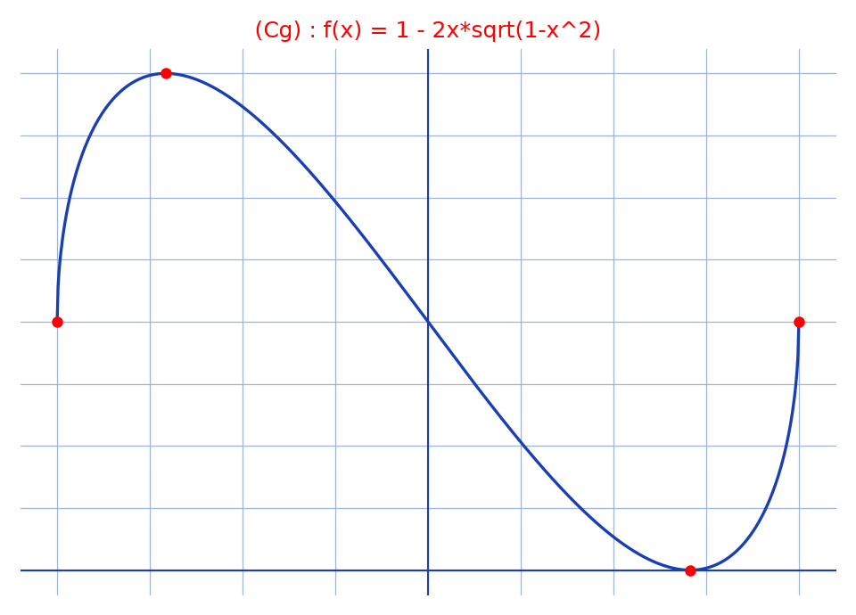

# Accroissements finis (Rolle, TAF, étude et primitive) — transcription fidèle

> 🧾 **Manuscrit original :** `accroissements-finis.pdf` (scan, 4 pages, encre bleue sur papier ligné ; pli de reliure sur la page 2) · ✍️ KpihX
> 🔍 **Statut :** lisible (~75 %), transcrit fidèlement. Page 1 : deux applications de Rolle/TVI à $g(x) = 2x^4+x$. Page 2 : moyenne de dérivées et TVI sur $f'$ (pli masquant un membre), puis étude de $f(x) = 1-2x\sqrt{1-x^2}$ avec tableau et courbe $(C_g)$. Pages 3–4 : primitive de $\sqrt{4\theta^2-25}$ par $\arg\cosh$.
> 📄 **Source scannée :** [`accroissements-finis.pdf`](accroissements-finis.pdf) (restaurée Datas1, vérifiée pdfinfo, 2026-09-07)

---

## Page 1 — Deux zéros de dérivée pour $g$

[haut de page rogné — fin d'un calcul précédent : « …Posons $g(x) = $ … » ; avec les valeurs ci-dessous, $g(x) = 2x^4+x$]

1/a) Cherchons $c \in ]-1, 0[ / g'(c) = 0$

Ona : $g$ est $C^1$ sur $[-1, 0]$ comme somme de fonctions $C^1$ sur $[-1, 0]$

Car $g(-1) = g(0)$ [lecture incertaine — on lit aussi bien « $g(1) - g(0)$ » ; voir notes]

1/b) Cherchons $c \in ]-1, 1[ / g'(c) = 0$ [lecture incertaine — l'intervalle et le prime sont empâtés]

ona : $g(-1) = 2(-1)^4 + (-1)$ [un tracé parasite après $(-1)$] $= 1$

$g(0) = 0$ ; $g(1) = 3$

Ona : $g$ est continue sur $[-1, 0]$ comme somme de fonctions continues sur $[-1, 0]$

D'après le théorème des valeurs intermédiaires :

- car $0,5 \in ]g(0), g(-1)[$, $\exists c_1 \in ]-1, 0[ / g(c_1) = 0,5$
- car $0,5 \in ]g(0), g(1)[$, $\exists c_2 \in ]0, 1[ / g(c_2) = 0,5$

Ainsi $g(c_1) = g(c_2) = 0,5$. Car $g$ est $C^1$ sur $]-1, 1[$ comme somme de fonctions $C^1$, alors d'après le théorème de Rolle, $\exists c \in ]-1, 1[ / g'(c) = 0$ CQFD [souligné]

---

## Page 2 — Moyenne de dérivées, étude de $f$ et courbe $(C_g)$

b) Montrons cela.

Cherchons $c \in ]0, u[ / f'(c) = \frac{2f(u) + u f'(u)}{3u} = \overbrace{\frac{1}{3}(f'(c_1) + f'(c_2) + f'(u))}^{\alpha}$ [lecture incertaine — le membre central est masqué par le pli de la reliure ; reconstitué d'après la ligne « Ainsi » ci-dessous]

Car $f$ $C^1$ sur $[0, u]$, $\exists c_1 \in ]0, u[ / f'(c_1)$ car $\frac{f(u)-f(0)}{u-0} = \frac{f(u)}{u}$ [*sic* — lire « $=$ » au lieu de « car »]

Ainsi $f'(c) = \underbrace{\frac{1}{3}(f'(c_1) + f'(c_2) + f'(u))}_{\alpha}$ (d'après Théo des Accroissements finis)

Car $\alpha$ est la moyenne arithmétique de $f'(c_1)$, $f'(c_2)$ et $f'(u)$ alors $\alpha$ est entre $f'(c_1)$ et $f'(u)$.

Car $f$ est $C^1$, alors $f'$ est continue sur $[0, u]$ ; d'après le théo des valeurs intermédiaires $\exists c_2 \in [c_1, u] / f'(c_2) = \alpha$ [*sic* — $c_2$ désigne déjà un point du TAF dans la moyenne ci-dessus].

Car $[c_1, u] \subset ]0, u[$ il suffit alors de prendre $c = c_2$ [« $c_2$ » souligné d'une flèche]

2/ $f(x) = 1 - 2x\sqrt{1-x^2}$

. $D_f = [-1, 1]$. $f$ est dérivable sur $]-1, 1[$ comme somme et produit de fonctions dérivables sur $]-1, 1[$

Ainsi $\forall x \in ]-1, 1[$, $f'(x) = -2\left[(\sqrt{1-x^2})' + x\frac{1-2x}{2\sqrt{1-x^2}}\right]$ [lecture incertaine — le numérateur $1-2x$ est empâté]

$$= \frac{2(2x^2-1)}{\sqrt{1-x^2}}$$

Tableau [bas du tableau partiellement rogné] :

| $x$ | $-1$ | $-1/\sqrt{2}$ | $1/\sqrt{2}$ | $1$ |
|---|---|---|---|---|
| $f'(x)$ | $+$ | $0$ | $-$ | $0$ | $+$ |
| $f(x)$ | $1$ | $\nearrow 2 \searrow$ | $0$ | $\nearrow 1$ |

[courbe $(C_g)$ : axes $x$ (de $-1$ à $1$) et $y$ ; part de $(-1,1)$, maximum $(-1/\sqrt{2},2)$, passe en $(0,1)$, minimum $(1/\sqrt{2},0)$, finit en $(1,1)$]

*Figure reproduite : `courbe-cg.png` (script `reproduce_accroissements-finis_1.py`) — la description manuscrite ci-dessus est conservée.*

---

## Page 3 — Primitive de $\sqrt{4\theta^2-25}$ sur $]5/2, +\infty[$

[haut de page rogné — fin du calcul précédent : « … $= $ …$/2$ »]

③ $\int \sqrt{4\theta^2-25}\,d\theta$, $\theta \in ]-\infty, -5/2[ \cup ]5/2, +\infty[$

$= 5\int \sqrt{(\frac{2}{5}\theta)^2-1}\,d\theta$

[en marge : $= \ln(\frac{2}{5}\theta + \sqrt{\frac{4}{25}\theta^2-1})$ — calcul partiel, lecture incertaine]

. Pour $\theta \in ]5/2, +\infty[$, posons $t = \arg\cosh(\frac{2}{5}\theta)$ qui est bien une bijection de $[5/2, +\infty[$ vers $[0, +\infty[$

Ona : $t = \arg\cosh(\frac{2}{5}\theta) \Rightarrow \frac{2}{5}\theta = \cosh t \Rightarrow d\theta = \frac{5}{2}\sinh t\,dt$

Ainsi $I(3) = \frac{25}{2}\int \sqrt{\cosh^2 t-1}\,\sinh t\,dt$

$= \frac{25}{2}\int \sinh^2 t\,dt$ car $\sqrt{\cosh^2 t-1}\,|\sinh t| = |\sinh t|\sinh t$ [le membre central est empâté] car $t \ge 0$

$= \frac{25}{2}\int \frac{\cosh 2t-1}{2}\,dt$

$I(3) = \frac{25}{4}(\frac{1}{2}\sinh 2t - t) + c$, $c \in \mathbb{R}$ [le facteur $25/4$ est peu lisible]

---

## Page 4 — Primitive sur $]-\infty, -5/2[$

[haut rogné : « … $\theta \mapsto -I(\theta)$ (car $I$ étant paire, toutes ses [primitives] sont impaires) »]

d'où [symbole raturé] $I_1(\theta) = -5\int \sqrt{(\frac{2}{5}\theta)^2-1}\,d\theta = -\frac{25}{8}($ [suite coupée]

$I_1(\theta) = \frac{25}{8}(-2\arg\cosh(\frac{2}{5}\theta) + \sinh(2\arg\cosh(\frac{2}{5}\theta))) + c$, $c \in \mathbb{R}$

. Pour $\theta \in ]-\infty, -5/2[$, en posons $u = -\theta \in [5/2, +\infty[$, ona $I_1(\theta) = -5\int \sqrt{(\frac{2}{5}u)^2-1}\,du$

$= -\frac{25}{8}(-2\arg\cosh(\frac{2}{5}u) + \sinh(2\arg\cosh(\frac{2}{5}u))) + c$, $c \in \mathbb{R}$ (d'après ce qui précède)

$= -\frac{25}{8}(-2\arg\cosh(-\frac{2}{5}\theta) + \sinh(2\arg\cosh(-\frac{2}{5}\theta))) + c$, $c \in \mathbb{R}$

---

## Figures

- p. 2, courbe $(C_g)$ de $f(x) = 1-2x\sqrt{1-x^2}$ : `assets/courbe-cg.png` — script `~/KpihX-Labs/Explore/lab/scripts/reproduce_accroissements-finis_1.py` (vérifié `uv run`, grille `#9db3d8`, `tick_params` sans étiquettes). Embed visible p. 2 (ligne 69). Aucune autre figure pp. 1–4 vérifiées sur rendus `/tmp/faf1/r150/` (p. 1, 3, 4 : texte seul).

## Vocabulaire

Rolle, TVI, TAF/accroissements finis, $C^1$, tableau de variations, courbe $(C_g)$, primitive, $\arg\cosh$, $\sinh$/$\cosh$, $CQFD$, $Ona$ (= On a).

## 📝 Notes de transcription (fidélité)

- Encre bleue sur papier ligné ; page 2 photographiée avec le pli de la reliure au milieu (membre central du calcul de $\alpha$ masqué, reconstitué d'après la ligne « Ainsi » et balisé).
- 1/a) : l'hypothèse de Rolle lue ($g(-1) = g(0)$) contredit les valeurs calculées en 1/b) ($g(-1) = 1$, $g(0) = 0$) — le tracé « $=$ / $-$ » et « $1$ / $-1$ » est ambigu, transcrit tel quel sans correction.
- Page 2, bas : collision de notations ($c_2$ dans la moyenne et $c_2$ point du TVI), conservée [*sic*].
- Notations d'origine : $Ona$, $Mq$ implicite, $C^1$/$C^2$, $CQFD$, virgule décimale ($0,5$), $\arg\cosh$/$\argch$, $\sinh$/$\sh$, $\cosh$/$\ch$.
- Figure : une seule — la courbe $(C_g)$ p. 2, reproduite en `assets/courbe-cg.png` via `~/KpihX-Labs/Explore/lab/scripts/reproduce_accroissements-finis_1.py` (`uv run`, style bleu/rouge + quadrille `#9db3d8`, PNG relu).
