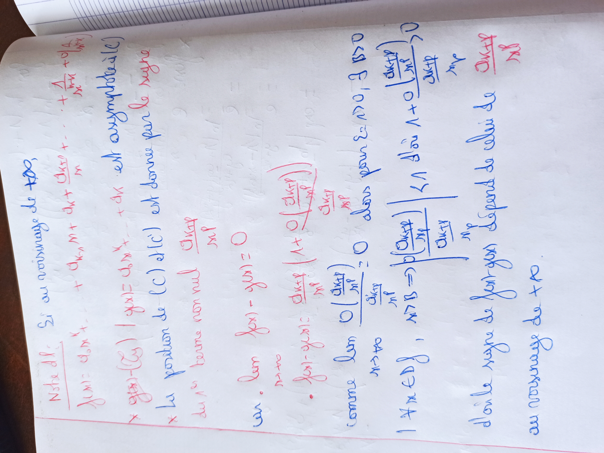
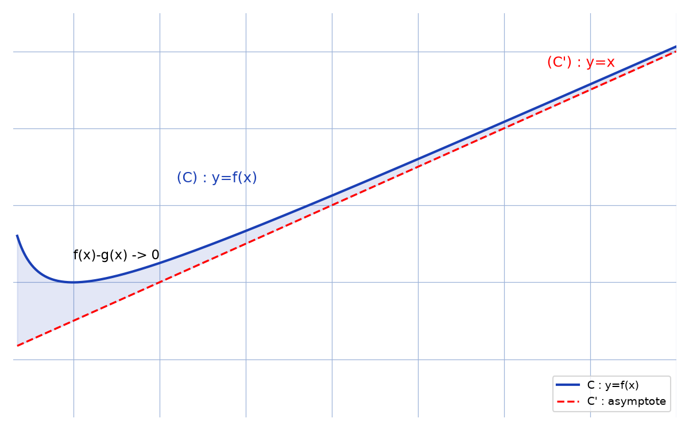

# Asymptotes et DL — transcription fidèle

> Source : `asymptotes-dl.jpg` (1 page, photo pivotée 90° — redressée pour lecture).
> Encre bleue (énoncé) + rouge (calculs). Lisibilité ~75 %.

## Page 1 — transcription fidèle

Notre dl : [lecture incertaine — « Nstre dl » sur l'original]

$y(x) = a_{n}x^{n} + \dots + a_{k+1}x^{k+1} + a_{k}x^{k} + \dots + \frac{\Delta}{x^{n}} + o\left(\frac{1}{x^{n}}\right)$ [lecture incertaine]

Si au voisinage de $+\infty$,

$\times \; (g(x) - f(x)) \mid g(x) = a_{n}x^{n} + \dots + a_{k} \dots$ est asymptotique [lecture incertaine]

$\times$ La position de $(C)$ [par rapport à] $d(C')$ est donnée par le signe [reconstruction — motif : suite logique « position de (C) par rapport à (C') »]

du $1^{er}$ terme non nul $\frac{\alpha x + p}{x^{p}}$ [lecture incertaine sur les lettres]

car $\lim f(x) - g(x) = 0$
$\;x \to +\infty$

$\cdot \; f(x) - g(x) : \frac{\alpha x + p}{x^{p}} \left(1 + o\left(\frac{\alpha x + p}{x^{p}}\right)\right)$ [lecture incertaine]

$\frac{\alpha x + p}{x^{p}}$

comme $\lim \frac{o\left(\frac{\alpha x + p}{x^{p}}\right)}{\frac{\alpha x + p}{x^{p}}} = 0$ alors pour $\varepsilon > 0$, $\exists R > 0$
$\;x \to +\infty$

$\mid A \times \dots \mid$, $\forall x$ [lecture incertaine — grand crochet bleu illisible en partie] $\left| \dots + o\left(\frac{\alpha x + p}{x^{p}}\right) \right| > 0$

$\frac{\alpha x + p}{x^{p}}$ [répété en marge]

donc le signe de $f(x) - g(x)$ dépend de celui de $\frac{\alpha x + p}{x^{p}}$

en voisinage de $+\infty$.

## Figures

Pas de schéma géométrique sur le manuscrit (texte seul). Reproduction illustrative du propos (courbe et son asymptote) :

*Script : `~/KpihX-Labs/Explore/lab/scripts/reproduce_asymptotes-dl_1.py` — $f(x) = x + 1/x$, asymptote $g(x) = x$, aire $f - g$ ombrée.*

## Vocabulaire / notions

- Développement limité (DL), voisinage de $+\infty$.
- Courbe asymptotique, écart $f(x) - g(x) \to 0$.
- Position relative de $(C)$ par rapport à $(C')$, signe du premier terme non nul.
- Notations $o(\cdot)$, $O(\cdot)$, limite de quotient.
