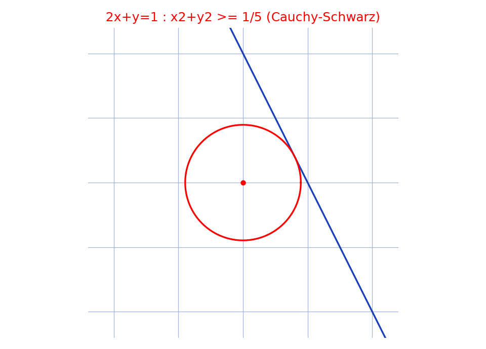

# Inégalité de Cauchy-Schwarz (cas $ax+by=1$) — transcription fidèle

> 🧾 **Photo originale :** `cauchy-schwarz-droite-disque.jpg` (4624×3472, stylo bleu sur feuille blanche pliée).
> 🔍 **Statut :** lisible (~80 %), transcrit mot à mot, incertitudes signalées.
> 📐 **Contenu :** $P$ : $ax+by=1 \Rightarrow Q$ : $\frac{1}{x^2+y^2} \le a^2+b^2$ (preuve avec absurde partiel).
> 🖼️ **Restauration :** copie de lecture `/tmp/pm/photo-juin2022_1.png` — transcription fidèle, rien d'inventé.

## Page 1 — transcription

a/ Mq $\forall a, b, x$ [lecture incertaine — `x` cursif ressemble à `m`], $y \in \mathbb{R}$, P: "$ax+by = 1$" $\Rightarrow$ Q: "$\frac{1}{x^2+y^2} \le a^2+b^2$"

$\forall a, b, x, y \in \mathbb{R}$ supposons que P soit vraie

on a : $ax+by = 1 \Rightarrow \{ a^2x^2 + b^2y^2 + 2abxy = 1$ [mise au carré]

$(x, y) \neq (0, 0)$ car sinon on aurait $0 + 0 = 1$ (Absurde)

$\Rightarrow \{ (x, y) \neq (0, 0)$

$a^2x^2 + b^2y^2 + 2abxy = 1$ car [raturé — `car` repassé, lu `can` avant correction]

$(ay - bx)^2 \ge 0$ (toujours vraie) [raturé — signe `-` repassé au stylo]

$\Rightarrow \{ x^2 + y^2 \neq 0$ car $x^2 + y^2 = 0 \Leftrightarrow (x, y) = (0, 0)$

$a^2x^2 + b^2y^2 + 2abxy = 1$

$a^2y^2 + b^2x^2 - 2abxy \ge 0$

$\Rightarrow \{ x^2 + y^2 \neq 0$

$a^2(x^2 + y^2) + b^2(x^2 + y^2) \ge 1$ [reconstruction — somme des deux lignes précédentes, $2abxy$ s'annule]

$\Rightarrow \{ x^2 + y^2 \neq 0$

$(x^2 + y^2)(a^2 + b^2) \ge 1$

$\Rightarrow \frac{1}{x^2+y^2} \le a^2 + b^2$

## Figures

Pas de schéma sur la page (calcul) : illustration du fond — la droite $ax+by=1$ reste hors du disque ouvert de rayon $1/\sqrt{a^2+b^2}$ (ex. $a=2$, $b=1$).

Reproduction (script `reproduce_cauchy-schwarz-droite-disque_1.py`, exécuté avec `uv run`) : droite bleue ($2x+y=1$), cercle rouge ($x^2+y^2=1/5$), quadrillage bleu `#9db3d8`. PNG relu et conforme.

## Vocabulaire / notions

- **Cauchy-Schwarz** : $(ax+by)^2 \le (a^2+b^2)(x^2+y^2)$, d'où le résultat avec $ax+by=1$.
- **Raisonnement par l'absurde (partiel)** : $(x, y) = (0, 0)$ est exclu car il donnerait $0 = 1$.
- **Astuce $(ay-bx)^2 \ge 0$** : ajoutée au carré développé, elle élimine le double produit et factorise $(x^2+y^2)(a^2+b^2) \ge 1$.
- **Normes** : $1/\sqrt{a^2+b^2}$ est la distance de l'origine à la droite $ax+by=1$.
