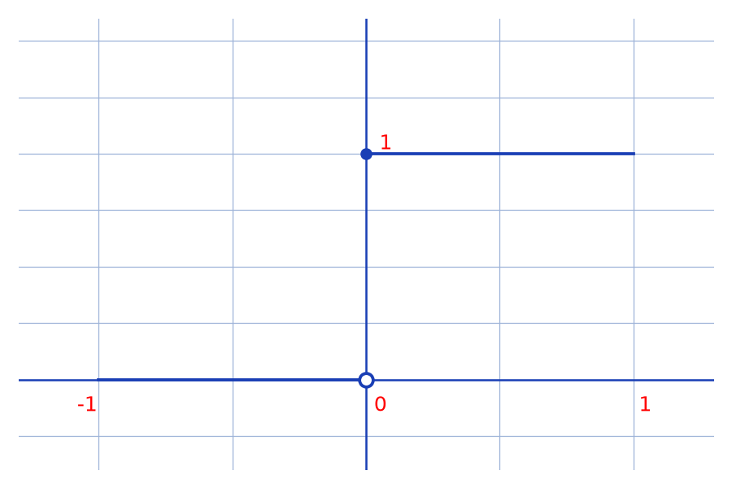
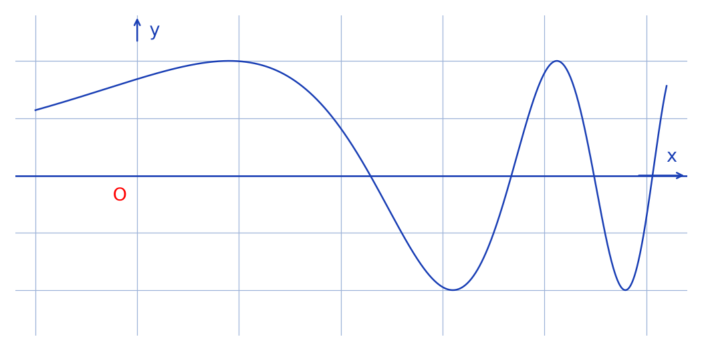

# Fonctions continues mais pas uniformément continues (Heine) — transcription fidèle

> 🧾 **Manuscrit original :** `continuite-uniforme-heine.pdf` (scan, 5 pages, encre bleue) · ✍️ KpihX
> 🔍 **Statut :** lisible (~85 %), transcrit mot à mot. Calculs d'analyse conservés tels quels ; ratures et passages incertains signalés. Deux croquis reproduits en figures.
> 📄 **Source scannée :** [`continuite-uniforme-heine.pdf`](continuite-uniforme-heine.pdf) (restaurée Datas1, vérifiée pdfinfo, 2026-09-07)

---

## Page 1 — Exemple 1 (palier) et début de l'exemple 2 ($x^2$)

Exples de fonctions continues mais pas uniformément [titre souligné ; fin probable « uniformément continues », rognée]

Exple 1

$$f(x) = \begin{cases} 0 \text{ si } x \in ]-1 ; 0[ \\ 1 \text{ si } x \in ]0 ; 1] \end{cases}, \text{ qui est continue mais pas uni [fin rognée — lire « uniformément continue »]}$$

[Figure : petit repère, graduations $-1$, $0$, $1$ en abscisse et $1$ en ordonnée ; palier $y = 0$ à gauche de $0$ (cercle ouvert en $0$), palier $y = 1$ à droite de $0$ — voir reproduction ci-dessous.]

En effet posons $\varepsilon = 0{,}5$, $\forall \eta > 0$.

En posant $x =$ [raturé] [lecture incertaine — « $\max$ … $-\eta/4$ »] et $y = -x =$ [lecture incertaine — « $\min$ d $\eta/4$ … »] on a bien $|y - x| < \eta$ mais pourtant $|f(y) - f(x)| = 1 > \varepsilon$

Pb : $]-1 ; 1[ \setminus \{0\}$ [lecture incertaine — l'ensemble est noté de façon compacte, il s'agit de l'intervalle privé de $0$] n'est pas fermé et donc pas un compact

Exple 2 | $f(x) = x^2 \quad x \in \mathbb{R}$ qui est continue mais pas uni [fin rognée — lire « uniformément continue »]

En effet en posant $\varepsilon = 1$, $\forall \eta > 0$. Cherchons $x, y \in \mathbb{R}$ / $|y - x| < \eta$ et $|f(x) - f(y)| > 1 = \varepsilon$

Pour simplifier la tâche on va prendre [raturé — « $x > 0$ »] et $y$ de la forme $y = x + h$ où $h > 0$.

Car on veut que $|y - x| < \eta$ alors [raturé] il suffit que $h < \eta$

De plus on veut $|f(y) - f(x)| > 1 \Leftrightarrow 2xh + h^2 > 1$

$$\Leftrightarrow x > \frac{1 - h^2}{2h}$$

Ainsi en prenant $h = \eta/2$, $x = \frac{1}{2h}$ et $y = x + h$

on a [raturé] $|y - x| < \eta$ et $|f(x) - f(y)| > \varepsilon = 1$

D'où $f$ non uniformément continue

Pb : $\mathbb{R}$ n'est pas borné et donc pas un compact

---

## Page 2 — Exemple 3 ($\sin(e^x)$, cas borné)

Exple 3 : $f(x) = \sin(e^x)$ (un cas où $f$ est même bornée) $f$ est bien continue mais pas uni [fin rognée — lire « uniformément continue »]

[Figure : courbe oscillante d'amplitude constante dont la fréquence augmente vers la droite, axes $y$ vertical et $x$ horizontal avec origine $O$ — voir reproduction ci-dessous.]

En effet posons $\varepsilon = 1$. Soit $\eta > 0$. Cherchons $x, y \in \mathbb{R}$ / $|x - y| < \eta$ et $|f(x) - f(y)| > \varepsilon = 1$

Pour faire simple on va chercher $x, y \geqslant 0$ de la forme $e^x = 2k\pi + \frac{\pi}{2}$ et $e^y = 2k'\pi$ ($k, k' \in \mathbb{N}$) et ainsi on aura bien $|f(x) - f(y)| = 1 \geqslant \varepsilon$

Or [raturé] on veut aussi $|x - y| < \eta \Leftrightarrow |\ln(2k\pi + \frac{\pi}{2}) - \ln(2k'\pi)| < \eta$

$$\Leftrightarrow -\eta < \ln\left(\frac{2k\pi + \pi/2}{2k'\pi}\right) < \eta$$

$$\Leftrightarrow e^{-\eta} 2k'\pi < 2k\pi + \pi/2 < e^{\eta} 2k'\pi$$

$$\Leftrightarrow e^{-\eta}k' - \frac{1}{4} < k < e^{\eta}k' - \frac{1}{4}$$

Ainsi pour que $k$ existe il suffit d'avoir $e^{\eta}k' - \frac{1}{4} - (e^{-\eta}k' - \frac{1}{4}) > 1$ et dans ce cas $k = E(e^{-\eta}k' - \frac{1}{4})$ [$E$ = partie entière] si $e^{-\eta}k' - \frac{1}{4} \notin \mathbb{N}$ et $e^{-\eta}k' - \frac{1}{4} + 1$ sinon

or $(I) \Leftrightarrow k' > \frac{1}{e^{\eta} - e^{-\eta}}$. Ainsi en prenant [lecture incertaine — « $k' > E\left(\frac{1}{e^{\eta} - e^{-\eta}}\right) +$ … »] $k$ ce défini plus haut, $x$ et $y$ se [lecture incertaine — suite en page 3] d'après ce qui

---

## Page 3 — Fin de l'exemple 3 et exemple 4 ($\sin(1/x)$)

[Début :] …cède, on aura bien $|x - y| < \eta$ et $|f(x) - f(y)| = 1 \geqslant \varepsilon$

CQFD

Pb : Bien que bornée $f$ n'est pas définie sur un ensemble borné et donc pas sur un compact

Exple 4 : $f(x) = \sin(1/x) \quad x \in ]0 ; 1[$

$f$ est bien continue sur $]0 ; 1[$ mais pas uni [fin rognée — lire « uniformément continue »].

En effet posons $\varepsilon = 1$. Soit $\eta > 0$. Cherchons $x, y \in \mathbb{R}$ / $|x - y| < \eta$ et $|f(x) - f(y)| > \varepsilon$

Pour faire simple on va de façon analogue chercher $x$ et $y$ de la forme $\frac{1}{x}$ [*sic* — manuscrit lu « $x$ », attendre $\frac{1}{x}$ par symétrie avec $\frac{1}{y}$ et la ligne 93] $= 2k\pi + \frac{\pi}{2}$ et $\frac{1}{y} = 2k'\pi$ et on aura bien si tel est le cas $|f(x) - f(y)| = 1 \geqslant \varepsilon$

Il ne reste plus qu'à avoir $|x - y| < \eta$

$$\Leftrightarrow -\eta < \frac{1}{2k\pi + \frac{\pi}{2}} - \frac{1}{2k'\pi} < \eta$$

$$\Leftrightarrow \left(\frac{1}{\eta + \frac{1}{2k'\pi}} - \frac{\pi}{2}\right) \times \frac{1}{2\pi} < k \quad (I_1) \text{ et } \frac{1}{2k\pi + \frac{\pi}{2}} > \frac{1}{2k'\pi} - \eta \quad (I_2)$$

Pour inverser $(I_2)$ et recoller la double inégalité, on va imposer la condition $\frac{1}{\dots}$ [lecture incertaine]. Pour se débarrasser de $I_2$, on va prendre $k'$ / $\frac{1}{2k'\pi} - \eta < 0 \Leftrightarrow k' > \frac{1}{2\pi\eta}$

---

## Page 4 — Fin de l'exemple 4 et conclusion

Ainsi en prenant $k' \geqslant E\left(\frac{1}{2\pi\eta}\right) + 2$ il ne suffit [*sic* — « il ne suffit alors plus que », lire « il ne reste plus qu'à »] alors plus que d'avoir $k > \frac{1}{2\pi\eta + \frac{1}{\dots}} - \frac{1}{4}$ [lecture incertaine — dénominateur partiellement lisible]

Au final en prenant $k = \max\{d\dots, E(\frac{1}{\dots} - \frac{1}{4}) + 1\}$ [lecture incertaine — formule de recollement partiellement lisible] on a bien le résultat escompté

Pb : Bien que $]0 ; 1[$ soit borné, ce n'est pas un fermé et donc pas compact

Conclusion : Tout semble à dire qu'une condition suffisante pour que uni $\Rightarrow$ continue [lire « continue $\Rightarrow$ uni » — ordre inversé dans le manuscrit, *sic*] est que $f$ soit définie sur un compact, ce qui fait bien l'objet du théorème de Heine

---

## Page 5 — Théorème de Heine

Théo de Heine : Soit $f : (E, d) \to (F, \delta)$ où $(E, d)$ est compact. Si $f$ est continue sur $(E, d)$, alors $f$ y est aussi uniformément continue.

En effet, supposons $f$ continue sur $(E, d)$.

Supposons par l'absurde que $f$ n'y est pas uniformément continue, alors $\exists \:\varepsilon > 0$ / $\forall \eta > 0 \:\exists \:x, y \in E$ / $d(x, y) < \eta$ et $\delta(f(x), f(y)) \geqslant \varepsilon$.

Considérons $\forall n \in \mathbb{N}$, $\eta_n = 1/n$. $\exists \:(x_n, y_n) \in E^2$ / $d(x_n, y_n) < \eta_n$ et $\delta(f(x_n), f(y_n)) \geqslant \varepsilon$.

$(x_n)_n$ est définie sur un compact [le mot « bornée » est raturé et remplacé par « définie sur un compact »] donc en vertu du théorème de Bolzano-Weierstrass, on peut en extraire une sous-suite $(x_{\varphi(n)})$ convergente vers un certain $x_l \in E$.

Or $\forall n \in \mathbb{N}$, $d(x_l, y_n) \leqslant d(x_l, x_n) + d(x_n, y_n) \underset{n \to +\infty}{\longrightarrow} 0$

d'où $y_n \to x_l$

Or comme $f$ continue en $x_l$ (car $x_l \in E$), $f(x_n), f(y_n) \to f(x_l)$

d'où $\lim \delta(f(x_n), f(y_n)) \geqslant \varepsilon \Rightarrow \delta(f(x_l), f(x_l)) \geqslant \varepsilon$

$\Rightarrow 0 \geqslant \varepsilon$ Absurde !

CQFD

---

## Figures

- p. 1, palier $0$ à gauche / $1$ à droite de $0$ : `assets/palier-0-1.png` — script `~/KpihX-Labs/Explore/lab/scripts/reproduce_continuite_uniforme_heine_1.py` (vérifié `uv run`, grille `#9db3d8`, `tick_params` sans étiquettes). Embed visible (ligne 19).
- p. 2, oscillations $\sin(e^x)$ fréquence croissante : `assets/sin-exp-oscillations.png` — script `~/KpihX-Labs/Explore/lab/scripts/reproduce_continuite_uniforme_heine_2.py` (vérifié `uv run`, même style). Embed visible (ligne 55). P. 3–5 non relues (limite 20 p.) — aucune autre figure mentionnée.

## Vocabulaire

continue / uniformément continue ($uni$), compact, $Exple$, $\varepsilon$/$\eta$, partie entière $E(\cdot)$, théorème de Heine, Bolzano-Weierstrass, $CQFD$.

## 📝 Notes de transcription (fidélité)

- Titre et « Exple » : abréviations d'origine conservées (« Exples », « Exple », « uni » en fin de ligne rognée).
- Page 1 : la construction explicite de $x$ et $y$ autour de $0$ (avec $\max$/$\min$ de $\pm\eta/4$) reste partiellement illisible (mots écrasés) ; l'idée ($|y - x| < \eta$ mais $|f(y) - f(x)| = 1$) est intacte.
- Page 2–3 : la condition $(I) \Leftrightarrow k' > 1/(e^{\eta} - e^{-\eta})$ puis le choix de $k'$ via la partie entière $E(\cdot)$ sont fidèlement transcrits ; la toute fin du choix de $k'$ déborde sur la page 3 (bord rogné).
- Page 3–4 : les étiquettes $(I_1)$, $(I_2)$ et la condition $k' > 1/(2\pi\eta)$ sont lisibles ; la formule finale de recollement de $k$ (avec $\max$) est estompée — signalée en lecture incertaine, rien d'inventé.
- Page 4, conclusion : le manuscrit écrit « uni $\Rightarrow$ continue » alors que le sens voulu est « continue $\Rightarrow$ uni » [*sic* — ordre inversé].
- Page 5 : « bornée » raturé au profit de « définie sur un compact » ; preuve du théorème de Heine complète jusqu'au CQFD.
- Chaque « Pb : … pas un compact » est une remarque d'origine (défaut de compacité : non fermé / non borné / non défini sur un borné).
