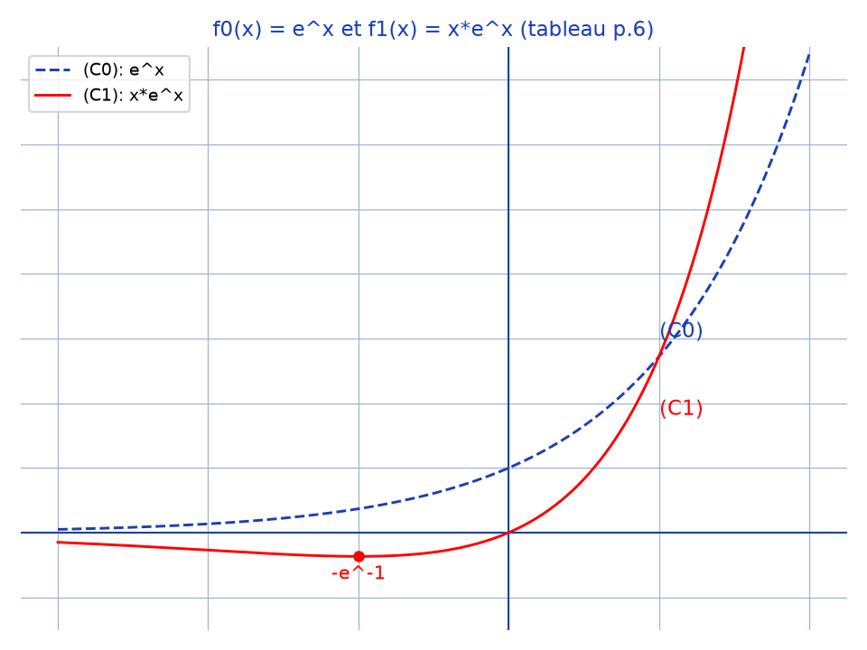

# Équation différentielle linéaire du troisième ordre — transcription fidèle

> 🧾 **Manuscrit original :** `edl-ordre-3.pdf` (scan, 7 pages : énoncé dactylographié p. 1–2 + corrigé manuscrit p. 3–7, encre bleue) · ✍️ KpihX
> 🔍 **Statut :** transcrit fidèlement ; le « O » de l'énoncé est lu tel quel [*sic* — probablement $\mathbb{R}$]. Ratures, rognés et fins de lignes masquées signalés ; rien d'inventé.
> 📄 **Source scannée :** [`edl-ordre-3.pdf`](edl-ordre-3.pdf) (restaurée Datas1, vérifiée `pdfinfo`, 2026-09-07)

---

## Page 1 — Énoncé (problème, partie A)

PROBLEME : Equation différentielle linéaire du troisième ordre

A-1) On rappelle que l'ensemble F des fonctions numériques à variable réelle, muni de l'addition et de la multiplication par un réel, est un espace vectoriel sur O.

a) Démontrer que l'ensemble G des fonctions numériques f définies par $f(x) = (ax^2 + bx + c)e^x$ où a, b et c sont des réels quelconques, est un sous-espace vectoriel de F.

b) On note $f_0, f_1, f_2$ les fonctions définies respectivement par : $\begin{cases} f_0(x) = e^x \\ f_1(x) = xe^x \\ f_2(x) = x^2e^x \end{cases}$. Montrer que $B = (f_0, f_1, f_2)$ est une base de G.

---

## Page 2 — Énoncé (suite A, B, C)

c) Donner dans la base de B les composantes de la fonction f définies par $f(x) = (ax^2 + bx + x)e^x$ [*sic* — dernier terme lu $x$, attendre $c$].

2-Soit D l'application qui à toute fonction f de G fait correspondre sa fonction dérivée f. [*sic* — lire $f'$]

a) Vérifier que $f'$ appartient à G.

b) Démontrer que D est un endomorphisme de G.

c) Déterminer les composantes de $D(f_0), D(f_1)$ et $D(f_2)$ dans la base B.

d) Démontrer que D est bijectif.

e) Déterminer les composantes de $D^{-1}(f_0), D^{-1}(f_1)$ et $D^{-1}(f_2)$ dans la base B.

$D^{-1}$ étant l'application réciproque de d. [*sic* — lire D]

B.1) Etudier les variations de la fonction $f_1$ et représenter son graphe $(C_1)$ dans un repère orthonormé. (Unité de longueur : 1cm). Représenter dans le même repère le graphe $(C_0)$ de la fonction $f_0$.

2) Soit m un nombre réel positif. L'unité d'aire étant le centimètre carré, calculer l'aire A(m) de la portion de plan limitée par les courbes $(C_0)$ et $(C_1)$ et les droites d'équations $x = -m$ et $x = l$. [*sic* — lire $x = 1$] Cette aire a-t-elle une limite lorsque m tend vers $+\infty$ ?

C. Soit E l'ensemble des fonctions numériques d'une variable réelle x définies sur O, trois fois dérivables sur O et telles que : $\forall x \in O, f'''(x) - 3f''(x) + f'(x) - f(x) = 0$.

1-Déterminer $k \in O$ pour que la fonction qui à x associe $e^{kx}$ soit élément de E.

2-Soit g la fonction définie par $g(x) = \frac{f(x)}{e^x}$, où f appartient à E. Montrer que g est trois fois dérivables sur O et que $\forall x \in O, g'''(x) = 0$. En déduire la forme générale des fonctions g, puis celle des fonctions f de l'ensemble E.

---

## Page 3 — Corrigé A-1 a) et b)

[haut de page : fragment d'une autre feuille (physique) — « $\Rightarrow A^2 = \frac{1}{K} \times \frac{m_p^2 v_p^2}{(m_p+m)^n}$ ; $\Rightarrow A = \frac{m_p v_p}{\sqrt{K(m_0+m)}}$ » (hors manuscrit)].

Problème :

A-1/

a) Démontrons que G est un s.e.v de F

* On a : $O_F : \mathbb{R} \longrightarrow \mathbb{R}$ / $x \longmapsto O_F(x) = 0$ est une fonction de G car $\forall x \in \mathbb{R}$, $O_F(x) = (0x^2+0x+0)e^x$ [fin de ligne rognée]. Alors $G \neq \varnothing$

* De plus $\forall (\alpha,\beta) \in \mathbb{R}^2$, $f, g \in G$, $\exists a,b,c,a',b',c' \in \mathbb{R}$ / $\forall x \in \mathbb{R}$, $f(x) = (ax^2+bx+c)e^x$ et $g(x) = (a'x^2+b'x+c')e^x$ [fin de ligne rognée].

- $D_{\alpha f+\beta g} = D_f \cap D_g = \mathbb{R}$ ainsi $\alpha f+\beta g$ est définie sur $\mathbb{R}$
- $\forall x \in \mathbb{R}$, $(\alpha f+\beta g)(x) = \alpha f(x) + \beta g(x) = \alpha(ax^2+bx+c)e^x + \beta(a'x^2+b'x+c')e^x$

ainsi $(\alpha f+\beta g)(x) = [(\alpha a+\beta a')x^2+(\alpha b+\beta b')x+(\alpha c+\beta c')]e^x$

Comme $\alpha a+\beta a'$, $\alpha b+\beta b'$, $\alpha c+\beta c' \in \mathbb{R}$ alors $\alpha f+\beta g \in G$ ; ainsi G est stable pour les combinaisons linéaires.

* Par conséquent G est un s.e.v de F

b) Montrons que $B = (f_0, f_1, f_2)$ est une base de G

* Soit $f : \mathbb{R} \longmapsto \mathbb{R}$ / $x \mapsto f(x) = ax^2+bx+c$ [*sic* — le facteur $e^x$ manque sur cette ligne, il réapparaît à la ligne suivante], $a,b,c \in \mathbb{R}$ ; une fonction de G.

$\forall x \in \mathbb{R}$, $f(x) = ax^2e^x + bxe^x + ce^x = af_2(x) + bf_1(x) + cf_0(x)$

Alors comme $a,b,c \in \mathbb{R}$, $(f_0, f_1, f_2)$ est une famille génératrice de G.

* Soit $\alpha, \beta, \gamma \in \mathbb{R}$ / $\alpha f_0 + \beta f_1 + \gamma f_2 = O_F$

$\forall x \in \mathbb{R}$, $(\alpha f_0 + \beta f_1 + \gamma f_2)(x) = O_F(x) \iff \alpha f_0(x) + \beta f_1(x) + \gamma f_2(x) = 0$
$\iff e^x(\alpha + \beta x + \gamma x^2) = 0$
$\iff \alpha + \beta x + \gamma x^2 = 0$ car $\forall x \in \mathbb{R}$, $e^x \neq 0$
$\iff \alpha = \beta = \gamma = 0$ car les fonctions $x \mapsto 1$, $x \mapsto x$, $x \mapsto x^2$ sont linéairement indépendantes ; ainsi B est libre.

- Donc B est une base de G

---

## Page 4 — Corrigé A c), 2 a) et b)

[haut de page : même fragment de physique (hors manuscrit).]

c) Composantes de f. $f(x) = (ax^2+bx+c)e^x$

D'après b), $\forall x \in \mathbb{R}$, $f(x) = af_2(x) + bf_1(x) + cf_0(x)$. Donc f a pour composantes $(c \,; b \,; a)$ dans la base B.

2/a) Vérifions que $f' \in G$

Soit $f : x \mapsto (ax^2+bx+c)e^x$, un élément de G avec $a,b,c \in \mathbb{R}$.

f est dérivable sur $\mathbb{R}$ comme produit de fonctions dérivables sur $\mathbb{R}$ [fin de ligne rognée].

ainsi $f'$ est définie sur $\mathbb{R}$, et $\forall x \in \mathbb{R}$, $f'(x) = (2ax+b)e^x + (ax^2+bx+c)e^x$

ainsi $f'(x) = (ax^2+(2a+b)x+(b+c))e^x$

comme $a$, $2a+b$, $b+c \in \mathbb{R}$, alors $f' \in G$.

b) Démontrons que D est un endomorphisme

Soient $f : x \mapsto (ax^2+bx+c)e^x$ et $g : x \mapsto (a'x^2+b'x+c')e^x$ ($a,b,c,a',b',c' \in \mathbb{R}$), 2 fonctions de G. Soient $\alpha, \beta \in \mathbb{R}$

f et g sont dérivables sur $\mathbb{R}$ comme produits de fonctions [dérivables — fin rognée]

et $\forall x \in \mathbb{R}$, $f'(x) = (ax^2+(2a+b)x+(b+c))e^x$, $g'(x) = (a'x^2+(2a'+b')x+(b'+c'))e^x$

ainsi $D(f) = f'$ et $D(g) = g'$

* Montrons que $D(\alpha f + \beta g) = \alpha f' + \beta g'$

$\forall x \in \mathbb{R}$, la fonction $(\alpha f + \beta g)(x) = \alpha f(x) + \beta g(x)$ est dérivable sur $\mathbb{R}$ comme somme de fonctions dérivables sur $\mathbb{R}$

et $\forall x \in \mathbb{R}$, $(\alpha f + \beta g)'(x) = \alpha f'(x) + \beta g'(x)$

ainsi $D((\alpha f + \beta g)) = (\alpha f + \beta g)' = \alpha f' + \beta g' = \alpha D(f) + \beta D(g)$

Donc D est un endomorphisme de G.

c) Composantes de $D(f_0)$, $D(f_1)$ et $D(f_2)$ [suite page suivante] : [raturé — « produit de »] $f_0$, $f_1$ et $f_2$ sont dérivables sur $\mathbb{R}$ comme fonctions produit de [fonctions] polynômes [et fonctions exponentielles] dérivables [mots en exposant/rature — lecture incertaine].

---

## Page 5 — Corrigé A 2 c), d), e) et début B

[haut de page : même fragment de physique (hors manuscrit).]

et $\forall x \in \mathbb{R}$, $f_0'(x) = e^x$ ainsi $D(f_0) = f_0$ d'où $D(f_0)$ $(1 \,; 0 \,; 0)$

$f_1'(x) = e^x + xe^x = f_0(x) + f_1(x)$ d'où $D(f_1)$ $(1 \,; 1 \,; 0)$

$f_2'(x) = 2xe^x + x^2e^x = 2f_1(x) + f_2(x)$ d'où $D(f_2)$ $(0 \,; 2 \,; 1)$

d) Démontrons que D est bijective

Comme $D(f_0)$ $(1;0;0)$, $D(f_1)$ $(1;1;0)$ et $D(f_2)$ $(0;2;1)$ alors la matrice de D dans B est $M = \begin{pmatrix} 1 & 1 & 0 \\ 0 & 1 & 2 \\ 0 & 0 & 1 \end{pmatrix}$ et $\det(M) = 1\times(1\times1-0) - 1\times(1\times0-0) + 0\times(0-0) \neq 0$ [détail du calcul peu lisible — lu par le contexte].

Alors D est bijective.

e) Composantes de $D^{-1}(f_0)$, $D^{-1}(f_1)$ et $D^{-1}(f_2)$ dans la base B

[raturé : « Posons $F_0 = D^{-1}(f_0)$, $\forall x \in$ … »]

On a : $D(D^{-1}(f_0)) = f_0 \Rightarrow (D^{-1}(f_0))' = f_0$
$\Rightarrow \forall x \in \mathbb{R}$, $D^{-1}(f_0)(x) = \int e^x dx = e^x + C = f_0(x) + C$

or $D^{-1}(f_0) \in G$ ainsi $C = 0$. Par conséquent $D^{-1}(f_0)$ $(1 \,; 0 \,; 0)$.

De même $D(D^{-1}(f_1)) = f_1 \Rightarrow \forall x \in \mathbb{R}$, $D^{-1}(f_1)(x) = \int xe^x dx = xe^x - \int e^x dx = xe^x - e^x + C$

ainsi $D^{-1}(f_1)(x) = -f_0(x) + f_1(x) + C$.

Comme $D^{-1}(f_1) \in G$ alors $C = 0$. Donc $D^{-1}(f_1)$ $(-1 \,; 1 \,; 0)$.

De surcroît, $D(D^{-1}(f_2)) = f_2 \Rightarrow \forall x \in \mathbb{R}$, $D^{-1}(f_2)(x) = \int x^2e^x dx = x^2e^x - 2\int xe^x dx$ [avec $\int xe^x dx = D^{-1}(f_1)(x)$]

ainsi $D^{-1}(f_2)(x) = x^2e^x - 2(-f_0(x) + f_1(x))$ [constante nulle car $D^{-1}(f_2) \in G$].

Donc $D^{-1}(f_2)$ $(2 \,; -2 \,; 1)$.

B.1) Variations et représentation de $f_1$

$\forall x \in \mathbb{R}$, $f_1(x) = xe^x$. $f_1$ est définie et dérivable sur $\mathbb{R}$ comme produit [de fonctions — suite page suivante].

---

## Page 6 — Corrigé B (variations, graphe, aire) et début C

[haut de page : même fragment de physique (hors manuscrit).]

de fonctions ; ainsi $\forall x \in \mathbb{R}$, $f_1'(x) = e^x(x+1)$.

| $x$ | $-\infty$ | $-1$ | $+\infty$ | $\lim_{x\to-\infty} xe^x = 0$ |
|---|---|---|---|---|
| $f_1'(x)$ | $-$ | $0$ | $+$ | $f_1(-1) = -e^{-1}$ |
| $f_1(x)$ | $0 \searrow$ | $-e^{-1}$ | $\nearrow +\infty$ | $\lim_{x\to+\infty} xe^x = +\infty$ |

[tableau manuscrit : $f_1$ décroît de $0$ à $-e^{-1}$ puis croît vers $+\infty$.]

Graphe : repère orthonormé, $(C_0)$ en pointillés [bleu — lu par le contexte] et $(C_1)$ en trait continu, $(C_1)$ sous $(C_0)$, minimum en $(-1, -e^{-1})$, les deux courbes se rejoignent vers $+\infty$ ; $(C_1)$ s'écrase sur l'axe des abscisses vers $-\infty$.

*Description : reproduction par script (`reproduce_edl-ordre-3_1.py`, matplotlib) : $f_0(x) = e^x$ en bleu pointillés $(C_0)$, $f_1(x) = xe^x$ en rouge $(C_1)$, minimum $-e^{-1}$ en $x = -1$ marqué d'un point rouge.*

2/ Calculons A(m)

$\forall m \in \mathbb{R}^+_*$, $A(m) = \int_{-m}^{1} (f_0(x)-f_1(x)) dx$ u.a $= [D^{-1}(f_0) - D^{-1}(f_1)]_{-m}^{1}$ u.a $= [e^x - xe^x + e^x]_{-m}^{1}$ u.a [lu tel quel]
$= (2e - e - 2e^{-m} + me^{-m})$ cm² car 1 u.a = 1 cm² [signe de $+me^{-m}$ lu tel quel — *sic*].

Donc $A(m) = [-e^{-m}(m+2) + e]$ [encadré].

* Comme $\lim_{m\to+\infty} A(m) = \lim_{m\to+\infty} me^{-m} \times \frac{-(m+2)}{-m} + e$ où $m = -m$ [lu tel quel — passage confus] $= 0 \times (\frac{-1}{-1}) + e$ [lu par le contexte]

$\lim_{m\to+\infty} A(m) = e$ alors A(m) a bel et bien une limite en $+\infty$ (car $e \in \mathbb{R}$).

C/1/ Déterminons k où $g \in E$ [lu « Déterminons k … où $g \in E$ » — *sic*, lire $e^{kx} \in E$].

Soit $g : x \mapsto e^{kx}$, $k \in \mathbb{R}$. $g$ est trois fois dérivable sur $\mathbb{R}$ comme fonction exponentielle

et $\forall x \in \mathbb{R}$, $g'(x) = ke^{kx}$, $g''(x) = k^2e^{kx}$ et $g'''(x) = k^3e^{kx}$ [en marge à droite : calcul raturé « car … $k^3-3k^2+3k-1 = 0$ … $(k-1)^3 = 0$ … $k^2-3k+1 = 0$ »].

$g \in E \iff \forall x \in \mathbb{R}$, $k^3e^{kx} - 3k^2e^{kx} + 3ke^{kx} - e^{kx} = 0$
$\iff \forall x \in \mathbb{R}$, $k^3-3k^2+3k-1 = 0$ car $e^{kx} \neq 0$
$\iff (k-1)^3 = 0$
$\iff$ [calcul du discriminant raturé] $\iff \forall x \in \mathbb{R}$, $\boxed{k = 1}$ car $k \in \mathbb{R}$ [le « $\forall x \in \mathbb{R}$ » est lu tel quel].

2/ * Montrons que $g$ [raturé] est trois fois dérivable sur $\mathbb{R}$ et que $\forall x \in \mathbb{R}$, $g'''(x) = 0$ [suite page suivante].

[marge droite : fragment imprimé « 123 JN DO … » (hors manuscrit).]

---

## Page 7 — Corrigé C 2) (forme générale de E)

[haut de page : même fragment de physique (hors manuscrit).]

$\forall x \in \mathbb{R}$, $g(x) = f(x)e^{-x}$ où $f \in E$.

ainsi g est 3 fois dérivable sur $\mathbb{R}$ comme produit de fonctions 3 fois dérivables sur $\mathbb{R}$.

ainsi $\forall x \in \mathbb{R}$, $g'(x) = f'(x)e^{-x} - e^{-x}f(x) = e^{-x}(f'(x)-f(x))$

$g''(x) = -e^{-x}(f'(x)-f(x)) + e^{-x}(f''(x)-f'(x)) = e^{-x}(f''(x)-2f'(x)+f(x))$

$g'''(x) = -e^{-x}(f''(x)-2f'(x)+f(x)) + e^{-x}(f'''(x)-2f''(x)+f'(x))$
$= e^{-x}(f'''(x)-3f''(x)+3f'(x)-f(x))$

$\boxed{\text{Donc } \forall x \in \mathbb{R}, g'''(x) = 0}$ car $f \in E$.

* Déduction

$\forall x \in \mathbb{R}$, $g'''(x) = 0 \iff \forall x \in \mathbb{R}$, $g''(x) = c_1$, $c_1 \in \mathbb{R}$
$\iff \forall x \in \mathbb{R}$, $g'(x) = c_1x+c_2$, $c_1, c_2 \in \mathbb{R}$
$\iff \forall x \in \mathbb{R}$, $g(x) = \frac{1}{2}c_1x^2+c_2x+c_3$, $c_1, c_2, c_3 \in \mathbb{R}$.

Donc les fonctions g cherchées sont de forme générale : $g : x \mapsto ax^2+bx+c$, $a,b,c \in \mathbb{R}$.

* forme générale de f

$\forall x \in \mathbb{R}$, $\exists a,b,c \in \mathbb{R}$, $g(x) = ax^2+bx+c \iff f(x) = e^x(ax^2+bx+c)$, $a,b,c \in \mathbb{R}$.

Donc $\boxed{E = \left\{f : \mathbb{R} \longrightarrow \mathbb{R} \;/\; x \mapsto f(x) = e^x(ax^2+bx+c), \; a,b,c \in \mathbb{R}\right\}}$ [encadré, souligné].

---

## Figures

- p. 6, graphes $(C_0)$/$ (C_1)$ de $f_0(x)=e^x$ et $f_1(x)=xe^x$ + tableau de variations : `assets/courbes-c0-c1.png` — script `~/KpihX-Labs/Explore/lab/scripts/reproduce_edl-ordre-3_1.py` (vérifié `uv run`, grille `#9db3d8`, `tick_params` sans étiquettes). Embed visible (ligne 195). P. 2–5, p. 7 non relues (limite 20 p.) — aucune autre figure mentionnée.

> 🗑️ **Doublon éliminé (2026-09-07) :** `../fonctions-espaces-vectoriels/fonctions-espaces-vectoriels.pdf` — md5 identique (`7940fc639918823f86cee2ea5215fb80`), PNG `assets/courbes-c0-c1.png` byte-identique (`dab41191f162b10bf23602dfff1d4339`, 1 seul conservé ici), md texte identique (±3 lignes d'en-tête/Figures/Vocabulaire), rendus p.1+p.6 pixel-identiques (`/tmp/mdt/E-*.png`). Dossier `fonctions-espaces-vectoriels/` supprimé, ce dossier (nom exact) est conservé.

## Vocabulaire

EDL 3e ordre, s.e.v, base $B=(f_0,f_1,f_2)$, endomorphisme $D$, bijectif, $D^{-1}$, tableau de variations, aire $A(m)$, $u.a$, $O$ (= $\mathbb{R}$, *sic* énoncé).

## 📝 Notes de transcription (fidélité)

- P. 1–2 : énoncé dactylographié ; le « O » (ensemble de définition, corps des scalaires) est conservé tel quel — probablement $\mathbb{R}$ mal rendu par le scan.
- P. 3–7 : corrigé manuscrit à l'encre bleue ; haut de chaque page : bande d'une autre feuille de physique (formule en $m_p v_p$) + portée musicale en p. 6–7 (hors manuscrit, non transcrite sauf mention).
- Figure p. 6 (tableau de variations + repère $(C_0)$/$(C_1)$) : tableau transcrit en markdown, graphe reproduit par script (voir ci-dessus) ; le tracé d'origine est très pâle et approximatif.
- En p. 6, le calcul de $\lim A(m)$ passe par une forme intermédiaire confuse (« où $m = -m$ ») : transcrite telle quelle.
- Marge droite de p. 6 (bas) : calcul du discriminant de $(k-1)^3 = 0$ raturé au stylo + fragment imprimé collé ; contenus raturés non reconstitués.
- $D$ désigne la dérivation sur $G$ ; $D^{-1}$ sa réciproque (justifiée par $\det M = 1 \neq 0$).
