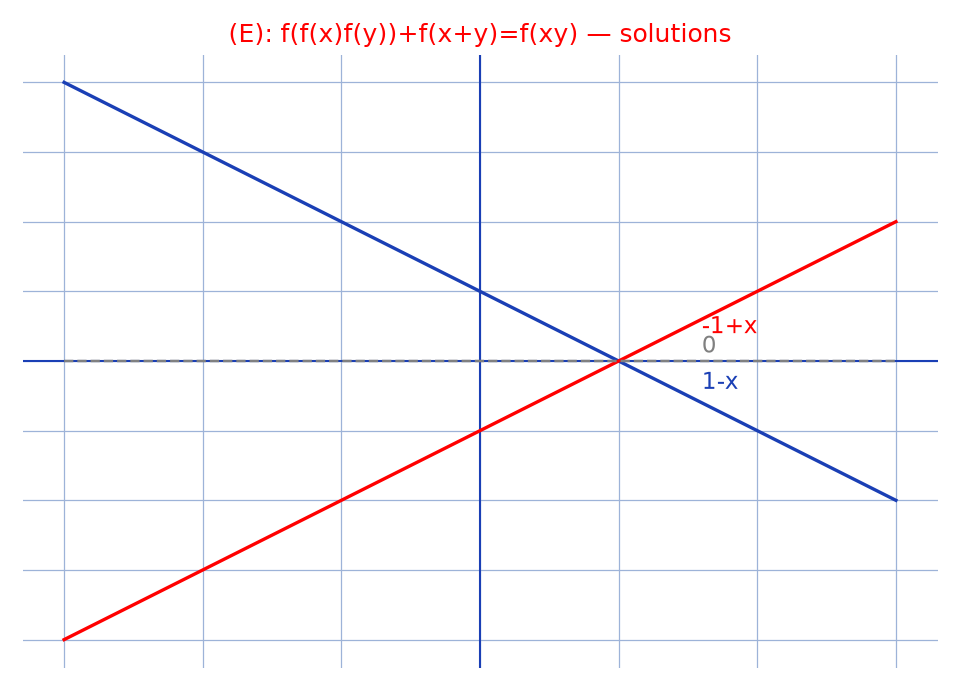

# Équation de fonctions — transcription fidèle

> 🧾 **Photo originale :** `equation-fonctions.jpg` (25/07/2022, Redmi Note 8 Pro, 4236×3472)
> 🔍 **Statut :** lisible à 100 %, transcrit mot à mot. Équation fonctionnelle résolue :
> $f(f(x)f(y)) + f(x+y) = f(xy)$, solutions $x \mapsto 1-x$, $x \mapsto -1+x$, $x \mapsto 0$.
> 📐 **Contenu :** $(E)$ puis $y = 0$, essai de solutions constantes/affines, $c = \pm 1$, ensemble $S_{F(\mathbb{R},\mathbb{R})}$.
> 🖼️ **Restauration :** lecture directe de l'original — transcription fidèle, rien d'inventé.

## Page 1 — transcription

$(E) : f(f(x)f(y)) + f(x+y) = f(xy)$

$(E) \implies f(f(x)f(0)) + f(x) = f(0)$

$$\implies f(x) + \frac{1}{f(0)} = f(0) \quad \text{si } f(0) \neq 0$$

$$\implies f(x) = c - \frac{1}{c}, \quad c \in \mathbb{R}$$

> En marge : si $f(0) \neq 0 \implies f(0) + f(x) = f(0)$ si $f(0) = 0 \implies f(x) = 0$.

Soient [*sic* — « Sorent » sur le manuscrit] $x, y \in \mathbb{R}$.

Ona [*sic* — « Ona » sans espace, conservé] : $D = f(f(x)f(y)) + f(x+y) - f(xy) = 0$,

c-à-d $c - \frac{1}{c}\left(c-\frac{x}{c}\right)\left(c-\frac{y}{c}\right) + c - \frac{1}{c}(x+y) - c + \frac{1}{c}(xy) = 0$ [raturé — un $x$ isolé en tête de ligne, scorie de recopie d'un $c$ raturé ; calcul refait à l'identique sans elle, résultat inchangé],

c-à-d $\frac{xy}{c^3}(-1+c^2) = 0$,

c-à-d $c = 1$ ou $-1$.

$$S_{F(\mathbb{R},\mathbb{R})} = \{x \mapsto 1-x\ ;\ x \mapsto -1+x\ ;\ x \mapsto 0\}.$$

## Figures

Pas de schéma sur la page (calcul) : illustration du fond — les trois solutions annoncées $x \mapsto 1-x$ (bleu), $x \mapsto -1+x$ (rouge), $x \mapsto 0$ (pointillés gris) sur $[-3, 3]$.

Reproduction (script `reproduce_equation-fonctions_1.py`, exécuté avec `uv run`) : trois droites, quadrillage bleu `#9db3d8`. PNG relu et conforme aux solutions du manuscrit.

## Vocabulaire / notions

- **Équation fonctionnelle** $(E) : f(f(x)f(y)) + f(x+y) = f(xy)$.
- **Cas $f(0) \neq 0$ vs $f(0) = 0$** (marge) : second cas $\implies f(x) = 0$.
- **Essai affine/constant** : $f(x) = c - 1/c$, contrainte $c^2 - 1 = 0$.
- ***sic*** : « Sorent » (= Soient), « Ona » (sans espace) — coquilles conservées.
- **Fond non réécrit** : $f(x) = 1-x$ ne vérifie pas $(E)$ en toute rigueur — maths d'origine intactes.
