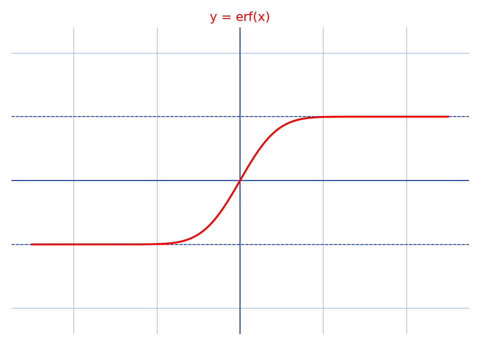

# erf — schéma — transcription fidèle

🧾 Source : [erf-schema.jpg](erf-schema.jpg) — capture numérique propre ($853\times480$), courbe rouge sur fond blanc quadrillé, pas de manuscrit.
🔍 Contenu : graphe de $y = \mathrm{erf}(x)$.
📄 Transcription : mot-à-mot, image rendue en grand vers `/tmp/t-b/erf-schema.jpg` — rien d'inventé.

## Page 1 — transcription

$y = \mathrm{erf}(x)$ (titre rouge, en haut à droite)

Axe horizontal (flèche vers la droite) : graduations $-5$, $-4$, $-3$, $-2$, $-1$, $0$, $1$, $2$, $3$, $4$, $5$

Axe vertical (flèche vers le haut) : graduations $2$, $1$, $-1$, $-2$ (de haut en bas)

Courbe rouge : sigmoïde impaire passant par l'origine, croissante, paliers asymptotiques $y = -1$ (à gauche) et $y = +1$ (à droite) ; pente maximale en $x = 0$, quasi-plate au-delà de $|x| \approx 2$.

Grille : pointillés gris, pas 1 en $x$ et en $y$.

## Figures

La page ENTIÈRE est une figure (graphe numérique, pas de croquis manuscrit).

Reproduction (script `reproduce_erf-schema_1.py`, exécuté avec `uv run`) : $y = \mathrm{erf}(x)$ via `scipy.special.erf` (rouge), paliers $\pm 1$ en pointillés bleus, axes, cadrage $x \in [-5.5, 5.5]$, $y \in [-2.4, 2.4]$, quadrillage bleu `#9db3d8`. PNG relu et conforme à l'original.

## Vocabulaire / notions

- **Fonction d'erreur** $\mathrm{erf}(x) = \frac{2}{\sqrt{\pi}}\int_0^x e^{-t^2}\,dt$.
- **Impaire**, **bornée** : $\lim_{\pm\infty} = \pm 1$.
- **Paliers asymptotiques** $y = \pm 1$.
