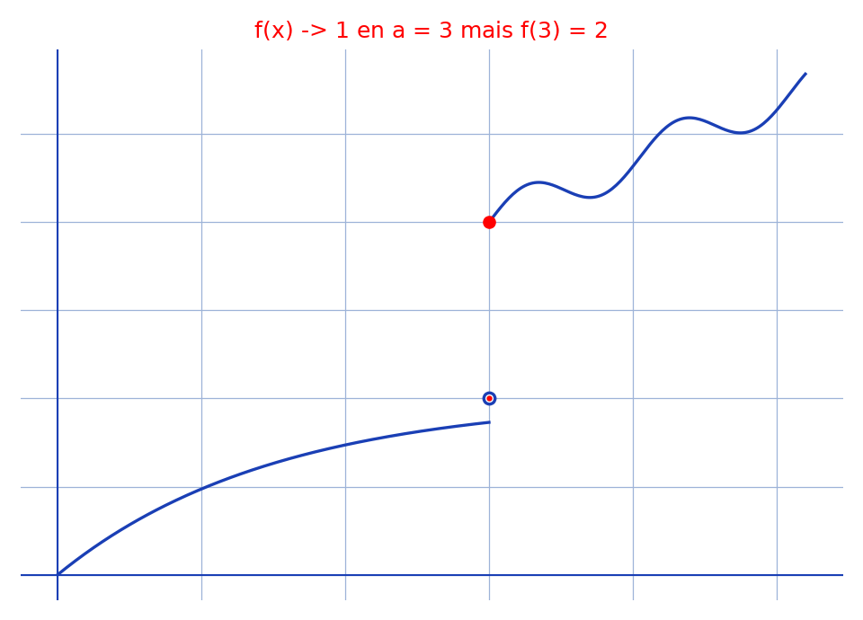

# Hôpital rigoureux — transcription fidèle

> 🧾 **Manuscrit original :** `hopital-rigoureux.pdf` (scan, 8 pages, encre bleue sur papier blanc ; pages numérotées 1–6 puis (a)–(b)) · ✍️ KpihX
> 🔍 **Statut :** lisible (~80 %), transcrit fidèlement ; ratures et empâtements signalés `[raturé]` / `[lecture incertaine — …]` ; coquilles conservées `[*sic* — …]`. Transcrit mot à mot, rien d'inventé.
> 📄 **Source scannée :** [hopital-rigoureux.pdf](hopital-rigoureux.pdf) (restaurée Datas1, vérifiée pdfinfo, 2026-09-07)

---

## Page 1

thés (ou règle) de l'Hôpital (Hospital) [lecture incertaine — « thés » : lire « théorème »]

I/ Formulation initiale : Soient $f$ et $g$, 2 fonctions réelles définies sur $]a, b[$, dérivables en $a$, telles que $f(a) = g(a) = 0$ et $g'(a) \neq 0$. On a : $\lim_{x \to a^+} \frac{f(x)}{g(x)} = \frac{f'(a)}{g'(a)}$.

[raturé — « et $g(x) \neq 0 \quad \forall x \in ]a, b[$ »]

Lemme : Soit $g$ une fonction réelle définie sur $]a, b[$ dérivable en $a$ et telle que $g'(a) \neq 0$. Il existe $c \in ]a, b[$ / $\forall x \in ]a, c[$, $g(x) \neq 0$

En effet supposons par l'absurde que $\forall r \in ]a, b[$, $\exists x_r \in ]a, r[$ / $g(x_r) = 0$. Considérons la suite $(v_n)_{n \in \mathbb{N}^*}$ $v_n = a + \frac{1}{n}$ [lecture incertaine — $v_n$ empâté, on lit aussi bien « $u_n$ »] et construisons la suite $(u_n)_{n \in \mathbb{N}^*}$ ce : suit : [lecture incertaine — « ce : suit : » pour « comme suit : »]

- D'après l'hypothèse en amont, $\exists x \in ]a, \min(b, a + \frac{1}{r_1})[$ [lecture incertaine — l'indice $r_1$ est empâté] / $g(x_1) = 0$ on fixe $u_1 = x_1$

- Pour $x_n$ construit ($n \in \mathbb{N}^*$), [toujours ?] d'après l'hypothèse en amont, $\exists x \in ]a, \min(u_n, v_n)[$ / $g(x) = 0$. on fixe ainsi $u_{n+1} = x$

. Mq $(u_n)_{n \in \mathbb{N}^*} \underset{n \to \infty}{\longrightarrow} a$. [raturé — « Soit $\varepsilon > 0$ Cherchons $N_2 \in \mathbb{N}^*$ / $\forall n \in \mathbb{N}^*$ … »] [raturé — « $u_{N_2} \to$ … »] Soit $n \in \mathbb{N}^*$. Ona : $|u_n - a| < v_n - a$

[raturé — « Soit $n \in \mathbb{N}^*$ ona : car $u_n \in ]a, \min$ … »] car $u_n \in ]a, \min(u_n, v_n, v_{n+1})[$ [lecture incertaine — la suite des minorants est empâtée]

d'où $|u_n - a| < \frac{1}{n} \underset{n \to \infty}{\longrightarrow} 0$ d'où $(u_n)_{n \in \mathbb{N}^*} \underset{n \to \infty}{\longrightarrow} a$

1. Car $(v_n)_{n \in \mathbb{N}^*} \underset{n \to \infty}{\longrightarrow} a$ et que $\frac{g(x_n) - g(a)}{x_n - a} \underset{x \to a^+}{\longrightarrow} g'(a)$ [lecture incertaine — on lit « $x_n$ » aussi bien que « $u_n$ »]

alors en particulier $\frac{g(u_n) - g(a)}{u_n - a} \underset{n \to \infty}{\longrightarrow} g'(a)$

---

## Page 2

c-à-d $\frac{0 - g(a)}{u_n - a} \underset{n \to \infty}{\longrightarrow} g'(a)$

- Si $g(a) = 0$, $\frac{0 - g(a)}{u_n - a} = 0 \underset{n \to \infty}{\longrightarrow} 0 \Rightarrow g'(a) = 0$ Absurde !

- Sinon $\frac{0 - g(a)}{u_n - a} \underset{n \to \infty}{\longrightarrow} \pm\infty \Rightarrow g'(a) = \pm\infty$ Absurde !

Ainsi $\exists c \in ]a, b[$ / $\forall x \in ]a, c[$, $g(x) \neq 0$

Suite : D'après le lemme précédent, $\exists c \in ]a, b[$ / $\forall x \in ]a, c[$, $g(x) \neq 0$. Ainsi pour $x \in ]a, c[$, [raturé — « bon »] l'expression $\frac{f(x)}{g(x)}$ est définie

On a alors $\lim_{x \to a^+} \frac{f(x)}{g(x)} = \lim_{x \to a^+} \frac{f(x) - f(a)}{x - a} \times \lim_{x \to a^+} \frac{x - a}{g(x) - g(a)}$

($x \in ]a, c[$)

Car $\lim_{x \to a^+} \frac{f(x) - f(a)}{x - a} = f'(a) \in \mathbb{R}$ et $\lim_{x \to a^+} \frac{g(x) - g(a)}{x - a} = g'(a) \neq 0$ d'où $\lim_{x \to a^+} \frac{x - a}{g(x) - g(a)} = \frac{1}{g'(a)}$, alors $\lim_{x \to a^+} \frac{f(x)}{g(x)} = \frac{f'(a)}{g'(a)}$

Rq : Ce résultat reste valable si $]a, b[$ est remplacé par $]b, a[$, [raturé — « tout »] en évaluant plutôt $\lim_{x \to a^-} \frac{f(x)}{g(x)}$ et plus globalement si on travaille plutôt sur [raturé — « les intervalles … de la forme »] $]b, a[ \cup ]a, b[$ tout en évaluant cette fois-ci $\lim_{x \to a} \frac{f(x)}{g(x)}$.

---

## Page 3

Formulation actuelle : Soient $f$ et $g$, 2 fonctions dérivables sur $]a, b[$ / $g'(x) \neq 0 \quad \forall x \in ]a, b[$

Si $\lim_{a^+} f, g = 0$ et $\lim_{a^+} \frac{f'}{g'} = l \in \bar{\mathbb{R}}$ alors $\lim_{a^+} \frac{f}{g} = l$

En effet considérons $h$ : $\forall x \in ]a, b[$, [raturé — « $h(x) = f_x$ … $x \in ]a, b[$ »] et $h$ : $\forall y \in ]a, x[$, $h(y) = f(x)(g(y) - \lim_{a^+} g) - g(x)(f(y) - \lim_{a^+} f)$ [lecture incertaine — le membre « $\lim_{a^+} g$ » est empâté] avec $g(x) \neq 0$ (a) [« (a) » encadré]

$h(y) = f(x)g(y) - g(x)f(y)$ et $h(a) = 0$ [lecture incertaine — la ligne « $h(y) = f(x)g(y) - g(x)f(y)$ » est une simplification marginale postérieure]

. $h$ est continue sur $]a, x]$ et en $a$ car $\lim_a h = 0 = h(a)$ d'où $h$ est continue sur $[a, x]$.

. De plus $h$ est dérivable sur $]a, x[$ car $]a, x[ \subset ]a, b[$. D'après le théorème de Rolle ou les résultats précédents et le fait que $h(x) = h(a) = 0$ alors $\exists z \in ]a, x[$ / $h'(z) = 0$ ($\Rightarrow$) $\frac{f(x)}{g(x)} = \frac{f'(z)}{g'(z)}$ et pour $x \to a^+$, $z \to a^+$

d'où [raturé — « lim »] Ainsi car $\lim_{z \to a^+} \frac{f'(z)}{g'(z)} = l \in \bar{\mathbb{R}}$, $\lim_{x \to a^+} \frac{f(x)}{g(x)} = l$

Rq : ① L'existence d'un tel $x$ est garantie par le fait qu'on pourra toujours trouver une suite $(x_n)_{n \to \infty} \to a$ (décroissante) [raturé — « dû au fait que … avec … $x_n \neq 0$ … »] dans $]a, b[$ avec $\forall n \in \mathbb{N}$, $g(x_n) \neq 0$, dû au fait que $g'(x) \neq 0$ $\forall x \in ]a, b[$.

[bas de page rogné — la phrase se poursuit page 4]

---

## Page 4

Pour être plus précis cela résulte du fait que [raturé — « … dans $]a, b[$ ($g(x_n)$) »] $\forall x \in ]a, b[$, $\exists y \in ]a, x[$ [lecture incertaine — la borne est empâtée], $g(y) \neq 0$ car en raisonnant par l'absurde on aurait $g = 0_{]a, x[} \Rightarrow g' = 0_{]a, x[}$ ce qui est absurde vu les hypothèses de départ.

2/ Si $\lim_{a^+} g = +\infty$ (et éventuellement $\lim_{a^+} f = +\infty$ et $\lim_{a^+} \frac{f'}{g'} = l \in \bar{\mathbb{R}}$ alors $\lim_{a^+} \frac{f}{g} = l \in \bar{\mathbb{R}}$

En effet [raturé — « soit $x_0 \in ]a, b[$ »] comme $\lim_{a^+} g = +\infty$ alors $\exists b' \in ]a, b[$ / $\forall x \in ]a, b'[$, $g(x) \neq 0$.

Soient alors $x, y \in ]a, b[$. [raturé — « Car »] $f$ et $g$ continues sur $[x, y]$, dérivables sur $]x, y[$ (car $]x, y[ \subset ]a, b[$)

Car $\lim_{a^+} g = +\infty$, $\exists b' \in ]a, b[$ / $\forall x \in ]a, b'[$, $g(x) > 0$

Soient alors $x, y \in ]a, b'[$ avec $x < y$

Car $f$ et $g$ continues sur $[x, y]$ et dérivables sur $]x, y[$, $\exists z \in ]x, y[$ / $(f(y) - f(x))g'(z) = (g(y) - g(x))f'(z)$ [reconstruction — premier facteur « $f(y) - f(x)$ », confirmé second passage]

d'où $f(x)$ d'après le théorème des accroissements finis généralisé

---

## Page 5

…, car $g(x) \neq 0$, $\frac{f(x)}{g(x)} = \frac{f'(z)}{g'(z)}\left(1 - \frac{g(y)}{g(x)}\right) + \frac{f(y)}{g(x)}$ [$g'(z) \neq 0$ car $z \in ]a, b[$ en marge]

Ainsi car $\lim_{x \to a^+} \frac{f'(z)}{g'(z)}\left(1 - \frac{g(y)}{g(x)}\right) + \frac{f(y) - f(x)}{g(x)}\left(1 - \frac{g'(y)}{g'(z)}\right)$ [raturé — ce membre intermédiaire est biffé] $+ \frac{f(y)}{g(x)}$ [« $\to 0$ » sous le dernier terme]

[raturé — « c-à-d $\lim_{x \to a^+} \frac{f'(z)}{g'(z)}\left(1 - \frac{g(y)}{g(x)}\right) + \frac{f(y)}{g(x)} =$ … »]

ainsi car $\lim_{x \to a^+} \frac{f'(z)}{g'(z)}\left(1 - \frac{g(y)}{g(x)}\right) + \frac{f(y)}{g(x)} = l(1 - 0) + 0 = l \in \bar{\mathbb{R}}$

alors $\lim_{x \to a^+} \frac{f(x)}{g(x)} = l$ CQFD

Rq : L'hypothèse $\lim_{a^+} f = +\infty$ n'est en fait pas utile.

---

## Page 6

Thèse de la limite séquentielle : Soit $f : I \to \mathbb{R}$. $a \in$ [lecture incertaine — l'appartenance est rognée en haut de page]

Soit $(u_n)_{n \in \mathbb{N}}$, une suite de pts de $I$ et $l \in \overline{f(I)}$. [lecture incertaine — « $l \in \overline{f(I)}$ » empâté]

Si $\begin{cases} (u_n) \underset{n \to \infty}{\longrightarrow} a \\ . f(x) \underset{x \to a}{\longrightarrow} l \\ . (u_n) \text{ non stationnaire } \forall n \in \mathbb{N}, u_n \neq a \end{cases}$ [raturé — « $(u_n)$ non stationnaire » remplacé par « $\forall n \in \mathbb{N}, u_n \neq a$ »] alors $f(u_n) \underset{n \to \infty}{\longrightarrow} l$

Soit $\varepsilon > 0$. Cherchons [raturé — « $\eta > 0$ »] $\forall N \in \mathbb{N}$ / $\forall n \in \mathbb{N}$, $n \geq N \Rightarrow$

$|f(u_n) - l| < \varepsilon$

Car $f(x) \underset{x \to a}{\longrightarrow} l$, $\exists \eta > 0$ / $\forall x \in D_f$, $0 < |x - a| < \eta \Rightarrow |f(x) - l| < \varepsilon$

Car $(u_n)_{n \in \mathbb{N}} \underset{n \to \infty}{\longrightarrow} a$, $\exists N' \in \mathbb{N}$ / $\forall n \in \mathbb{N}$, $n \geq N' \Rightarrow |u_n - a| < \eta$ (car …)

Ainsi pour $n \geq N'$ on a de plus $|u_n - a| \neq 0$ alors $|f(u_n) - l| < \varepsilon$

$|f(u_n) - l| < \varepsilon$. Prendre alors $N = N'$.

Rq : la dernière hypothèse serait moins contraignante si elle était formulée en sept : [lecture incertaine — « en sept » pour « ainsi »] : $\exists N \in \mathbb{N}$ / $\forall n \in \mathbb{N}$, $n \geq N \Rightarrow u_n \neq a$.

Ex justifiant l'importance de cette dernière hypothèse. Considérons cette fct : Posons $u_n = 3$ $\forall n \in \mathbb{N}$, $a = 3$. On a bien $u_n \underset{n \to \infty}{\longrightarrow} a$.

$f(x) \underset{x \to a}{\longrightarrow} 1$ mais pourtant $f(u_n) = f(3) = 2 \underset{n \to \infty}{\longrightarrow} 2 \neq 1$ ⑥

[croquis : axes $x$ (avec $0$, $3$) et $y$ (avec $1$, $2$) ; courbe partant de l'origine, montant vers le point creux $(3, 1)$, saut en $(3, 2)$ (point plein), puis reprise croissante en dents de scie]

*Figure reproduite : `contre-exemple-limite-sequentielle.png` (script `reproduce_hopital-rigoureux_1.py`) — le croquis manuscrit (saut en $x = 3$ : limite $1$, valeur $2$) est décrit ci-dessus et conservé.*

---

## Page 7

[Rq :] Soit $f$, une fct continue sur $I$ et strict monotone sur $I$. alors $f^{-1}$ est aussi continue sur $J = f(I)$ [lecture incertaine — l'amorce « Rq : » est rognée en haut de page]

En effet, SNALG, supp $f$ ↗$^*$ sur $I$. Soit $y_0 \in J$. Soit $\varepsilon > 0$. Cherchons $\eta > 0$ / $\forall y \in J$, $|y - y_0| < \eta \Rightarrow |f^{-1}(y) - f^{-1}(y_0)| < \varepsilon$. Posons $x_0 = f^{-1}(y_0)$.

SNALG on va supposer que $x_0$ [raturé — « Soit $m = \max$ … »] $\cup I$ et $M = \min$ … $\cup I$. SNALG, on va supposer que $x_0$ est un pt intérieur de [phrase interrompue, reprise ci-dessous]

. Si $x_0$ est un pt intérieur, $\exists \varepsilon' > 0$ / $\varepsilon' < \varepsilon$ et $]x_0 - \varepsilon', x_0 + \varepsilon'[ \subset I$. Soit $y \in J$ et $x = f^{-1}(y)$. Pour $x \in ]x_0 - \varepsilon', x_0 + \varepsilon'[$ on a : $y \in ]f(x_0 - \varepsilon'), f(x_0 + \varepsilon')[$. Posons [raturé — « conf$^{**}$ »] $\eta' = \min(\ f(x_0 + \varepsilon') - y_0,\ y_0 - f(x_0 - \varepsilon')\ )$.

[raturé — « Ona : $|y - y_0| < \eta'$ »] Pour $y \in J$ / $|y - y_0| < \eta'$, [« car $f$ ↗$^*$ » en marge] on a : $y \in ]f(x_0 - \varepsilon'), f(x_0 + \varepsilon')[$ d'où $x = f^{-1}(y) \in ]x_0 - \varepsilon', x_0 + \varepsilon'[$ et donc $|f^{-1}(y) - f^{-1}(y_0)| = |x - x_0| < \varepsilon' < \varepsilon$. Prendre $\eta = \eta'$

. Si $x_0 = \min I$, $\exists \varepsilon'$ / $]x_0, x_0 + \varepsilon'[ \subset I$. (a)

---

## Page 8

Soit $y \in J$ et $x = f^{-1}(y)$. Pour $|y - y_0| < \eta' = f(x_0 + \varepsilon') - y_0$ on a : $x \in ]x_0, x_0 + \varepsilon'[$ [« car $f$ ↗$^*$ » en marge] d'où $|f^{-1}(y) - f^{-1}(y_0)| = |x - x_0| < \varepsilon' < \varepsilon$

. Le raisonnement est le même pour $x_0 = \max I$

Rq : La règle de l'Hôpital reste valable en $\pm\infty$ en raisonnant sur [raturé — « $b = 1/x$ et »] $G(x) = g(1/x)$ et $F(x) = f(1/x)$. (b)

---

## Figures

- p. 6 : croquis du contre-exemple (saut en $x = 3$ : limite $1$, valeur $2$, reprise en dents de scie) → reproduction : [`assets/contre-exemple-limite-sequentielle.png`](assets/contre-exemple-limite-sequentielle.png), script `reproduce_hopital-rigoureux_1.py` (vérifié `uv run`, 24640 o).
- pp. 2–5, 7–8 relues au second passage (2026-09-07, /tmp/s7/, pdftoppm -png -r 150) : texte seul, aucune figure, pas de PNG requis.

## Vocabulaire

- SNALG = sans nuire à la généralité (lu tel quel) ; Rq, Mq, Ona, fct = fonction, pts = points ; ↗$^*$ = strictement croissante.
- (a)/(b) = renvois p. 7–8 ; $D_f$ = domaine ; $\bar{\mathbb{R}}$ ; ⑥ = renvoi au croquis p. 6 ; « en sept » = ainsi [*sic*].
