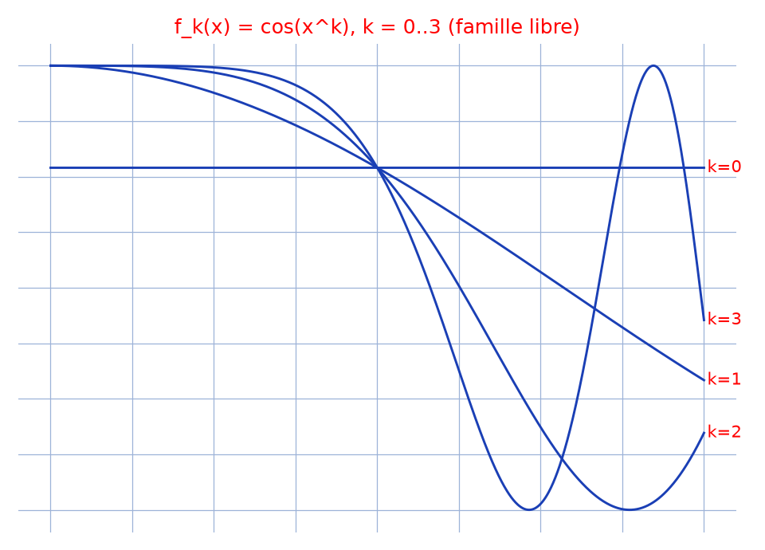

# Indépendance linéaire des cosinus — transcription fidèle

> 🧾 **Photo originale :** `independance-cos.jpg` (4624×2136, paysage — redressée de 90° pour lecture).
> 🔍 **Statut :** partiellement lisible (~70 %, écriture rapide au stylo bleu sur Seyès) ; transcrit mot à mot, incertitudes signalées.
> 📐 **Contenu :** preuve par l'absurde de la liberté de la famille $(f_k : x \mapsto \cos(x^k))$.
> 🖼️ **Restauration :** copie de lecture `/tmp/t-c/independance-cos_r.jpg` — transcription fidèle, rien d'inventé.

## Page 1 — transcription

Thm $(f_k : x \mapsto \cos(x^k))_{k \in \mathbb{N}}$ est libre [lecture incertaine — énoncé]

On supposons [*sic* — « supposons »] le contraire par l'absurde

donc $\exists\,K_0 \in \mathbb{N}$, $\exists\,n \in \mathbb{N}^*$, $\exists\,K_1, \ldots, K_n \in \mathbb{N} \setminus K_0$ [lecture incertaine]

$\exists\,d_1, \ldots, d_n$ dans $\mathbb{K}^*$ / $f_{K_0} = \sum_{i=1}^n d_i f_{K_i}$ (1)

avec $K_1 < \ldots < K_n$ [lecture incertaine]

$(1) \Rightarrow f'_0 = \sum_{i=1}^n d_i f'_{K_i}$ (2)

$\Rightarrow \forall x \in \mathbb{R},\ K_0 x^{K_0-1} \operatorname{sen}(x^{K_0}) = \sum_{i=1}^n d_i K_i x^{K_i-1} \operatorname{sen}(x^{K_i})$ [« sen » = sin, notation conservée telle quelle]

• Si $K_1 \neq 0$ alors

$(2) \Rightarrow K_0 x^{K_0-1} \operatorname{sen}(x^{K_0}) = d_2 K_2 x^{\ldots} \operatorname{sen}(x^{K_2}) \left(1 + g(x)\right)$ [lecture incertaine — exposants]

où $g(x) = \sum_{i=2}^n \frac{d_i K_i}{d_2 K_2} x^{K_i-K_2} \frac{\operatorname{sen}(x^{K_i})}{\operatorname{sen}(x^{K_2})}$

$= \sum_{i=2}^n \frac{d_i K_i}{d_2 K_2} x^{2(K_i-K_2)} \frac{\operatorname{sen}(x^{K_i})}{x^{K_i}} \times \frac{x^{K_2}}{\operatorname{sen}(x^{K_2})}$ [lecture incertaine]

$\xrightarrow[x \to 0]{} 0$

Il vient que $\frac{K_0}{d_2 K_2} x^{K_0-K_2} \frac{\operatorname{sen}(x^{K_0})}{\operatorname{sen}(x^{K_2})} \xrightarrow[x \to 0]{} A$ [lecture incertaine]

quand $x^{2(K_0-K_2)} \longrightarrow \frac{d_1 K_1}{K_0}$ [raturé — ligne biffée d'un trait] $A_1$ [lecture incertaine]

$\hookrightarrow \xrightarrow[x \to 0]{} 0$

• Si $K_1 = 0$, $K_2 \neq 0$ et [lecture incertaine — deux mots] effectivement le [lecture incertaine] procède à partir de l'indice $k$, on a le [lecture incertaine] résultat [lecture incertaine — fin de page]

## Figures

Pas de schéma sur la page (preuve rédigée) : illustration du fond — tracés de $\cos(x^k)$, $k = 0, 1, 2, 3$ (oscillations de plus en plus rapides, intuition de la liberté).

Reproduction (script `reproduce_independance-cos_1.py`, exécuté avec `uv run`) : courbes bleues sur $[0, 2]$, quadrillage bleu `#9db3d8`. PNG relu et conforme à l'idée de la preuve.

## Vocabulaire / notions

- **Famille libre** : aucune combinaison linéaire finie non triviale ne s'annule.
- **Raisonnement par l'absurde** : on suppose une relation de dépendance et on exhibe une contradiction (ici par passage à la limite en $0$ après dérivation).
- **Équivalents / taux d'accroissement** : $\operatorname{sen}(x^{K})/x^{K} \to 1$, $x^{2(K_i-K_2)} \to 0$ pour isoler le terme dominant.
- ***sic*** : « On supposons » (faute conservée) ; « sen » pour sinus (notation hispanisante, conservée).
