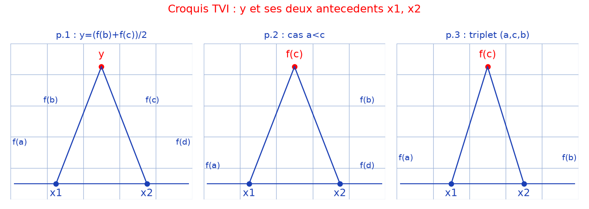

# Injective continue => monotone — transcription fidèle

> 🧾 **Manuscrit original :** `injective-continue-monotone.pdf` (scan, 3 pages) · ✍️ KpihX
> 🔍 **Statut :** lisible à ~90 %, transcrit mot à mot. Les maths sont conservées telles quelles ;
> seules les coquilles d'orthographe évidentes sont corrigées (signalées). Les ratures sont notées `[raturé]`.
> 📄 **Source scannée :** [`injective-continue-monotone.pdf`](injective-continue-monotone.pdf) (restaurée Datas1, vérifiée pdfinfo, 2026-09-07)

---

## Page 1

Théo : Soit $f : I \to J$ une application injective et continue. Alors $f$ est strict monotone.

En effet, supposons par l'absurde que $f$ ne l'est pas. $\exists a, b, c, d \in I \mid a < b$, $c < d$ et $f(a) < f(b)$ et $f(c) > f(d)$.

- Si $b \leq c$.
- Si de plus $f(b) < f(c)$, posons $y = \frac{f(c) + f(b)}{2} \in ]f(b) ; f(c)[$ [en marge : $d = \max\{f(b), f(d)\}$ — lecture incertaine]. Car $f$ est continue alors $\exists x_1 \in ]c ; d[ \mid f(x_1) = y$. De plus $y \in ]f(b) ; f(c)[$ et ce $f$ continue alors $\exists x_2 \in ]b ; c[ \mid f(x_2) = y$. Car $f$ injective alors $x_1 = x_2$ ce qui est absurde ! vu que $x_1 < c < x_2$ [*sic* — lire $x_2 < c < x_1$].

- Si $f(b) > f(c)$, en raisonnant de façon analogue en travaillant cette fois-ci avec les pts $a, b$ et $c$ on aboutit à une absurdité similaire.

[Croquis « en toit » : $y$ au sommet relié à $x_1$, $x_2$ en bas, $f(a)$ à gauche, $f(b)$, $f(c)$, $f(d)$ autour — voir reproduction ci-dessous.]

On ne peut avoir $f(b) = f(c)$ vu que $b \neq c$ et $f$ injective.

- Si $d \leq a$.
- Si de plus $f(d) < f(a)$ ; posons $y = \frac{f(d) + f(a)}{2}$ où $\alpha = \min\{f(a), f(a)\}$ [lecture incertaine]. On a $y \in ]f(d) ; f(a)[$, $]f(d) ; f(a)[$ [*sic* — intervalle répété].

## Page 2

et ce $f$ continue $\exists (x_1, x_2) \in ]c ; d[ \times ]d ; a[ \mid y = f(x_1) = f(x_2)$ [lecture incertaine sur les intervalles]. D'où $x_1 = x_2$ (absurde ! car $x_1 < d < x_2$).

- Si $f(d) > f(a)$, par un raisonnement analogue cette fois-ci sur le triplet $(d, a, b)$, on aboutit à une absurdité analogue.

On ne peut avoir $f(d) = f(a)$ car $f$ injective et $d \neq a$.

- Si $a \leq c \leq d \leq b$, on ne peut avoir $a = c$ et $d = b$ car sinon on aurait $f(a) < f(b)$ et $f(d) = f(b) < f(a) = f(c)$ [contradiction]. SNALG, supposons $a < c$ (en fait le cas $d < b$ se traite similairement). [raturé — amorce biffée] $f(a) < f(c)$ (le cas $f(a) > f(c)$ se traite similairement et on ne peut avoir le cas $f(a) = f(c)$). Un raisonnement analogue à celui du cas ($b \leq c$ et $f(b) < f(c)$) aboutit à une absurdité similaire.

[Croquis « en toit » : $f(c)$, $f(b)$ au sommet, $f(a)$ et $f(d)$ en bas — voir reproduction page 1.]

- Si $c \leq a \leq b \leq d$ un raisonnement analogue à celui précédent aboutit à une absurdité similaire.

- Si enfin les intervalles $]a ; b[$ et $]c ; d[$ se chevauchent (SNALG on va supposer $a \leq c \leq b \leq d$) [croquis].

- Si $f(c) < f(b)$ en raisonnant [comme au] cas ($b \leq c$ et $f(b) < f(c)$) avec cette fois $\alpha = \max\{f(d), \min\{f(a), f(c)\}\}$ [lecture incertaine].

## Page 3

[Début coupé :] on fait intervenir $\min\{f(a), f(c)\}$ pour gérer le cas $c = b$), on aboutit à une absurdité similaire.

- Si $f(c) > f(b)$, en travaillant avec le triplet $(a, c, b)$ on aboutit à une absurdité en raisonnant comme dans les cas antérieurs.

[Croquis « en toit » : $f(c)$ au sommet, $f(a)$ à gauche, $f(b)$ à droite, $x_1$, $x_2$ en bas — voir reproduction page 1.]

D'où une absurdité générale ce qui conclut la preuve de la monotonie strict de $f$.

Corollaire : Sachant que si $f$ est continue et strict monotone sur $I$, alors $f$ y est bijective, on en déduit avec ce qui précède que : « Si $f$ est continue sur $I \subset \mathbb{R}$, $f$ bijective $\iff f$ strict monotone ».

---

## Figures

- p. 1, 2 et 3 : trois croquis « en toit » (TVI : une valeur $y$ au sommet reliée à ses deux antécédents $x_1$, $x_2$) → synthèse en un PNG 3-panneaux : [`assets/croquis-tvi.png`](assets/croquis-tvi.png), script `reproduce_injective_continue_monotone_1.py` (vérifié `uv run`, 58282 o).

## Vocabulaire

- SNALG = sans nuire à la généralité ; Théo ; TVI = théorème des valeurs intermédiaires (implicite, croquis).
