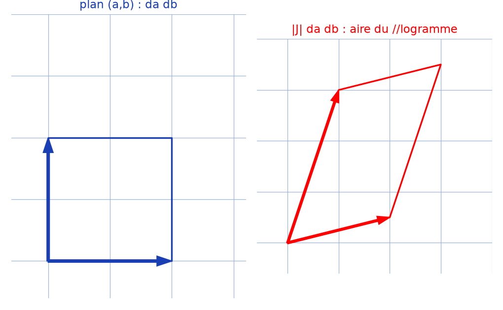

# Changement de système à l'ordre 2 (jacobien) — transcription fidèle

> 🧾 **Photo originale :** `jacobien-changement-variable-ordre2.jpg` (4624×3472, stylo bleu sur feuille blanche).
> 🔍 **Statut :** lisible (~85 %), transcrit mot à mot, incertitudes signalées.
> 📐 **Contenu :** $I = \iint_D f(x,y)\,dxdy$, passage $(x,y) \to (a,b)$, $dS_2 = \lvert J \rvert\,dadb$.
> 🖼️ **Restauration :** copie de lecture `/tmp/pm/photo-mai2022_1.png` — transcription fidèle, rien d'inventé.

## Page 1 — transcription

Changement de Sys [*sic* — abréviation de `Système`] à l'ordre 2 [titre souligné]

- Soit $S_1 = (x, y)$ le système de coord [*sic* — `coordonnées` tronqué] canonique dans $\mathbb{R}^2$
- Soit $S_2 = (a, b)$, un autre dans $\mathbb{R}^2$
- Soit $I = \iint_D f(x, y)\,dxdy$ où $D \subseteq \mathbb{R}^2$

Qu'obtient-on en quittant de $S_1$ à $S_2$ [lecture incertaine — `à $S_2$` ; `S_1` lu `S_n` avant correction] ?

En remplaçant $x$ et $y$ par $x(a, b)$ et $y(a, b)$ on remplacera aussi $dS_1$ [lecture incertaine — indice `1`] $= dxdy$ (elt [*sic* — `élément`] de surface) par $dS_2 = \left\lVert \frac{\partial \vec{r}}{\partial a} \wedge \frac{\partial \vec{r}}{\partial b} \right\rVert da\,db$

d'où $I = \iint_D g(x(a,b), y(a,b))\,dS_2$

or $\frac{\partial \vec{r}}{\partial a} \wedge \frac{\partial \vec{r}}{\partial b} = \frac{\partial (x\vec{e_x} + y\vec{e_y})}{\partial a} \wedge \frac{\partial (x\vec{e_x} + y\vec{e_y})}{\partial b}$

$= \left( \frac{\partial x}{\partial a}\vec{e_x} + \frac{\partial y}{\partial a}\vec{e_y} \right) \wedge \left( \frac{\partial x}{\partial b}\vec{e_x} + \frac{\partial y}{\partial b}\vec{e_y} \right)$

$= \frac{\partial x}{\partial a}\frac{\partial y}{\partial b}\vec{e_z} - \frac{\partial x}{\partial b}\frac{\partial y}{\partial a}\vec{e_z}$ où $\vec{e_z} = \vec{e_x} \wedge \vec{e_y}$

ainsi $dS_2 = \left\lvert \frac{\partial x}{\partial a}\frac{\partial y}{\partial b} - \frac{\partial x}{\partial b}\frac{\partial y}{\partial a} \right\rvert da\,db$

Donc $I = \iint_{D_2} g(a, b) \left\lvert \begin{matrix} \frac{\partial x}{\partial a} & \frac{\partial x}{\partial b} \\ \frac{\partial y}{\partial a} & \frac{\partial y}{\partial b} \end{matrix} \right\rvert da\,db$ où $g(a, b) = f(x(a, b), y(a, b))$ [reconstruction — $D_2$ : image de $D$ dans $(a,b)$, implicite sur l'original]

## Figures

Pas de schéma sur la page (calcul) : illustration du fond — le rectangle $da\,db$ devient un parallélogramme d'aire $\lvert J \rvert\,da\,db$.

Reproduction (script `reproduce_jacobien-changement-variable-ordre2_1.py`, exécuté avec `uv run`) : carré bleu (plan $(a,b)$), parallélogramme rouge engendré par $\partial\vec{r}/\partial a$, $\partial\vec{r}/\partial b$, quadrillage bleu `#9db3d8`. PNG relu et conforme.

## Vocabulaire / notions

- **Élément de surface** : $dS_1 = dxdy$ devient $dS_2 = \lVert \partial_a\vec{r} \wedge \partial_b\vec{r} \rVert\,dadb$.
- **Produit vectoriel** : $(\alpha\vec{e_x}+\beta\vec{e_y}) \wedge (\gamma\vec{e_x}+\delta\vec{e_y}) = (\alpha\delta-\gamma\beta)\vec{e_z}$.
- **Jacobien** : $J = \det \frac{\partial(x,y)}{\partial(a,b)}$, valeur absolue pour l'aire.
- **Formule de changement de variable** : $I = \iint g(a,b)\,\lvert J \rvert\,dadb$.
