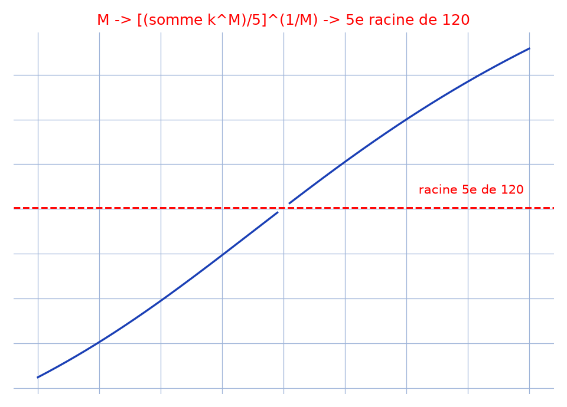

# Limite d'une moyenne de puissances — transcription fidèle

> 🧾 **Photo originale :** `limite-tableau-1.jpg` (4624×3472, portrait, lecture directe sur cahier Seyès).
> 🔍 **Statut :** lisible (~85 %, encre bleue + énoncé et résultat en rouge), transcrit mot à mot.
> 📐 **Contenu :** $\lim_{M\to 0} \sqrt[M]{\frac{1}{n}\sum_{k=1}^n k^M} = \sqrt[n]{n!}$ (daté 11/06/2021).
> 🖼️ **Restauration :** lecture directe de l'original — transcription fidèle, rien d'inventé.

## Page 1 — transcription

[en haut à droite] 11/06/2021

\* (en rouge) $\lim_{M\to 0} \sqrt[M]{\frac{\sum_{k=1}^n k^M}{n}} = \sqrt[n]{n!}\ ?$

$\forall n \in \mathbb{N}^*,\ \lim_{M\to 0} \sqrt[M]{\frac{1}{n}\sum_{k=1}^n k^M} = \lim_{M\to 0} e^{\frac{1}{M}\ln\left(\frac{1}{n}\sum_{k=1}^n k^M\right)}$

$= \lim_{M\to 0} e^{\frac{1}{nM} \times \sum_{k=1}^n (k^M-1) \times \frac{\ln\left|1+\frac{1}{n}\sum_{k=1}^n (k^M-1)\right|}{\frac{1}{n}\sum_{k=1}^n (k^M-1)}}$

$= \lim_{M\to 0} e^{\frac{\ln\left|1+\frac{1}{n}\sum_{k=1}^n (k^M-1)\right|}{\frac{1}{n}\sum_{k=1}^n (k^M-1)} \times \frac{1}{n} \times \sum_{k=1}^n \frac{e^{M\ln k}-1}{M\ln k} \times \ln k}$

$= e^{1 \times \frac{1}{n} \times \sum_{k=1}^n 1 \times \ln k}$ \hfill car $M\ln k \to 0$ et $\frac{1}{n}\sum_{k=1}^n (k^M-1) \to 0$

(en rouge) $= \sqrt[n]{n!}$

## Figures

Pas de schéma sur la page (calcul) : illustration du fond ($n = 5$) — $M \mapsto [(\sum k^M)/5]^{1/M}$ des deux côtés de $0$ vers $\sqrt[5]{120}$.

Reproduction (script `reproduce_limite-tableau-1_1.py`, exécuté avec `uv run`) : courbe bleue, limite rouge pointillée, quadrillage bleu `#9db3d8`. PNG relu et conforme.

## Vocabulaire / notions

- **Moyenne de puissance** : $[(\sum k^M)/n]^{1/M}$ ; en $M \to 0$ elle tend vers la moyenne géométrique $\sqrt[n]{n!}$.
- **Taux d'accroissement** : $\ln(1+u)/u \to 1$ et $(e^v-1)/v \to 1$ avec $u = \frac{1}{n}\sum(k^M-1)$, $v = M\ln k$.
- **Couleur rouge** : l'auteur y réserve la question posée puis le résultat final.
