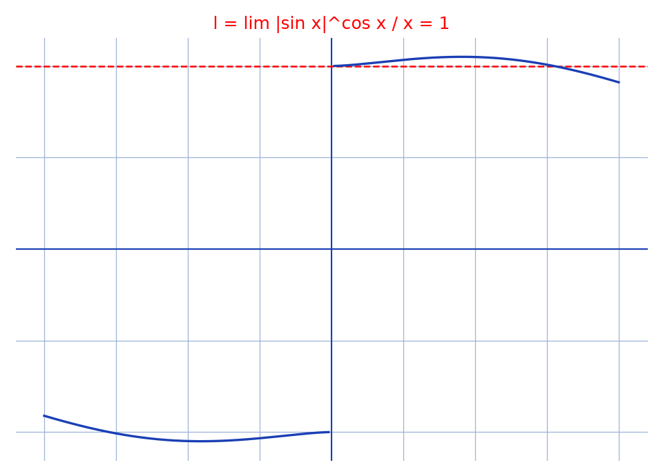

# Limite en $|\sin x|^{\cos x}/x$ — transcription fidèle

> 🧾 **Photo originale :** `limite-tableau-2.jpg` (4624×3472, portrait — redressée de 90° pour lecture).
> 🔍 **Statut :** lisible (~85 %), transcrit mot à mot, incertitudes signalées.
> 📐 **Contenu :** $l = \lim_{x\to 0} |\sin x|^{\cos x}/x = 1$ via $e^{0 \times 1 \times 0}$.
> 🖼️ **Restauration :** copie de lecture `/tmp/t-c/limite-tableau-2_r.jpg` — transcription fidèle, rien d'inventé.

## Page 1 — transcription

(+) $l = \lim_{x\to 0} \frac{|\sin x|^{\cos x}}{x}$

$= \lim_{x\to 0} \frac{|\sin x|}{x} \times |\sin x|^{\cos x-1}$

$= 1 \times \lim_{x\to 0} e^{\frac{\cos x-1}{x} \times \frac{x}{|\sin x|} \times |\sin x|\ln|\sin x|}$

$= \lim_{x\to 0} e^{0 \times 1 \times 0}$ car lorsque $x \to 0$, $|\sin x| \to 0$ et $\lim_{x\to 0} y\ln y = 0$

$= 1$

[en haut, fragment d'une autre feuille dépassant du champ] : $\frac{-\sin x}{-\cos x}$, $2\sqrt{1-x\ldots}$, $2\sqrt{x\ldots}$, $1$, $T - \sqrt{\ldots}$ [lecture incertaine — hors sujet, non transcrit au-delà]

## Figures

Pas de schéma sur la page (calcul) : illustration du fond — courbe des deux côtés de $0$ et droite limite $y = 1$.

Reproduction (script `reproduce_limite-tableau-2_1.py`, exécuté avec `uv run`) : courbe bleue, limite rouge pointillée, quadrillage bleu `#9db3d8`. PNG relu et conforme.

## Vocabulaire / notions

- **Forme $u^v = e^{v\ln u}$** : ramène $|\sin x|^{\cos x-1}$ à une exponentielle d'exposant $(\cos x-1)\ln|\sin x|$.
- **Taux $(\cos x-1)/x \to 0$** et **$x/|\sin x| \to \pm 1$** : l'auteur retient $1$ (limite à droite).
- **Croissances comparées** : $y\ln y \to 0$ ($y = |\sin x|$) éteint l'exposant.
