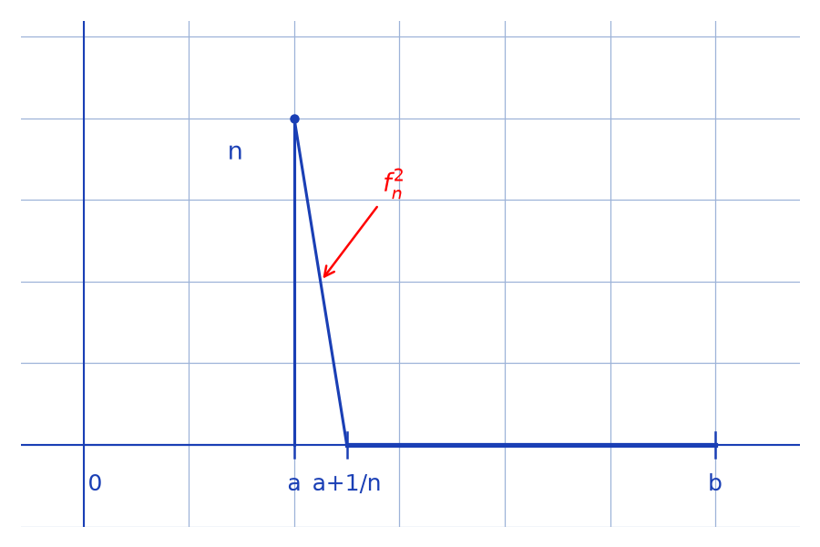

# Normes non équivalentes en dimension infinie — transcription fidèle

> 🧾 **Manuscrit original :** `normes-dim-infinie.pdf` (scan, 2 pages) · ✍️ KpihX
> 🔍 **Statut :** lisible (~85 %), transcrit fidèlement. Deux contre-exemples à l'équivalence $\|\cdot\|_\infty \leq c\|\cdot\|_2$ sur $\mathcal{C}^0([a,b])$ : pics logarithmiques (norme 2 bornée, norme $\infty$ explosive), puis pics triangulaires. Une ligne d'essai et un encadré biffés en page 1 (signalés).
> 📄 **Source scannée :** [`normes-dim-infinie.pdf`](normes-dim-infinie.pdf) (restaurée Datas1, vérifiée pdfinfo, 2026-09-07)

---

## Page 1 — Pics logarithmiques

Soit $E = \mathcal{C}^0([a,b])$. Mtr $\forall c > 0$, $\exists f \in E$ / $\|f\|_\infty > c\|f\|_2$

Considérons $(f_n)_{n \in \mathbb{N}^*}$ : $\forall n \in \mathbb{N}^*$, $\forall x \in [a,b]$, $f_n(x) = \sqrt{|\ln(|x-a|+1/n)|}$

et on a bien $f_n \in E$

Soit $n \in \mathbb{N}^*$

. On a : $\|f_n\|_\infty \geq f_n(a) = \sqrt{\ln n} \xrightarrow[n\to+\infty]{} +\infty$

[encadré raturé en haut à droite : « Rq : … $\|f_n\|_\infty < \dots$ » — entièrement biffé]

. De plus $\|f_n\|_2^2 = \int_a^b |\ln(|x-a|+1/n)|\,dx$

[raturé : essai $\int_a^b \ln(|x-a|+1+1/n)\,dx$ — ligne entièrement biffée]

— Si $b \geq 1+a$, $\|f_n\|_2^2 = -\int_a^{a+1-1/n} \ln(|x-a|+1/n)\,dx + \int_{a+1-1/n}^b \ln(|x-a|+1/n)\,dx$

$$= -\left[(|x-a|+1/n)(\ln(|x-a|+1/n)-1)\right]_a^{a+1-1/n}$$

$$+ \left[(|x-a|+1/n)(\ln(|x-a|+1/n)-1)\right]_{a+1-1/n}^b$$

$$= 1 + \frac{1}{n}(\ln\frac{1}{n}-1) + (b-a+\frac{1}{n})(\ln(b-a+\frac{1}{n})-1)$$

$$+ 1$$

$$\|f_n\|_2^2 \xrightarrow[n\to+\infty]{} 2 + (b-a)(\ln(b-a)-1)$$

— Si $b < 1+a$, $\exists N \in \mathbb{N}$ / $\forall n \in \mathbb{N}$, $n \geq N \implies a+1-1/n > b$

Pour $n \geq N$, $\|f_n\|_2^2 = -\int_a^b \ln(|x-a|+1/n)\,dx$

$$= -(b-a+\frac{1}{n})(\ln(b-a+\frac{1}{n})-1) + \frac{1}{n}(\ln(\frac{1}{n})-1)$$

$$\|f_n\|_2^2 \xrightarrow[]{} +(b-a)(1-\ln(b-a)) \text{ [bas de page — la flèche limite est coupée]}$$

## Page 2 — Conclusion et pics triangulaires

Ainsi … $\|f_n\|_\infty \xrightarrow[n\to+\infty]{} +\infty$ mais que de façon générale, $\|f_n\|_2 \xrightarrow[n\to+\infty]{} \ell \in \mathbb{R}$, alors $\exists N \in \mathbb{N}$ / $\forall n \in \mathbb{N}$, $n \geq N \implies$ [\*] $\forall c > 0$, $c\|f_n\|_2 \geq 0$ [ligne peu lisible — articulation logique elliptique : l'idée est que $\|f_n\|_\infty \to +\infty$ pendant que $\|f_n\|_2$ reste bornée]

$$\|f_n\|_\infty > c\|f_n\|_2$$

[grand trait horizontal de séparation]

Autre exemple : $(f_n)_{n \in \mathbb{N}^*}$ : $f_n(x) = \begin{cases} \sqrt{n^2(a-x)+n} \text{ si } x \in [a, a+1/n] \cap [a,b] \\ 0 \text{ sinon} \end{cases}$

$\exists N \in \mathbb{N}$ / $\forall n \in \mathbb{N}$, $a+1/n < b$. Pour $n \in \mathbb{N}$ / $n \geq N$, on a :

[Figure : graphe de $f_n^2$ — pic triangulaire de hauteur $n$ en $a$, s'annulant en $a+1/n$, nul jusqu'à $b$ — voir reproduction ci-dessous.]

$$\|f_n\|_\infty = \sqrt{n} \xrightarrow[n\to+\infty]{} +\infty$$

$$\|f_n\|_2^2 = \frac{n \times (1/n)}{2} = \frac{1}{2} \xrightarrow[n\to+\infty]{} \frac{1}{2}$$

cqfd

---

## Figures

- p. 2 : graphe de $f_n^2$ (pic triangulaire de hauteur $n$ en $a$, nul en $a+1/n$, marques $0, a, a+1/n, b$) → reproduction : [`assets/pic-triangulaire.png`](assets/pic-triangulaire.png), script `reproduce_normes_dim_infinie_1.py` (vérifié `uv run`, 15942 o).

## Vocabulaire

- Mtr = montrer ; cqfd ; $\mathcal{C}^0$ = continues ; $\|\cdot\|_\infty$, $\|\cdot\|_2$.

---

## 📝 Notes de transcription (fidélité)

- $f_n(x) = \sqrt{|\ln(|x-a|+1/n)|}$ : la fraction est bien $1/n$ (confirmée par le zéro du logarithme en $x = a+1-1/n$ et par $f_n(a) = \sqrt{\ln n}$).
- Page 1, cas $b \geq 1+a$ : le « $+1$ » isolé sous le calcul est la suite de l'expression (le $-[F]$ vaut $1 + \frac{1}{n}(\ln\frac{1}{n}-1)$ et le $+[F]$ vaut $(b-a+\frac{1}{n})(\dots) + 1$) ; la limite $2 + (b-a)(\ln(b-a)-1)$ est la somme des deux.
- Page 2 : $f_n^2$ est affine décroissante de $n$ (en $a$) à $0$ (en $a+1/n$), d'où $\|f_n\|_2^2$ = aire du triangle $= \frac{1}{2}$.
