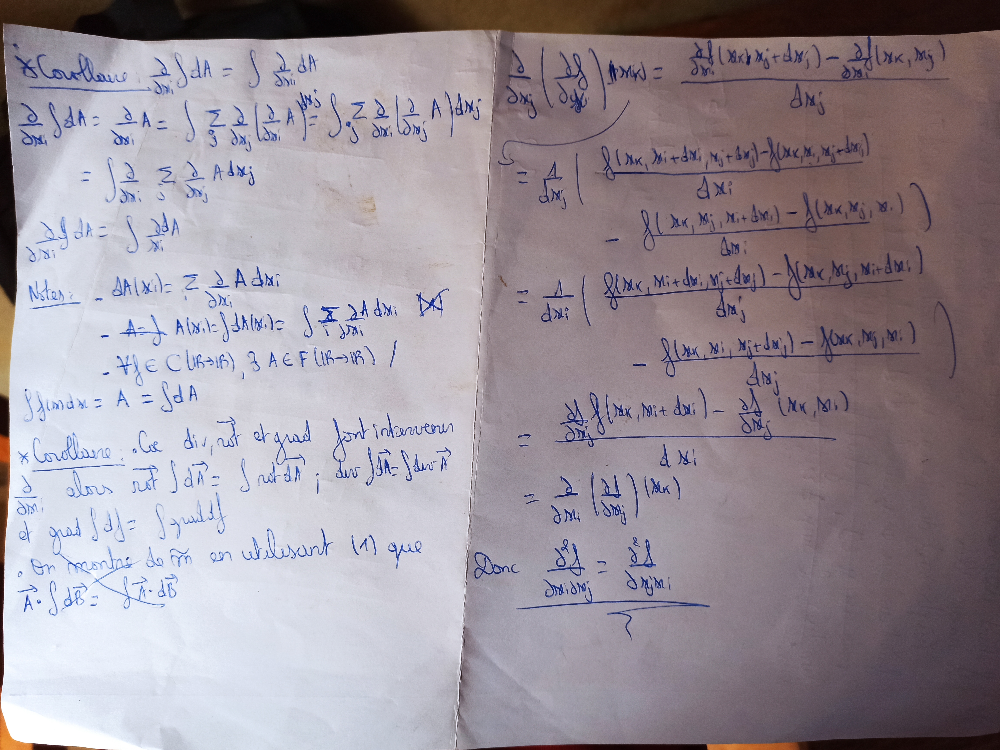
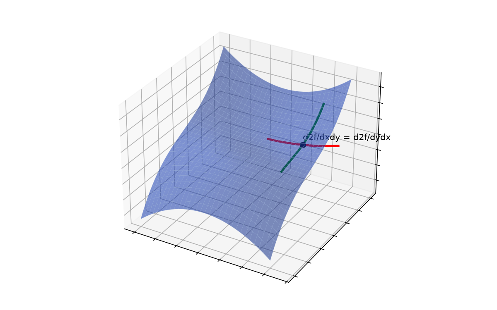

# Schwarz (dérivées partielles) — transcription fidèle

> Source : `schwarz-derivees-partielles.jpg` (1 page : deux volets, corollaire à gauche, Schwarz à droite).
> Encre bleue sur feuille blanche. Lisibilité ~75 %.

## Page 1 — transcription fidèle

### Volet gauche — corollaire

\* Corollaire : $\dfrac{\partial}{\partial x_i} \int dA = \int \dfrac{\partial}{\partial x_i} dA$

$\dfrac{\partial}{\partial x_i} \int dA = \dfrac{\partial}{\partial x_i} A = \int \sum_j \dfrac{\partial}{\partial x_j} \left( \dfrac{\partial}{\partial x_i} A \right)$ [lecture incertaine] $= \int \sum_j \dfrac{\partial}{\partial x_i} \left( \dfrac{\partial}{\partial x_j} A \right) dx_j$ [lecture incertaine]

$= \int \dfrac{\partial}{\partial x_i} \sum_j \dfrac{\partial}{\partial x_j} A \, dx_j$ [lecture incertaine]

$\dfrac{\partial}{\partial x_i} \int dA = \int \dfrac{\partial}{\partial x_i} dA$ [répété]

Notes : $- dA(x_i) = \sum_i \dfrac{\partial}{\partial x_i} A \, dx_i$ [lecture incertaine]

$- A = \int A(x_i)$ [raturé — « $A = \int$ » biffé] $= \int dA(x_i) = \int \sum_i \dfrac{\partial}{\partial x_i} A \, dx_i$ [lecture incertaine]

$- \forall f \in C(\mathbb{R} \to \mathbb{R})$, $\exists A \in F(\mathbb{R} \to \mathbb{R})$ / $\int f(x) dx = A = \int dA$ [lecture incertaine]

\* Corollaire : Que $\mathrm{div}$, $\overrightarrow{\mathrm{rot}}$ et $\overrightarrow{\mathrm{grad}}$ font intervenir $\dfrac{\partial}{\partial x_i}$ alors $\overrightarrow{\mathrm{rot}} \int d\vec{A} = \int \mathrm{rot}\, d\vec{A}$ ; $\mathrm{div} \int d\vec{A} = \int \mathrm{div}\, \vec{A}$ [\*sic\* — $d\vec{A}$ attendu] et $\mathrm{grad} \int df = \int \mathrm{grad}\, df$ [lecture incertaine]

. On montre de mêm [\*sic\* — « même »] en utilisant (1) que $\vec{A} \cdot \int d\vec{B} =$ [signe somme raturé puis récrit] $\int \vec{A} \cdot d\vec{B}$ [lecture incertaine]

### Volet droit — théorème de Schwarz

$\dfrac{\partial}{\partial x_j} \left( \dfrac{\partial f}{\partial x_i} \right)(x_k, x_i)$ [lecture incertaine sur les arguments] $= \dfrac{\dfrac{\partial f}{\partial x_i}(x_k, x_j + \Delta x_j) - \dfrac{\partial f}{\partial x_i}(x_k, x_j)}{\Delta x_j}$ [lecture incertaine]

$= \dfrac{1}{\Delta x_j} \left( \dfrac{f(x_k, x_i + \Delta x_i, x_j + \Delta x_j) - f(x_k, x_i, x_j + \Delta x_j)}{\Delta x_i} \right.$ [lecture incertaine]

$\left. - \dfrac{f(x_k, x_j, x_i + \Delta x_i) - f(x_k, x_j, x_i)}{\Delta x_i} \right)$ [lecture incertaine — ordre des arguments fluctuant sur l'original]

$= \dfrac{1}{\Delta x_i} \left( \dfrac{f(x_k, x_i + \Delta x_i, x_j + \Delta x_j) - f(x_k, x_j, x_i + \Delta x_i)}{\Delta x_j} \right.$ [lecture incertaine]

$\left. - \dfrac{f(x_k, x_i, x_j + \Delta x_j) - f(x_k, x_j, x_i)}{\Delta x_j} \right)$ [lecture incertaine]

$= \dfrac{\dfrac{\partial f}{\partial x_j}(x_k, x_i + \Delta x_i) - \dfrac{\partial f}{\partial x_j}(x_k, x_i)}{\Delta x_i}$ [lecture incertaine]

$= \dfrac{\partial}{\partial x_i} \left( \dfrac{\partial f}{\partial x_j} \right)(x_k)$ [lecture incertaine]

Donc $\dfrac{\partial^2 f}{\partial x_i \partial x_j} = \dfrac{\partial^2 f}{\partial x_j \partial x_i}$ [souligné, suivi d'un paraphe]

## Figures

Pas de schéma géométrique sur le manuscrit (calcul seul). Reproduction illustrative du propos (graphe de $f(x, y)$ dont les pentes croisées commutent) :

*Script : `~/KpihX-Labs/Explore/lab/scripts/reproduce_schwarz-derivees-partielles_1.py` — nappe $f(x,y) = x^2y + y^3$ et tangentes partielles en un point.*

## Vocabulaire / notions

- Dérivées partielles $\partial/\partial x_i$, dérivées croisées $\partial^2 f/\partial x_i \partial x_j$.
- Théorème de Schwarz (permutation des dérivations).
- Différentielle totale $dA$, opérateurs $\mathrm{div}$, $\overrightarrow{\mathrm{rot}}$, $\overrightarrow{\mathrm{grad}}$.
- Taux d'accroissement, passage à la limite $\Delta x_i, \Delta x_j \to 0$ [reconstruction — motif : limite implicite du calcul].
