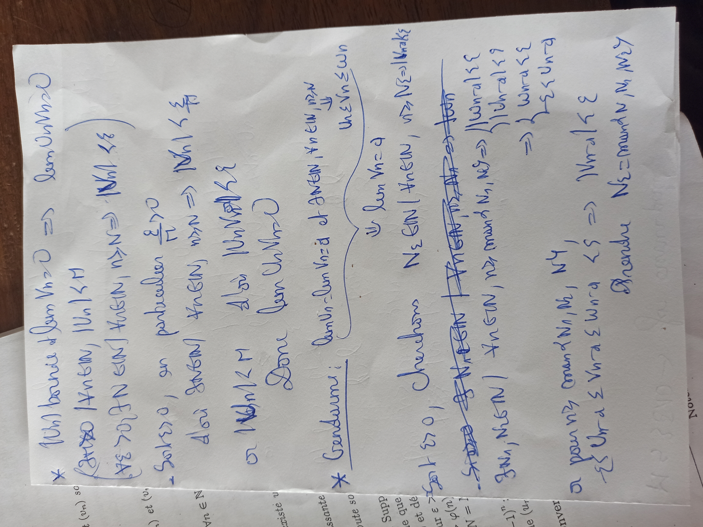
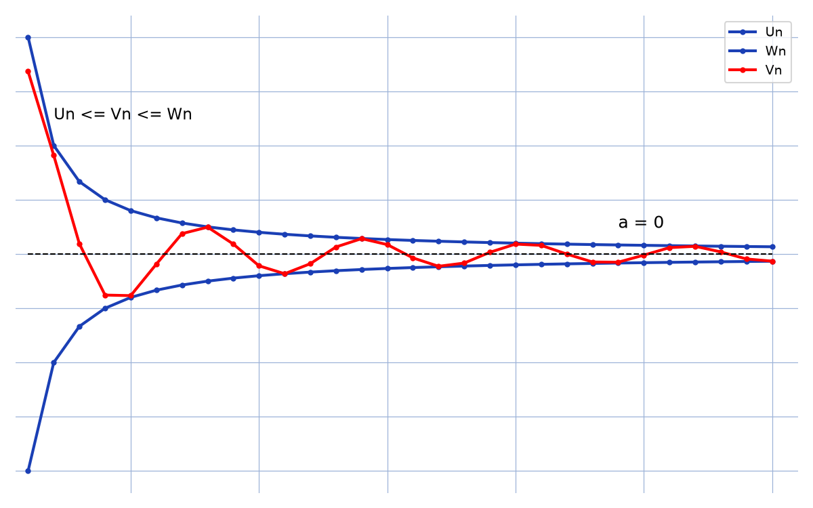

# Théorème des gendarmes — transcription fidèle

> Source : `theoreme-gendarmes.jpg` (1 page, photo pivotée 90° — redressée pour lecture).
> Encre bleue sur feuille blanche ; fragment imprimé sous la feuille (hors manuscrit, non transcrit).
> Lisibilité ~85 %.

## Page 1 — transcription fidèle

\* $(U_n)$ bornée et $\lim V_n = 0 \Rightarrow \lim U_n V_n = 0$

$(\exists M \geq 0 / \forall n \in \mathbb{N}, |U_n| \leqslant M)$

$(\forall \varepsilon > 0, \exists N \in \mathbb{N} / \forall n \in \mathbb{N}, n \geqslant N \Rightarrow |V_n| \leqslant \varepsilon)$

— Soit $\varepsilon > 0$, en particulier $\dfrac{\varepsilon}{M} > 0$

d'où $\exists N \in \mathbb{N} / \forall n \in \mathbb{N}, n \geqslant N \Rightarrow |V_n| \leqslant \dfrac{\varepsilon}{M}$

or $|U_n| \leqslant M$ d'où $|U_n V_n| \leqslant \varepsilon$

Donc $\lim U_n V_n = 0$

\* Gendarme : $\underbrace{\lim U_n = \lim W_n = a \text{ et } \exists N \in \mathbb{N}, \forall n \in \mathbb{N}, n \geqslant N}_{\Downarrow \lim V_n = a}$ [l'accolade relie l'hypothèse à la conclusion ; en marge :] $U_n \leqslant V_n \leqslant W_n$ [lecture incertaine — la double inégalité est sous l'accolade]

Soit $\varepsilon > 0$, Cherchons $N_2 \in \mathbb{N} / \forall n \in \mathbb{N}, n \geqslant N_2 \Rightarrow |V_n - a| \leqslant \varepsilon$

[ligne raturée :] [raturé — « $\exists N_1 \in \mathbb{N} / \forall n \in \mathbb{N}, n \geqslant N_1 \Rightarrow$ … » biffé]

$\exists N_1, N_2 \in \mathbb{N} / \forall n \in \mathbb{N}, n \geqslant \max(N_1, N_2)$ [lecture incertaine — « $\max(N_1, N_2)$ » probable] $\Rightarrow \begin{cases} |W_n - a| \leqslant \varepsilon \\ |U_n - a| \leqslant \varepsilon \end{cases}$ [lecture incertaine sur les noms d'indices]

$\Rightarrow \begin{cases} W_n - a \leqslant \varepsilon \\ -\varepsilon \leqslant U_n - a \end{cases}$ [lecture incertaine sur la seconde ligne]

or pour $n \geqslant \max(N_1, N_2, N_4)$ [lecture incertaine — « $N_4$ » tel que lu],

$-\varepsilon \leqslant U_n - a \leqslant V_n - a \leqslant W_n - a \leqslant \varepsilon \Rightarrow |V_n - a| \leqslant \varepsilon$

Prendre $N_2 = \max(N, N_1, N_2)$ [lecture incertaine sur les noms d'indices]

## Figures

Pas de schéma géométrique sur le manuscrit (texte seul). Reproduction illustrative du propos (suites $U_n \leqslant V_n \leqslant W_n$ convergeant vers $a$) :

*Script : `~/KpihX-Labs/Explore/lab/scripts/reproduce_theoreme-gendarmes_1.py` — $U_n = -1/n$, $W_n = 1/n$, $V_n = \sin(n)/n$ prises en étau vers $0$.*

## Vocabulaire / notions

- Suite bornée, limite nulle, produit $U_n V_n$.
- Théorème des gendarmes (encadrement $U_n \leqslant V_n \leqslant W_n$).
- Quantificateurs $\forall \varepsilon > 0$, $\exists N$, $\max$ des rangs.
