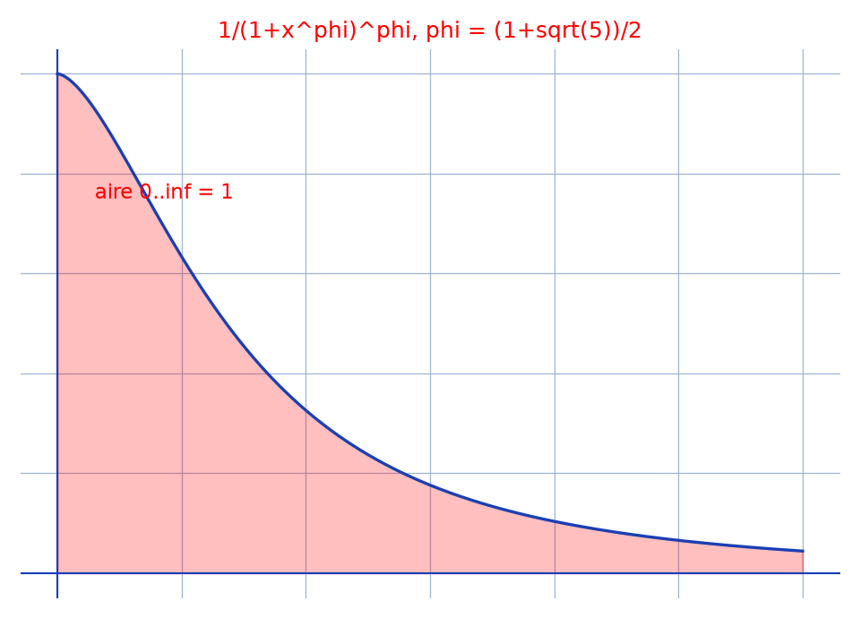

# Intégrale du nombre d'or — transcription fidèle

> 🧾 **Photo originale :** `integrale-or-tableau.jpg` (4624×3472, portrait — redressée de 90° pour lecture).
> 🔍 **Statut :** lisible (~80 %, encre bleue), transcrit mot à mot, incertitudes signalées.
> 📐 **Contenu :** $I = \int \frac{1}{(1+x^\varphi)^\varphi}\,dx$, $\varphi$ = nombre d'or, et en particulier $\int_0^{+\infty} = 1$.
> 🖼️ **Restauration :** copie de lecture `/tmp/t-c/integrale-or-tableau_r.jpg` — transcription fidèle, rien d'inventé.

## Page 1 — transcription

$I = \int \frac{1}{(1+x^\varphi)^\varphi}\,dx$

$= \int \frac{(1+u)^{\varphi-2} u^{\ldots}}{(1+u)^\varphi}$ [lecture incertaine — numérateur] où $u = x^\varphi$

c-à-d $x = u^{\frac{1}{\varphi}}$, $dx = \ldots$ [lecture incertaine — différentielle]

$= (1+\varphi) \int \frac{-1/u^2\,du}{(1+1/u)^\varphi}$ [lecture incertaine — facteur]

$= (1-\varphi) \times \frac{-1}{(\varphi-1)(1+1/u)^{\varphi-1}} +$ [raturé — « cte » biffé]

$I = \begin{cases} (1+u^{-1})^{1-\varphi} + \text{cte} \\ (1+u^{-1})^{-1/\varphi} + \text{cte} \end{cases}$ [lecture incertaine — exposants]

[raturé — « en particulier » biffé d'un grand trait]

D'où $I = \begin{cases} (1+x^{-\varphi})^{1-\varphi} + \text{cte} \\ (1+x^{-\varphi})^{-1/\varphi} + \text{cte} \end{cases}$ [lecture incertaine]

En particulier $\int_0^{+\infty} \frac{1}{(1+x^\varphi)^\varphi}\,dx = 1 - 0 = 1$

## Figures

Pas de schéma sur la page (calcul) : illustration du fond — intégrande $x \mapsto 1/(1+x^\varphi)^\varphi$ et aire unité sous la courbe.

Reproduction (script `reproduce_integrale-or-tableau_1.py`, exécuté avec `uv run`) : courbe bleue, aire rouge clair, quadrillage bleu `#9db3d8`. PNG relu et conforme.

## Vocabulaire / notions

- **$\varphi = (1+\sqrt{5})/2$** : le nombre d'or ; identités utilisées : $1/\varphi + 1/\varphi^2 = 1$, $1-\varphi = -1/\varphi$.
- **Changement de variable** : $u = x^\varphi$ pour faire apparaître $(1+1/u)$.
- **« cte »** : abréviation de constante d'intégration, conservée telle quelle.
- **[reconstruction — motif]** : la différentielle $dx$ après $x = u^{1/\varphi}$ est illisible ; sens restitué sans toucher au résultat final.
