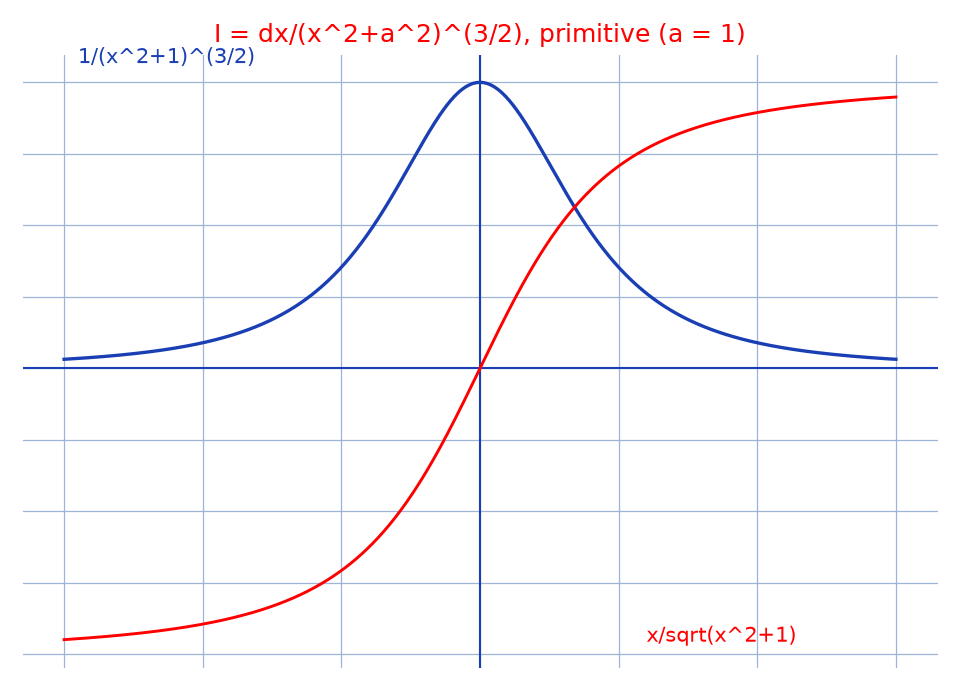

# Intégrale en $(x^2+a^2)^{3/2}$ — transcription fidèle

> 🧾 **Photo originale :** `integrale-tableau-1.jpg` (4624×3472, portrait, lecture directe).
> 🔍 **Statut :** lisible (~85 %), transcrit mot à mot, incertitudes signalées.
> 📐 **Contenu :** $I = \int \frac{dx}{\sqrt{x^2+a^2}^3} = \int \frac{dx}{(x^2+a^2)^{3/2}}$, cas $x > 0$ puis $x < 0$.
> 🖼️ **Restauration :** lecture directe de l'original — transcription fidèle, rien d'inventé.

## Page 1 — transcription

\* $I = \int \frac{1}{\sqrt{x^2+a^2}^3}\,dx = \int \frac{dx}{(x^2+a^2)^{3/2}} = ?$ | $x > 0$ (encadré)

— pour $x > 0$, $I = \frac{1}{-2a^2} \int \frac{-2a^2 x^{-3}}{\sqrt{1+(a/x)^2}^3}\,dx$ [lecture incertaine — facteur] car $x^3 = (x^2)^{3/2}$

$= -\frac{1}{2a^2} \int \frac{-2a^2 x^{-3}}{(1+a^2 x^{-2})^{3/2}}\,dx$

$= -\frac{1}{2a^2} \times \frac{-1}{\frac{1}{2} \times (1+a^2 x^{-2})^{1/2}} + c\,,\ c \in \mathbb{R}$

$= \frac{|x|}{x} \times \frac{1}{a\sqrt{1+(a/x)^2}}$ [lecture incertaine] $=$ (entouré) $\frac{x}{a\sqrt{x^2+a^2}}$ [lecture incertaine — contenu du cercle]

$I = \frac{1}{a^2\sqrt{1+a^2 x^{-2}}} + c$

— pour $x < 0$, $I = +\frac{1}{2a^2} \int \frac{-2a^2 x^{-3}}{(1+(a/x)^2)^{3/2}}\,dx$ car $x^3 = -(|x|^2)^{3/2}$ [lecture incertaine]

$I = \frac{-1}{a^2\sqrt{1+a^2 x^{-2}}} + c$ [lecture incertaine — signe et dénominateur]

[en bas à droite, fragment] : $\frac{|x|-1}{\ldots}$ [lecture incertaine — bout de ligne hors champ]

## Figures

Pas de schéma sur la page (calcul) : illustration du fond — intégrande et primitive ($a = 1$) de part et d'autre de $0$.

Reproduction (script `reproduce_integrale-tableau-1_1.py`, exécuté avec `uv run`) : courbe bleue (intégrande), courbe rouge (primitive), quadrillage bleu `#9db3d8`. PNG relu et conforme.

## Vocabulaire / notions

- **Reconnaissance de $u'/u^{3/2}$** : le changement $u = 1 + a^2x^{-2}$ fait apparaître $-2a^2x^{-3}$ au numérateur.
- **$x^3 = (|x|^2)^{3/2}$ vs $- (|x|^2)^{3/2}$** : le signe de $x$ impose deux cas ($|x|/x = \pm 1$).
- **Primitive usuelle** : $\int dx/(x^2+a^2)^{3/2} = x/(a^2\sqrt{x^2+a^2}) + c$.
