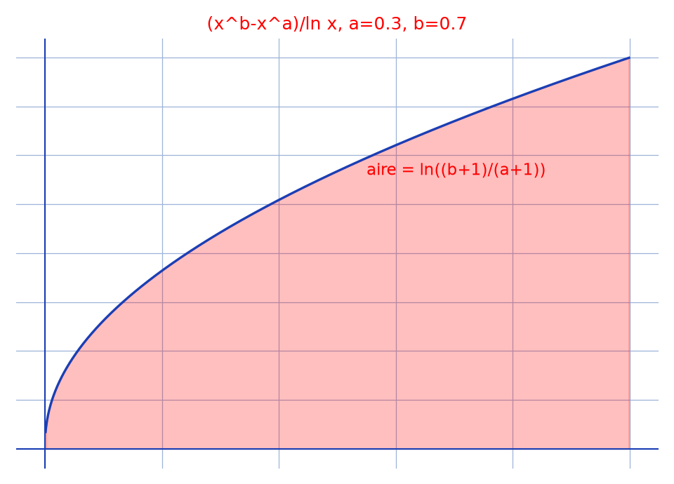

# Intégrale de Frullani — transcription fidèle

> 🧾 **Photo originale :** `integrale-tableau-2.jpg` (4624×3472, portrait — redressée de 90° pour lecture).
> 🔍 **Statut :** lisible (~85 %), transcrit mot à mot, incertitudes signalées.
> 📐 **Contenu :** $I = \int_0^1 \frac{x^b-x^a}{\ln x}\,dx = \ln\left|\frac{b+1}{a+1}\right|$ via $f(t)$ et $f'(t)$ sous le signe somme.
> 🖼️ **Restauration :** copie de lecture `/tmp/t-c/integrale-tableau-2_r.jpg` — transcription fidèle, rien d'inventé.

## Page 1 — transcription

$I = \int_0^1 \frac{x^b-x^a}{\ln x}\,dx \quad 0 < a, b < 1$ [lecture incertaine — condition]

$I = \int_0^1 \frac{e^{b\ln x}-e^{a\ln x}}{\ln x}\,dx$

$f(t) = \int_0^1 \frac{e^{bt\ln x}-e^{at\ln x}}{\ln x}\,dx$ \hfill calm down [marginalia — « calm down »]

$f'(t) = \int_0^1 \frac{be^{bt\ln x}-ae^{at\ln x}}{x}\,dx$ \hfill calm down [marginalia — « calm down »]

[raturé — $\neq \int_0^1 e^{\ldots}(be^{\ldots}-ae^{\ldots})\,dx$ biffé]

$= \int_0^1 \frac{bx^{bt}-ax^{at}}{x}\,dx$

$= \left[\frac{b}{bt+1}x^{bt+1} - \frac{a}{at+1}x^{at+1}\right]_0^1$

$= \frac{b}{bt+1} - \frac{a}{at+1}$

$f(t) = \ln|bt+1| - \ln|at+1| + \text{cte}$

$f(1) = \ln\left|\frac{b+1}{a+1}\right| + \text{cte}$ ; $f(0) = \int_0^1 \frac{1-1}{\ln x}\,dx = 0$

$f(0) = \text{cte} = 0$ ; $f(1) = \ln\left|\frac{b+1}{a+1}\right|$ ; $f(1) = \ln\left|\frac{b+1}{a+1}\right|$

[en marge à droite] : $x^r$, $\frac{1}{x^{r+1}}$ [lecture incertaine — brouillon] ; « Aire ? » [lecture incertaine]

[en fond, hors sujet] : papier calendaire « Ève : … Homme / Caïn, Abel, Adam 130 ans … » et « Noah → Judaïsme » (support d'écriture, non transcrit au-delà).

## Figures

Pas de schéma sur la page (calcul) : illustration du fond — intégrande $(x^b-x^a)/\ln x$ ($a = 0{,}3$, $b = 0{,}7$) et aire $= \ln((b+1)/(a+1))$.

Reproduction (script `reproduce_integrale-tableau-2_1.py`, exécuté avec `uv run`) : courbe bleue, aire rouge clair, quadrillage bleu `#9db3d8`. PNG relu et conforme.

## Vocabulaire / notions

- **Dérivation sous le signe intégral** : $f'(t)$ se calcule terme à terme, puis s'intègre en $t$.
- **« calm down »** : annotation d'humeur en marge, conservée comme marginalia (fond non mathématique intact).
- **Constante par $f(0) = 0$** : l'intégrande en $t = 0$ vaut $(1-1)/\ln x = 0$, d'où $\text{cte} = 0$.
