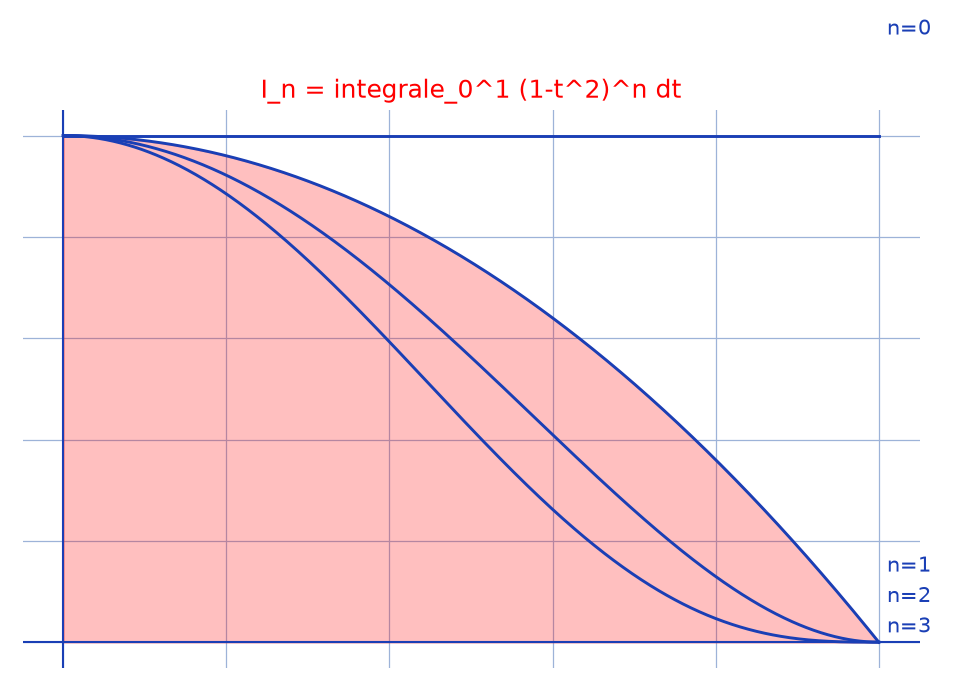

# Intégrale de Wallis $I_n$ — transcription fidèle

> 🧾 **Photo originale :** `integrale-tableau-3.jpg` (4624×3472, portrait — redressée de 90° pour lecture).
> 🔍 **Statut :** lisible (~85 %), transcrit mot à mot, incertitudes signalées.
> 📐 **Contenu :** $I_n = \int_0^1 (1-t^2)^n\,dt = \frac{(2^n n!)^2}{(2n+1)!}$ puis $S = \sum_{k=0}^n \frac{(-1)^k C_n^k}{2k+1}$.
> 🖼️ **Restauration :** copie de lecture `/tmp/t-c/integrale-tableau-3_r.jpg` — transcription fidèle, rien d'inventé.

## Page 1 — transcription

$I_n = \int_0^1 (1-t^2)^n\,dt$

1/ $\forall n \in \mathbb{N},\ I_{n+1} = \int_0^1 (1-t^2)^{n+1}\,dt$

$= \left[(1-t^2)^{n+1} \ldots\right]_0^1 - \int_0^1 (1+t)(-2t)(1-t^2)^n\,dt$ [lecture incertaine — crochet]

$= 2(n+1) \int_0^1 (1-(1-t^2))(1-t^2)^n\,dt$

$= 2(n+1)\left(\int_0^1 (1-t^2)^n\,dt - \int_0^1 (1-t^2)^{n+1}\,dt\right)$

$= 2(n+1)(I_n - I_{n+1})$

Donc $\forall n \in \mathbb{N},\ I_{n+1} = \frac{2(n+1)}{2n+3} I_n$

2/ $I_0 = \int_0^1 (1-t^2)^0\,dt = 1$

$\forall n \in \mathbb{N}^*,\ I_n = \frac{2n}{2(n-1)+3} I_{n-1}$

$= \frac{2n \times 2(n-1)}{2(n-1)+3} \times \ldots \times \frac{2 \times 2}{2(1-1)+3} \times \frac{2 \times 1}{2(1-1)+3} \times I_{1-1}$ [lecture incertaine — indices]

$= \frac{2^n n!}{(2n+1)(2n-1) \times \ldots \times 5 \times 3} \times 1$

$= 2^n n! \times \frac{2n \times (2n-2) \times \ldots \times 4 \times 2}{(2n+1)(2n) \times \ldots \times 3 \times 2}$ [raturé partiel — un facteur biffé]

$= \frac{2^n n! \times 2^n \times n!}{(2n+1)!}$

Donc $\forall n \in \mathbb{N}^*,\ I_n = \frac{(2^n n!)^2}{(2n+1)!}$ or $\frac{(2^0 \times 0!)^2}{(2 \times 0+1)!} = 1 = I_0$. Donc $\forall n \in \mathbb{N},\ I_n = \frac{(2^n n!)^2}{(2n+1)!}$

3/ Déduction

$S = \sum_{k=0}^n \frac{(-1)^k C_n^k}{(2k+1)}$

$\forall n \in \mathbb{N},\ I_n = \int_0^1 (1-t^2)^n\,dt = \frac{(2^n n!)^2}{(2n+1)!}$ [raturé — réécriture biffée]

$= \int_0^1 \sum_{k=0}^n C_n^k (-t^2)^k\,dt$

$= \sum_{k=0}^n C_n^k (-1)^k \int_0^1 t^{2k}\,dt$

$= \sum_{k=0}^n (-1)^k C_n^k \times \frac{1}{2k+1}\left[t^{2k+1}\right]_0^1$

d'où $I_n = \sum_{k=0}^n \frac{(-1)^k C_n^k}{(2k+1)}$ or $I_n = \frac{(2^n n!)^2}{(2n+1)!}$

Donc $\forall n \in \mathbb{N},\ S = \sum_{k=0}^n \frac{(-1)^k C_n^k}{(2k+1)} = \frac{(2^n n!)^2}{(2n+1)!}$

## Figures

Pas de schéma sur la page (calcul) : illustration du fond — $(1-t^2)^n$, $n = 0..3$, et aire $I_1$ hachurée.

Reproduction (script `reproduce_integrale-tableau-3_1.py`, exécuté avec `uv run`) : courbes bleues, aire rouge clair, quadrillage bleu `#9db3d8`. PNG relu et conforme.

## Vocabulaire / notions

- **Intégration par parties** : fait passer de $I_{n+1}$ à $I_n - I_{n+1}$, d'où la récurrence.
- **Double factorielle déguisée** : $(2n+1)(2n-1)\ldots 3$ complété en $(2n+1)!$ par les pairs $2n(2n-2)\ldots 2 = 2^n n!$.
- **Binôme de Newton** : $(1-t^2)^n = \sum C_n^k(-t^2)^k$ donne la somme alternée $S$.
