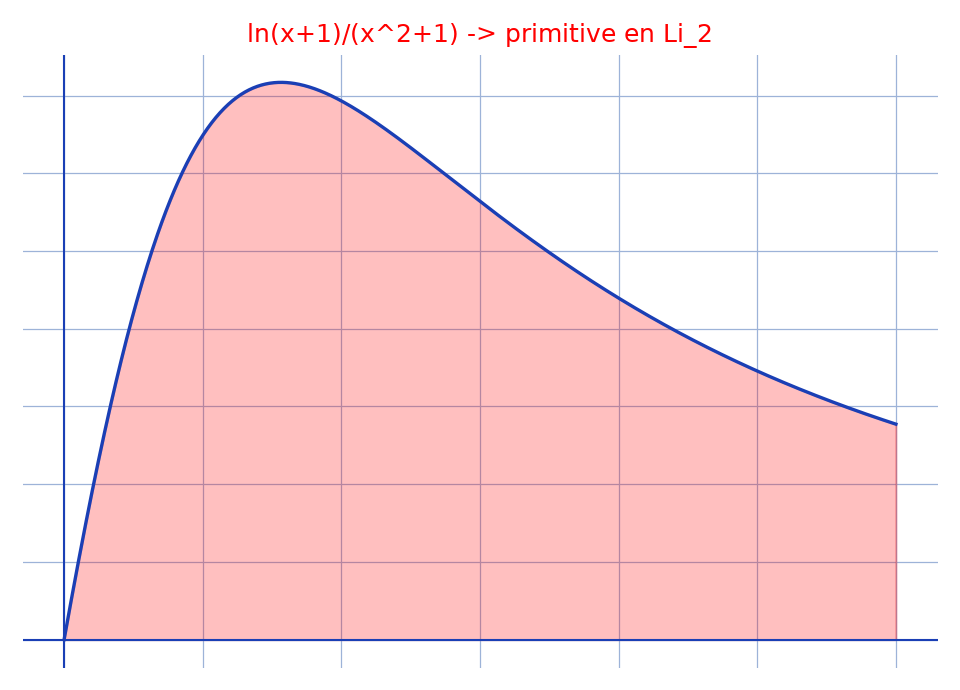

# Intégrale au dilogarithme — transcription fidèle

> 🧾 **Photo originale :** `integrale-tableau-4.jpg` (4624×3472, portrait — redressée de 90° pour lecture).
> 🔍 **Statut :** lisible (~75 %, ratures nombreuses), transcrit mot à mot, incertitudes signalées.
> 📐 **Contenu :** $I = \int \frac{\ln(x+1)}{x^2+1}\,dx$ (logarithme complexe) via $\operatorname{Li}_2$.
> 🖼️ **Restauration :** copie de lecture `/tmp/t-c/integrale-tableau-4_r.jpg` — transcription fidèle, rien d'inventé.

## Page 1 — transcription

$I = \int \frac{\ln(x+1)}{x^2+1}\,dx$ avec $\ln$, le logarithme népérien complexe d'où $x \in \mathbb{C} \setminus \{1+i, 1-i\}$ [lecture incertaine — ensemble exclu]

on $x^2+1 \neq 0$ (—) $x \neq i$ et $x \neq -i$. Donc $x \in \mathbb{C} \setminus \{1+i, 1-i\}$ [lecture incertaine — recopie de l'exclusion]

$= \int \frac{\ln(x+1)}{(x-i)(x+i)}\,dx$

$= \frac{1}{2} \int \left(\frac{\ln(x+1)}{x-i} - \frac{\ln(x+1)}{x+i}\right)dx$ car en posant $\frac{1}{(x-i)(x+i)} = \frac{a}{x-i} + \frac{b}{x+i}$, $a, b \in \mathbb{C}$, on trouve $\begin{cases} a+b = 0 \\ i(a-b) = 1 \end{cases} (\Longrightarrow) \begin{cases} a = -i/2 \\ b = i/2 \end{cases}$

on aimerait faire intervenir $\operatorname{Li}_2$ : $\forall z \in \mathbb{C},\ \operatorname{Li}(z) = -\int_0^z \frac{\ln(1-t)}{t}\,dt$ [lecture incertaine — $\operatorname{Li}$ vs $\operatorname{Li}_2$]

ann. soit $(a, b, t) \in \mathbb{C}^{*2} \times \mathbb{C}$ / $\frac{x+1}{a} = 1-t$ et [lecture incertaine — second changement]

alors $\begin{cases} \frac{x+1}{a} = 1-t \\ \frac{x-i}{b} = -t \end{cases} \Rightarrow \begin{cases} x+1 = a-at \\ x = -bt+i \end{cases} \Rightarrow -bt+i+1 = a-at \Rightarrow b = a = i+1$ (par identification) [raturé partiel]

alors $x \neq 0$ ($\Rightarrow$) $t \neq \ldots$ ou $\ldots$ ($\Rightarrow$) $t \in \ldots$ [raturé — passage biffé, illisible]

— soit $(a, b, u) \in \mathbb{C}^{*2} \times \mathbb{C}$ / $\frac{x+1}{a} = 1-u$ et $\frac{x+i}{b} = -u$.

alors $\begin{cases} \frac{x+1}{a} = 1-u \\ \frac{x+i}{b} = -u \end{cases} \Rightarrow \begin{cases} x+1 = a-au \\ x = -bu-i \end{cases} \Rightarrow -bu-i+1 = a-au \Rightarrow a = b = 1-i$

or $\ldots$ [raturé — deux lignes biffées] alors $x \neq \ldots$ [raturé — biffé]

avec $I = \frac{i}{2}\left(\int \frac{\ln((1+i)(1+t))}{(1+i)(t+1)} \times t\,dt - \int \frac{\ln((1-i)(1-u))}{(1-i)(-u)} \times (-(1-i))\,du\right)$, avec $(t, u) \in \mathbb{C} \times \mathbb{C}$ [lecture incertaine — intégrales intermédiaires, ratures]

$= -\frac{i}{2}\left(-\int \frac{\ln(1-t)}{-t}\,dt + \ln(1+i) \int \frac{dt}{t} + \int \frac{\ln(1-u)}{-u}\,du - \int \frac{\ln(1-i)}{u}\,du\right)$ avec $a = 1+i$ [lecture incertaine]

$= -\frac{i}{2}\left(-\operatorname{Li}_2(t) + \ln(1+i)\ln t + \operatorname{Li}_2(u) - \ln(1-i)\ln u\right) + c\,,\ c \in \mathbb{C}$

or $\frac{x-i}{b} = -t \Rightarrow t = \frac{-x+i}{1+i} = \frac{(1-i)(x+i)}{2}$ ; $\frac{x+i}{b} = -u \Rightarrow u = \frac{-x-i}{1-i} = \frac{(-x-i)(1+i)}{2}$ [lecture incertaine — second membre]

Donc $I = \int \frac{\ln(x+1)}{x^2+1}\,dx = \frac{i}{2}\left(\operatorname{Li}_2\left(\frac{(1-i)(x+i)}{2}\right) - \operatorname{Li}_2\left(\frac{(1x-i)(1+i)}{2}\right) - \ln(1+i)\ln\left(\frac{(1-i)(x+i)}{2}\right) + \ln(1-i)\ln\left(\frac{(1-x-i)(1+i)}{2}\right)\right)$ [lecture incertaine — arguments]

$+ c \quad c \in \mathbb{C}$

## Figures

Pas de schéma sur la page (calcul) : illustration du fond (partie réelle) — intégrande $\ln(x+1)/(x^2+1)$ sur $[0, 3]$.

Reproduction (script `reproduce_integrale-tableau-4_1.py`, exécuté avec `uv run`) : courbe bleue, aire rouge clair, quadrillage bleu `#9db3d8`. PNG relu et conforme.

## Vocabulaire / notions

- **Éléments simples complexes** : $1/((x-i)(x+i)) = a/(x-i) + b/(x+i)$, $a = -i/2$, $b = i/2$.
- **Dilogarithme** : $\operatorname{Li}_2(z) = -\int_0^z \ln(1-t)/t\,dt$ (noté $\operatorname{Li}$ par l'auteur).
- **Changements affines** : $(x+1)/a = 1-t$, $(x\mp i)/b = -t$ pour se ramener à $\operatorname{Li}_2$.
