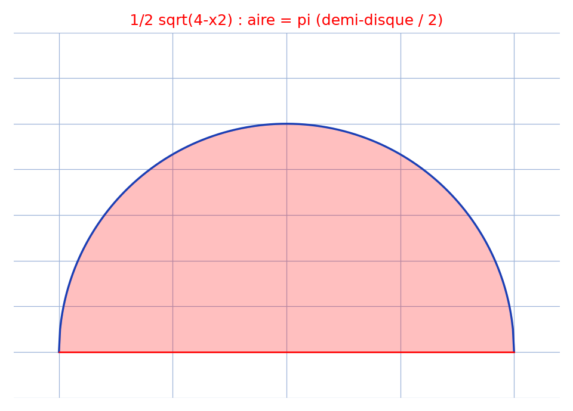

# Intégrale trigonométrique (encre rouge) — transcription fidèle

> 🧾 **Photo originale :** `integrale-trigo-demi-disque-pi.jpeg` (1080×1920, encre rouge, page pivotée à 90° pour lecture).
> 🔍 **Statut :** lisible (~85 %), transcrit mot à mot, incertitudes signalées.
> 📐 **Contenu :** $J = \int_{-2}^{2} x^3\cos\frac{x}{2}\sqrt{4-x^2}\,dx + \int_{-2}^{2} \frac{1}{2}\sqrt{4-x^2}\,dx = \pi$ ($x = 2\sin t$).
> 🖼️ **Restauration :** copie de lecture `/tmp/pm/wifi-gratuit_1.png` (1350×2400) + pivot `/tmp/pm/wifi-gratuit_rotCW.png` — transcription fidèle, rien d'inventé.

## Page 1 — transcription

$J = \underbrace{\int_{-2}^{2} x^3\cos\frac{x}{2}\sqrt{4-x^2}\,dx}_{0} + \underbrace{\int_{-2}^{2} \frac{1}{2}\sqrt{4-x^2}\,dx}$ [accolades manuscrites, `0` sous la première]

car $x \mapsto x^3\cos\frac{x}{2}\sqrt{4-x^2}$ impaire

$J$ [lecture incertaine — `J`/`I`, même ductus sur la page] $= \int_{-2}^{2} \sqrt{1-(x/2)^2}\,dx = \int_{-\pi/2}^{\pi/2} \sqrt{1-\sin^2 t}\,2\cos t\,dt$

où $x = 2\sin t$ [lecture incertaine — `sint` compact], $dx = 2\cos t\,dt$, $t = \arcsin(x/2)$

$= 2\int_{-\pi/2}^{\pi/2} \cos^2 t\,dt$

$= \int_{-\pi/2}^{\pi/2} (1 + \cos 2t)\,dt = \left[ t + \frac{1}{2}\sin 2t \right]_{-\pi/2}^{\pi/2} = \pi = J$ [souligné deux fois, résultat entouré d'un crochet]

## Figures

Pas de schéma sur la page (calcul) : illustration du fond — $y = \frac{1}{2}\sqrt{4-x^2}$ (demi-cercle) et son aire $\pi$.

Reproduction (script `reproduce_integrale-trigo-demi-disque-pi_1.py`, exécuté avec `uv run`) : courbe bleue, aire rouge ($\pi$), quadrillage bleu `#9db3d8`. PNG relu et conforme.

## Vocabulaire / notions

- **Parité** : l'intégrande $x^3\cos(x/2)\sqrt{4-x^2}$ est impaire, son intégrale sur $[-2, 2]$ vaut $0$.
- **Changement $x = 2\sin t$** : $\sqrt{4-x^2} = 2\cos t$ sur $[-\pi/2, \pi/2]$, $dx = 2\cos t\,dt$.
- **Linéarisation** : $2\cos^2 t = 1 + \cos 2t$, primitive $t + \frac{1}{2}\sin 2t$.
- **Aire géométrique** : $\int_{-2}^{2} \frac{1}{2}\sqrt{4-x^2}\,dx = \pi$ (moitié du demi-disque de rayon 2, aire $2\pi$).
