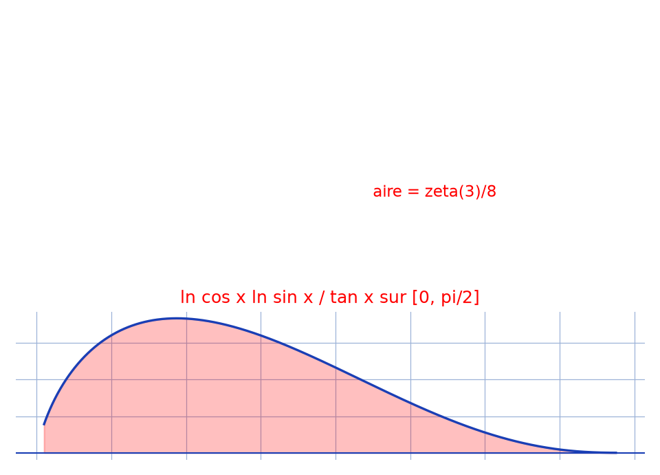

# Intégrale vers $\zeta(3)$ — transcription fidèle

> 🧾 **Photo originale :** `integrale-zeta3.jpg` (2577×3161, portrait, lecture directe).
> 🔍 **Statut :** lisible (~85 %), transcrit mot à mot, incertitudes signalées.
> 📐 **Contenu :** $I = \int_0^{\pi/2} \frac{\ln\cos x\,\ln\sin x}{\tan x}\,dx = \frac{1}{8}\zeta(3)$.
> 🖼️ **Restauration :** lecture directe de l'original — transcription fidèle, rien d'inventé.

## Page 1 — transcription

$I = \int_0^{\pi/2} \frac{\ln\cos x\,\ln\sin x}{\tan x}\,dx$

Posons $t = \sin x \Rightarrow \begin{cases} \cos x = \sqrt{1-t^2} \\ \tan x = \frac{t}{\sqrt{1-t^2}} \\ dt = \cos x\,dx \Rightarrow dx = \frac{dt}{\sqrt{1-t^2}} \end{cases}$

Ainsi $I = \int_0^1 \frac{\ln\sqrt{1-t^2}\,\ln t}{\frac{t}{\sqrt{1-t^2}}} \times \frac{dt}{\sqrt{1-t^2}}$

$= -\frac{1}{2} \int_0^1 \frac{\ln t}{t} \times \sum_{k=1}^{+\infty} \frac{(t^2)^k}{k}\,dt$ car $t \in {]0, 1[}$ [lecture incertaine — série]

$= -\frac{1}{2} \sum_{k=1}^{+\infty} \frac{1}{k} \int_0^1 \ln t \cdot t^{2k-1}\,dt$

$= -\frac{1}{2} \sum_{k=1}^{+\infty} \frac{1}{k}\left(\frac{1}{2k} \int_0^1 \ln t\,(t^{2k})'\,dt\right)$

$= -\frac{1}{4} \sum_{k=1}^{+\infty} \frac{1}{k^2}\left(\left[\ln t \times t^{2k}\right]_0^1 - \int_0^1 t^{2k-1}\,dt\right)$

$= -\frac{1}{4} \sum_{k=1}^{+\infty} \frac{1}{k^2}\left(0 - \frac{1}{2k}\left[t^{2k}\right]_0^1\right)$

$I = \frac{1}{8} \sum_{k=1}^{+\infty} \frac{1}{k^3}$ \quad Donc $\boxed{I = \frac{1}{8}\zeta(3)}$

## Figures

Pas de schéma sur la page (calcul) : illustration du fond — intégrande sur $]0, \pi/2[$ et aire $= \zeta(3)/8$.

Reproduction (script `reproduce_integrale-zeta3_1.py`, exécuté avec `uv run`) : courbe bleue, aire rouge clair, quadrillage bleu `#9db3d8`. PNG relu et conforme.

## Vocabulaire / notions

- **$\zeta(3)$** : constante d'Apéry, $\sum_{k\geq 1} 1/k^3$.
- **Série du log** : $\ln\sqrt{1-t^2} = -\frac{1}{2}\sum_{k\geq 1} t^{2k}/k$ sur $]0, 1[$.
- **Intégration par parties** : $\int_0^1 \ln t \cdot t^{2k-1}\,dt = -1/(2k)^2$ (terme tout intégré nul en $0$ et $1$).
