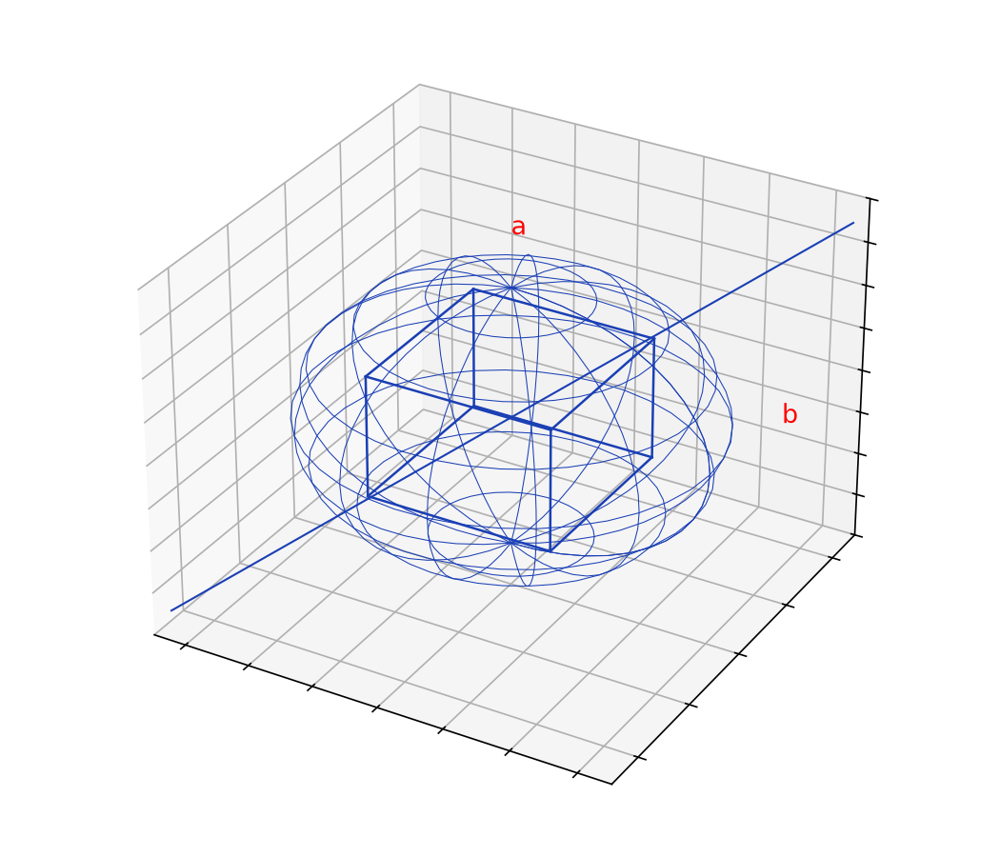
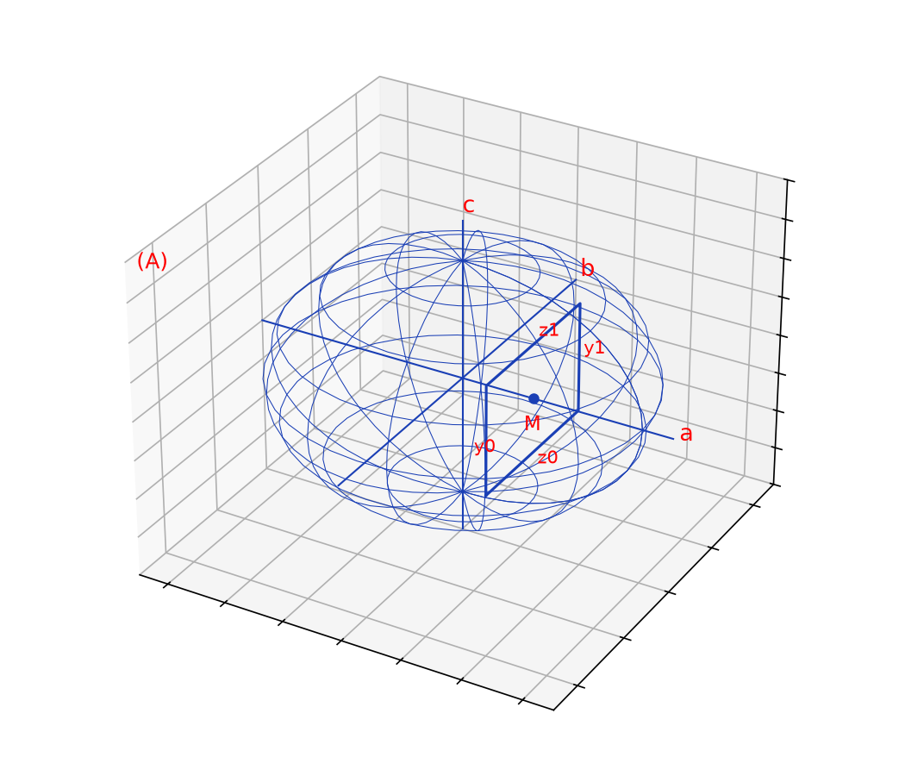
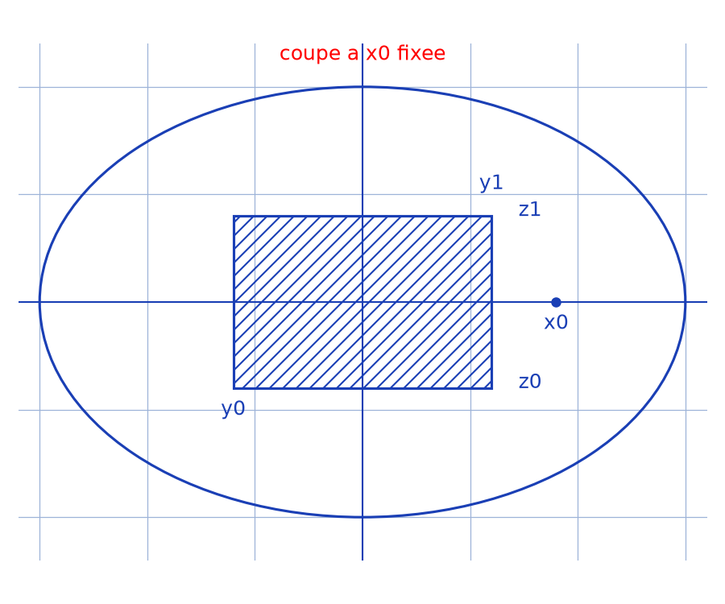

# Volume d'un ellipsoïde — transcription fidèle (2 sources fusionnées)

> 🧾 **Manuscrits originaux :** `volume-ellipsoide.pdf` (scan, 2 pages — source A) + `volume-ellipsoide-2-approches.pdf` (scan, 3 pages — source B) · ✍️ KpihX
> 🔍 **Statut :** même calcul dans les 2 sources (jacobien/produit mixte p.1 + tranches p.2–3, $V = 4\pi abc/3$), vérifié sur les 5 pages (rendus `/tmp/mdt/F-ve-*.png`, `/tmp/mdt/F-ve2-*.png`, 2026-09-07). Fusion : 5 pages ci-dessous (A p.1–2 = Pages 1–2, B p.1–3 = Pages 3–5) ; écriture rapide à l'encre bleue, calculs compacts par endroits en `[lecture incertaine — …]` ; ratures conservées ; trois croquis reproduits en figures. Transcrit mot à mot.
> 📄 **Sources scannées :** [volume-ellipsoide.pdf](volume-ellipsoide.pdf) + [volume-ellipsoide-2-approches.pdf](volume-ellipsoide-2-approches.pdf) (restaurées Datas1, vérifiées pdfinfo, 2026-09-07)
> 🗑️ **Doublon éliminé (2026-09-07) :** dossier `volume-ellipsoide-2-approches/` supprimé, son PDF gardé ici comme 2e source + son PNG `assets/coupe-ellipsoide.png` réuni aux 2 PNG existants.

---

## Page 1 (volume-ellipsoide.pdf)

Titre (en haut à droite, souligné) : Volume d'un Ellipsoïde.

Soit $(B)$ [lettre « $(B)$ » majuscule confirmée p.1 r150 2026-09-07 (`/tmp/s9/veA-1.png`)] : $\left\{ M(x, y, z) \in \mathbb{R}^3 \mathrel{} \middle| \mathrel{} \frac{x^2}{a^2} + \frac{y^2}{b^2} + \frac{z^2}{c^2} = r^2 \text{ où } r \in [0, 1] \right\}$ [« $\mathbb{R}^3$ » levé visuellement — doute levé] avec $a, b, c > 0$.

$M(x, y, z) \in (B) \iff \exists\, (r, \theta, \varphi) \in [0, 1] \times [0, \pi] \times [0, 2\pi[ \mathrel{} / \mathrel{} \begin{cases} \frac{x}{a} = r \sin\theta \cos\varphi \\ \frac{y}{b} = r \sin\theta \sin\varphi \\ \frac{z}{c} = r \cos\theta \end{cases}$

[raturé : un mot] $V_0 = \int_{r = 0} \int_{\theta = 0} \int_{\varphi = 0} dV$ [lecture incertaine — bornes supérieures peu lisibles ; cohérentes avec $(r, \theta, \varphi) \in [0, 1] \times [0, \pi] \times [0, 2\pi[$].

avec $dV = \left| \left( \frac{\partial \overrightarrow{OM}}{\partial r}, \frac{\partial \overrightarrow{OM}}{\partial \theta}, \frac{\partial \overrightarrow{OM}}{\partial \varphi} \right) \right| dr\,d\theta\,d\varphi$ [raturé : un fragment] $= \frac{\partial \overrightarrow{OM}}{\partial r} \cdot \left( \frac{\partial \overrightarrow{OM}}{\partial \theta} \wedge \frac{\partial \overrightarrow{OM}}{\partial \varphi} \right) dr\,d\theta\,d\varphi$, produit mixte par def qui est encore un déterminant.

$\forall\, M(x, y, z) \in (B),\ \overrightarrow{OM} = ra \sin\theta \cos\varphi\, \vec{e_x} + rb \sin\theta \sin\varphi\, \vec{e_y} + rc \cos\theta\, \vec{e_z}$

ainsi $\frac{\partial \overrightarrow{OM}}{\partial r} = a \sin\theta \cos\varphi\, \vec{e_x} + b \sin\theta \sin\varphi\, \vec{e_y} + c \cos\theta\, \vec{e_z}$

$\frac{\partial \overrightarrow{OM}}{\partial \theta} = ra \cos\theta \cos\varphi\, \vec{e_x} + rb \cos\theta \sin\varphi\, \vec{e_y} - rc \sin\theta\, \vec{e_z}$

$\frac{\partial \overrightarrow{OM}}{\partial \varphi} = -ra \sin\theta \sin\varphi\, \vec{e_x} + rb \sin\theta \cos\varphi\, \vec{e_y}$

ainsi [raturé : $\frac{\partial \overrightarrow{OM}}{\partial r}$ …] $\frac{dV}{dr\,d\theta\,d\varphi} = \frac{\partial \overrightarrow{OM}}{\partial r} \cdot \left( (r^2bc\,[\text{lecture incertaine — premier terme du produit vectoriel}] + r^2bc \sin^2\theta \cos\varphi)\, \vec{e_x} + (r^2ac \sin^2\theta \sin\varphi)\, \vec{e_y} + \vec{e_z}\, r^2ab \cos\theta \sin\theta \right)$

$$= r^2abc \sin\theta\,[\text{lecture incertaine — terme en }\cos^2] + r^2abc \sin^2\theta \sin^2\varphi + r^2abc \cos^2\theta \sin\theta$$
$$= r^2abc \sin^3\theta + r^2abc \cos^2\theta \sin\theta$$
$$= r^2abc \sin\theta.$$

ainsi $V_0 = \int_{r = 0} \int_{\theta = 0} \int_{\varphi = 0} r^2abc \sin\theta\, dr\,d\theta\,d\varphi$ [lecture incertaine — bornes supérieures peu lisibles]

$$= abc\,[\text{raturé}] \times 2\pi \times 2 \times \frac{1}{3}.$$

Donc $V_0 = \dfrac{4\pi abc}{3}$.

## Page 2 (volume-ellipsoide.pdf)

ou encore $V = \int_{x = -a}^{a} \int_{y = -y}^{y} \int_{z = -z_0}^{z_0} dx\,dy\,dz$ [lecture incertaine — bornes en $y$ et $z$ notées provisoirement, la suite de la page les précise en $y_0$ et $z_1$], $dV$ (sous l'intégrale).

Description gardée : croquis au stylo bleu d'un ellipsoïde vu en perspective, traversé par un pavé (boîte) intérieur et une diagonale qui le coupe ; annotations « $a$ » (en haut) et « $b$ » (à droite).

pour un $x$ dans $[-a, a]$

ou encore $V = \int_{x = -a}^{a} \int_{y = -y_0}^{y_0} \int_{z = -z_1}^{z_1} dx\,dy\,dz$

pour un $x$ dans $[-a, a]$

Description gardée : figure notée « $(A)$ » d'un ellipsoïde avec ses trois axes (annotations $a$, $b$, $c$), un point courant $M$ d'abscisse $x$, et le rectangle des points de même abscisse (ordonnées $y_0$, $y_1$, cotes $z_0$, $z_1$). Texte à droite : « L'ens des pts dans $(A)$ d'abscisse $x_1$ ont pour ordonnées et cotes resp $y \in [y_0, y_1]$, $z \in [z_0, z_1]$ ; ce sont les pts du rectangle représenté ».

On a : $z^2 \le c^2\left(1 - \frac{x^2}{a^2} - \frac{y^2}{b^2}\right)$

d'où $z$ va de $-c\sqrt{1 - \frac{x^2}{a^2} - \frac{y^2}{b^2}}$ à $c\sqrt{1 - \frac{x^2}{a^2} - \frac{y^2}{b^2}}$ (légendés $z_0$ et $z_1$ sous les racines).

Aussi l'ellipse dans le plan $(Ox[\text{lecture incertaine — plan noté « (Oxy) »}])$ a pour eqⁿ $\frac{x^2}{a^2} + \frac{y^2}{b^2} \le 1$ ainsi $y^2 \le b^2\left(1 - \frac{x^2}{a^2}\right)$ d'où $y$ va de $-b\sqrt{1 - \frac{x^2}{a^2}}$ à $b\sqrt{1 - \frac{x^2}{a^2}}$ (légendé $y_0$).

Donc $V = \int_{x = -a}^{a} \int_{y = -b\sqrt{1 - \frac{x^2}{a^2}}}^{b\sqrt{1 - \frac{x^2}{a^2}}} \int_{z = -c\sqrt{1 - \frac{x^2}{a^2} - \frac{y^2}{b^2}}}^{c\sqrt{1 - \frac{x^2}{a^2} - \frac{y^2}{b^2}}} dx\,dy\,dz = \frac{4\pi}{3}abc$

$$= 2c \int_{x = -a}^{a} \int_{y = -y_0}^{y_0} \sqrt{1 - \frac{x^2}{a^2} - \frac{y^2}{b^2}}\, dy\,dx$$
$$= 2c \int_{-a}^{a} \sqrt{1 - \frac{x^2}{a^2}} \int_{y = -y_0}^{y_0} \sqrt{1 - \left(\frac{y}{b\sqrt{1 - \frac{x^2}{a^2}}}\right)^2}\, dy\,dx$$
$$= 2c \int_{0}^{a} \sqrt{1 - \frac{x^2}{a^2}} \times b\sqrt{1 - \frac{x^2}{a^2}} \times \frac{1}{2} \left[ \arcsin \frac{y}{b\sqrt{1 - \frac{x^2}{a^2}}} + \frac{y}{b\sqrt{1 - \frac{x^2}{a^2}}} \sqrt{1 - \frac{y^2}{b^2\left(1 - \frac{x^2}{a^2}\right)}} \right]_{-b\sqrt{1 - \frac{x^2}{a^2}}}^{b\sqrt{1 - \frac{x^2}{a^2}}}.$$

(encadré) $V = bc \int_{-a}^{a} \left(1 - \frac{x^2}{a^2}\right)\left(\frac{\pi}{2} + \frac{\pi}{2}\right) = \pi bc \left[x - \frac{x^3}{3a^2}\right]_{-a}^{a} = \frac{4}{3}\pi abc.$

---

## Page 3 (volume-ellipsoide-2-approches.pdf, p. 1 — variante jacobien)

Volume d'un Ellipsoïde [titre souligné]

Soit $(b)$ : $\{M(x, y, z) \in \mathbb{R}^3 \mid \frac{x^2}{a^2} + \frac{y^2}{b^2} + \frac{z^2}{c^2} = r^2 \text{ où } r \in [0, 1]\}$ [CORRIGÉ 2e passage 2026-09-07 (`/tmp/s9/veB-1.png`, r150) : le scan B p.1 porte bien « $= r^2$ où $r \in [0,1]$ » comme la source A — l'ancienne lecture « $= 1$ » est abandonnée] avec $a, b, c > 0$.

$\forall M(x, y, z) \in (b)$ $\exists!$ $3(r, \theta, \varphi) \in [0, 1] \times [0, \pi[ \times [0, 2\pi[ \mid \begin{cases} \frac{x}{a} = r\sin\theta\cos\varphi \\ \frac{y}{b} = r\sin\theta\sin\varphi \\ \frac{z}{c} = r\cos\theta \end{cases}$

[raturé : Les coordonnées sphériques]

ainsi $V_b = \int_{r=0}^1 \int_{\theta=0}^{\pi} \int_{\varphi=0}^{2\pi} dV$

avec $dV = \left|\frac{\partial\overrightarrow{OM}}{\partial r}, \frac{\partial\overrightarrow{OM}}{\partial\theta}, \frac{\partial\overrightarrow{OM}}{\partial\varphi}\right| dr\,d\theta\,d\varphi = \frac{\partial\overrightarrow{OM}}{\partial r} \cdot \left(\frac{\partial\overrightarrow{OM}}{\partial\theta} \wedge \frac{\partial\overrightarrow{OM}}{\partial\varphi}\right) dr\,d\theta\,d\varphi$, produit mixte par(?) qui est encore un déterminant [lecture incertaine].

$\forall M(x, y, z) \in (b)$, $\overrightarrow{OM} = ra\sin\theta\cos\varphi\,\vec{e_x} + rb\sin\theta\sin\varphi\,\vec{e_y} + rc\cos\theta\,\vec{e_z}$

ainsi $\frac{\partial\overrightarrow{OM}}{\partial r} = a\sin\theta\cos\varphi\,\vec{e_x} + b\sin\theta\sin\varphi\,\vec{e_y} + c\cos\theta\,\vec{e_z}$

$\frac{\partial\overrightarrow{OM}}{\partial\theta} = ra\cos\theta\cos\varphi\,\vec{e_x} + rb\cos\theta\sin\varphi\,\vec{e_y} - rc\sin\theta\,\vec{e_z}$

$\frac{\partial\overrightarrow{OM}}{\partial\varphi} = -ra\sin\theta\sin\varphi\,\vec{e_x} + rb\sin\theta\cos\varphi\,\vec{e_y}$

ainsi $dV =$ [raturé — facteur biffé] $\frac{\partial\overrightarrow{OM}}{\partial r} \cdot \left((\cdots)\vec{e_x} + (r^2ac\sin^2\theta\sin\varphi)\vec{e_y} + \vec{e_z}(r^2ab\sin\theta\cos\theta\sin\varphi)\right)$ [composantes partiellement lisibles]

$+ (r^2ac\sin^2\theta\sin\varphi)\vec{e_y} + \vec{e_z}(r^2ab\sin\theta\cdots\sin\theta)$ [ligne peu lisible]

$$= r^2abc\sin\theta\cos^2\theta + r^2abc\sin\theta\sin^2\varphi + r^2abc\cos\theta\sin\theta \text{ [termes intermédiaires peu lisibles]}$$

$$= r^2abc\sin\theta + r^2abc\cos\theta\sin\theta \text{ [lecture incertaine]}$$

$$= r^2abc\sin\theta$$

ainsi $V_b = \int_{r=0}^1 \int_{\theta=0}^{\pi} \int_{\varphi=0}^{2\pi} r^2abc\sin\theta\,dr\,d\theta\,d\varphi$

$= abc \times 2\pi \times 2 \times \frac{1}{3}$

Donc $V_b = \frac{4\pi abc}{3}$.

[En bas : calendrier Financial House visible sous la feuille, hors manuscrit.]

## Page 4 (volume-ellipsoide-2-approches.pdf, p. 2 — tranches)

pour un $x$ dans $[-a, a]$, ou encore $V = \int_{x=-a}^a \int_{y=y_0}^{y_1} \int_{z=z_0}^{z_1} dx\,dy\,dz$ [bornes lues d'après le contexte].

pour un $x$ dans $[-a, a]$ $(b)$.

[Figure : coupe elliptique à $x_0$ fixé, avec le rectangle des points d'abscisse $x_0$ — voir reproduction ci-dessous.]

L'une des pts dans $(b)$ d'abscisse $x_0$ ont pour ordonnées et cotes resp. $y \in [y_0, y_1]$, $z \in [z_0, z_1]$ [lecture incertaine] ce sont les pts du rectangle représenté.

Or : $z^2 \leq c^2\left(1 - \frac{x^2}{a^2} - \frac{y^2}{b^2}\right)$ d'où $z$ va de $-c\sqrt{1-\frac{x^2}{a^2}-\frac{y^2}{b^2}}$ à $c\sqrt{1-\frac{x^2}{a^2}-\frac{y^2}{b^2}}$.

Ainsi l'ellipse dans le plan $(Oxy)$ a pour eq $\frac{x^2}{a^2} + \frac{y^2}{b^2} \leq 1$ ainsi $y^2 \leq b^2\left(1-\frac{x^2}{a^2}\right)$ d'où $y$ va de $-b\sqrt{1-\frac{x^2}{a^2}}$ à $b\sqrt{1-\frac{x^2}{a^2}}$.

Donc $V = \int_{x=-a}^a \int_{y=-b\sqrt{1-\frac{x^2}{a^2}}}^{b\sqrt{1-\frac{x^2}{a^2}}} \int_{z=-c\sqrt{1-\frac{x^2}{a^2}-\frac{y^2}{b^2}}}^{c\sqrt{1-\frac{x^2}{a^2}-\frac{y^2}{b^2}}} dx\,dy\,dz$.

## Page 5 (volume-ellipsoide-2-approches.pdf, p. 3 — calcul des tranches)

[Reprise de l'intégrale triple de la page 4, puis calcul. Bord droit partiellement hors cadre.]

Donc $V = \int_{x=-a}^a \int_{y=-b\sqrt{1-\frac{x^2}{a^2}}}^{b\sqrt{1-\frac{x^2}{a^2}}} \int_{z=-c\sqrt{1-\frac{x^2}{a^2}-\frac{y^2}{b^2}}}^{c\sqrt{1-\frac{x^2}{a^2}-\frac{y^2}{b^2}}} dx\,dy\,dz = \frac{4}{3}\pi abc$

$$= 2c\int_{x=-a}^a \int_{y=y_0}^{y_1} \sqrt{1-\frac{x^2}{a^2}-\frac{y^2}{b^2}}\,dy\,dx$$

$$= 2c\int_{-a}^a \sqrt{1-\frac{x^2}{a^2}} \int_{y_0}^{y_1} \sqrt{1-\left(\frac{y}{b\sqrt{1-\frac{x^2}{a^2}}}\right)^2}\,dy\,dx$$

$$= 2c\int_0^a \sqrt{1-\frac{x^2}{a^2}} \times b\sqrt{1-\frac{x^2}{a^2}} \times \frac{1}{2}\left[\arcsin\frac{y}{b\sqrt{1-\frac{x^2}{a^2}}} + \frac{y}{b\sqrt{1-\frac{x^2}{a^2}}}\sqrt{1-\frac{y^2}{b^2(1-\frac{x^2}{a^2})}}\right]_{-b\sqrt{1-\frac{x^2}{a^2}}}^{b\sqrt{1-\frac{x^2}{a^2}}} \text{ [fin de ligne coupée — bord droit hors cadre]}$$

---

## Figures

3 figures reproduites en 100 % code, embeds pp. 2 et 4 ci-dessus, scripts vérifiés `uv run` le 2026-09-07 (sources vérifiées visuellement : rendus `/tmp/mdt/F-ve-*.png`, `/tmp/mdt/F-ve2-*.png`) puis re-vérifiés `uv run` au 2e passage le 2026-09-07 (rendus `/tmp/s9/veA-1.png`, `/tmp/s9/veB-1.png`, `/tmp/s9/veB-2.png`, r150 — figure coupe-elliptique B p.2 confirmée, aucune figure manquante) :

1. `assets/ellipsoide-pave.png` — ellipsoïde + pavé intérieur + diagonale, annotations `a`, `b` (source A, p. 2) — script `~/KpihX-Labs/Explore/lab/scripts/reproduce_volume-ellipsoide_1.py` (grille `#9db3d8`, `tick_params` sans étiquettes, jamais `axis("off")`).
2. `assets/ellipsoide-coupe-rectangle.png` — figure `(A)` : axes `a, b, c`, point `M`, rectangle `[y₀,y₁]×[z₀,z₁]` (source A, p. 2) — script `~/KpihX-Labs/Explore/lab/scripts/reproduce_volume-ellipsoide_2.py` (idem).
3. `assets/coupe-ellipsoide.png` — coupe elliptique à `x₀` fixé + rectangle `[y₀,y₁]×[z₀,z₁]` (source B, p. 2) — script `~/KpihX-Labs/Explore/lab/scripts/reproduce_volume-ellipsoide_3.py` (idem).

---

## Vocabulaire

- `(B)` (source A) / `(b)` (source B) = ellipsoïde ; produit mixte = déterminant jacobien (`dV = r²abc·sinθ dr dθ dφ`).
- `y₀, y₁` / `z₀, z₁` = bornes tranche à `x` fixé ; `(A)` = figure des axes (source A) ; `V₀ = V_b = 4πabc/3`.
- Financial House = calendrier visible sous la feuille B p. 1 (hors manuscrit, exclu).
