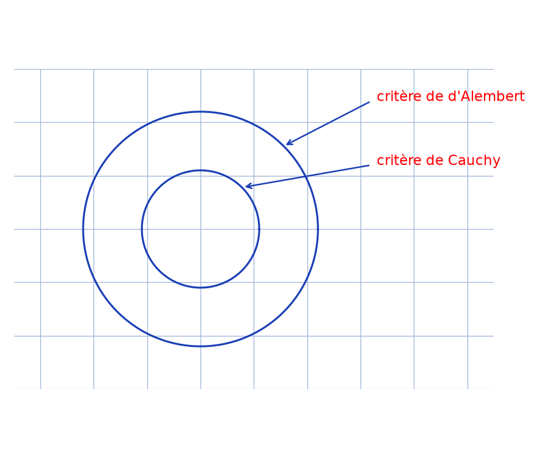

# Cauchy, d'Alembert, Cesàro — transcription fidèle

> 🧾 **Manuscrit original :** `cauchy-dalembert-cesaro.pdf` (scan, 2 pages) · ✍️ KpihX
> 🔍 **Statut :** écriture rapide à l'encre bleue, bord droit partiellement rogné (fins de lignes coupées) ; calculs compacts par endroits en `[lecture incertaine — …]` ; le schéma des deux cercles est reproduit en figure. Transcrit mot à mot.
> 📄 **Source scannée :** [cauchy-dalembert-cesaro.pdf](cauchy-dalembert-cesaro.pdf) (restaurée Datas1, vérifiée pdfinfo, 2026-09-07)

---

## Page 1

Thm : (schéma) critère de d'Alembert — critère de Cauchy. En effet,

Description gardée : deux cercles concentriques tracés au stylo bleu en haut à gauche ; une flèche annote le (grand) cercle « critère de d'Alembert », une autre le (petit) cercle « critère de Cauchy ».

Corollaire : Soit $(U_n)_{n \ge n_0} \in \mathbb{C}^{\mathbb{N}}$ / $\forall n \in \mathbb{N}\ (n > n_1)$, $\lim_{n \to +\infty} \left| \frac{U_n}{U_{n-2}} \right| = l$ [lecture incertaine — le symbole de la limite (« $l$ ») est peu lisible] (1).

Mq $\lim_{n \to +\infty} (V_n)^{1/n} = l$. Posons $\forall n \in \mathbb{N}\ (n > n_0)$, $V_n = |U_n| > 0$ [bord droit rogné — fin de ligne coupée].

meth1 : Soit $\varepsilon > 0$. Cherchons $N \in \mathbb{N}$ / $\forall n \in \mathbb{N},\ n \ge N \implies \left| V_n^{1/n} - l \right| < \varepsilon$. $*$ Si $l \ne 0 \implies l > 0$.

Posons $\varepsilon' = \min\{\varepsilon, l\} > 0$.

$(1) \implies \exists\, N_1 \in \mathbb{N}$ / $\forall n \in \mathbb{N},\ n \ge N_2 \implies \left| \frac{V_n}{V_{n-2}} - l \right| < \frac{\varepsilon'}{2}$ $(N_2 > N_0 + 2)$ [lecture incertaine — les indices $N_1$/$N_2$ sont permutés dans le manuscrit].

Pour $n \in \mathbb{N}\ (n > N_2)$, on a $\implies l - \frac{\varepsilon'}{2} < \frac{V_n}{V_{n-2}} < l + \frac{\varepsilon'}{2}$ (2)

$$(2) \implies V_{n-2}\left(l - \frac{\varepsilon'}{2}\right) < V_n < \left(l + \frac{\varepsilon'}{2}\right) V_{n-2}$$
$$\implies \underbrace{V_{N_2}\left(l - \frac{\varepsilon'}{2}\right)^{[\text{lecture incertaine — exposant}]}}_{V_{1n}} < V_n < \underbrace{V_{N_2}\left(l + \frac{\varepsilon'}{2}\right)^{[\text{lecture incertaine — exposant}]}}_{V_{2n}}$$
$$\text{car } l - \frac{\varepsilon'}{2} > l - \frac{l}{2} = \frac{l}{2} > 0$$
$$\implies V_{1n}^{1/n} < V_n^{1/n} < V_{2n}^{1/n}.$$

or $V_{1n}^{1/n} \xrightarrow[n \to +\infty]{} l - \frac{\varepsilon'}{2}$

ainsi $\exists\, N_2 \in \mathbb{N}$ / $\forall n \in \mathbb{N},\ n > N_2 \implies \left| V_{1n}^{1/n} - \left(l - \frac{\varepsilon'}{2}\right) \right| < \frac{\varepsilon'}{2} \implies l - \varepsilon' < V_n^{1/n}$

$\exists\, N_3 \in \mathbb{N}$ / $\forall n \in \mathbb{N},\ n > N_3 \implies \left| V_{2n}^{1/n} - \left(l + \frac{\varepsilon'}{2}\right) \right| < \frac{\varepsilon'}{2} \implies V_n^{1/n} < l + \varepsilon'$

Pour $n \ge \max\{N_1, N_2, N_3\}$, $(2) \implies l - \varepsilon' < V_n^{1/n} < l + \varepsilon' \implies \left| V_n^{1/n} - l \right| < \varepsilon' < \varepsilon$.

## Page 2

Il suffit de prendre $N = \max\{N_1, N_2, N_3\}$.

$*$ Supposons $(l = 0)$.

$(1) \implies \exists\, N_1 \in \mathbb{N}$ / $\forall n \in \mathbb{N},\ n \ge N_1 \implies \left| \frac{V_n}{V_{n-2}} \right| < \frac{\varepsilon}{2}$ (3) $(N_1 > N_0 + 2)$.

Pour $n \ge N_1$, (2) [*sic* — le manuscrit porte « $(2)$ »] $\implies |V_n| < \frac{\varepsilon}{2} V_{n-2}$

$$\implies |V_n| < \left(\frac{\varepsilon}{2}\right)^{n - N_2} V_{N_2}$$
$$\implies |V_n|^{1/n} < \left(\frac{\varepsilon}{2}\right)^{1 - N_2/n} \times \underbrace{V_{N_2}^{1/n}}_{V_{3n}}$$

or $V_{3n} \xrightarrow[n \to +\infty]{} \frac{\varepsilon}{2}$ ainsi $\exists\, N_3 \in \mathbb{N}$ / $\forall n \in \mathbb{N},\ n \ge N_3 \implies \left| V_{3n} - \frac{\varepsilon}{2} \right| < \frac{\varepsilon}{2} \implies V_{3n} < \varepsilon$.

Ainsi pour $n \ge \max\{N_2, N_3\}$, (2) [*sic* — le manuscrit porte « $(2)$ »] $\implies |V_n|^{1/n} < \varepsilon$.

Il suffit de prendre $N = \max\{N_2, N_3\}$. CQFD.

meth2 : On a : $\frac{V_n}{V_{n-2}} \to l \implies \ln\left| \frac{V_n}{V_{n-2}} \right| \to \ln|l|$.

D'après le lemme de Cesàro, $\frac{1}{n} \sum_{k = [\text{lecture incertaine — borne inférieure}]}^{n} \ln\left| \frac{V_k}{V_{k-2}} \right| \to \ln|l|$

càd $\lim_{n \to +\infty} \frac{1}{n} \ln\left( \prod_{[\text{lecture incertaine — bornes du produit}]} \frac{V_k}{V_{k-2}} \right) = \ln|l|$

càd $\lim_{n \to +\infty} \ln\left( \left( \frac{V_n}{V_{n_0}} \right)^{1/n} \right) = \ln|l|$ d'où $\lim_{n \to +\infty} V_n^{1/n} = l$.

(encadré, à droite) Rq : $\sum_{n \ge 0} U_n$ où $U_n = \begin{cases} \frac{A_n}{n} \text{ si } n \text{ pair} \\ \text{si } n \text{ impair} \end{cases}$ [lecture incertaine — premier cas, « $A_n/2^n$ » ?] [lecture incertaine — second cas ($n$ impair) peu lisible] cvg par Cauchy mais pas d'Alembert.

## Figures

- Fig. 1 (p. 1, haut à gauche) : deux cercles concentriques au stylo bleu, flèche vers le grand cercle « critère de d'Alembert », flèche vers le petit « critère de Cauchy » — vérifiée sur source le 2026-09-07 (rendu `/tmp/qas/`).

Reproduction : `~/KpihX-Labs/Explore/lab/scripts/reproduce_cauchy_dalembert_cesaro_1.py` → `assets/criteres-cercles.png` (vérifié `uv run`, style stylo : grille `#9db3d8`, `tick_params` sans étiquettes, jamais `axis("off")`).

## Vocabulaire

- Mq : montrons que ; Thm : théorème ; meth1/meth2 : première/seconde méthode ; Rq : remarque ; CQFD.
- cvg : converge ; $V_n = |U_n|$ ; $l$ : limite du rapport $|V_n/V_{n-2}|$ ; $\varepsilon' = \min\{\varepsilon, l\}$.
- $V_{1n}, V_{2n}, V_{3n}$ : encadrements auxiliaires ; lemme de Cesàro : passage log + moyenne.
