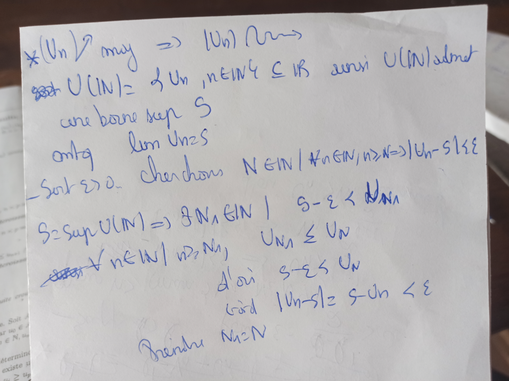
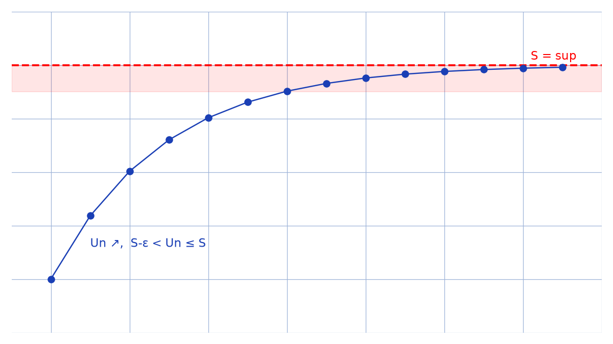

# Convergence monotone — transcription fidèle

> Source : `convergence-monotone.jpg` (1 page, stylo bleu).
> Lisibilité ~85 %, mots raturés recopiés entre crochets.

## Page 1 — transcription fidèle

$\ast (U_{n}) \nearrow$ maj $\Rightarrow (U_{n}) \leadsto$ [lecture incertaine — « converge »]

[Raturé : « eset »] $U(\mathbb{N}) = \{ U_{n}, n \in \mathbb{N} \} \subseteq \mathbb{R}$ ainsi $U(\mathbb{N})$ admet

une borne sup $S$

mtq [montrons que] $\lim U_{n} = S$

- Soit $\varepsilon > 0$. Cherchons $N \in \mathbb{N} \mid \forall n \in \mathbb{N}, n \ge N \Rightarrow |U_{n} - S| < \varepsilon$

$S = \sup U(\mathbb{N}) \Rightarrow \exists N_{1} \in \mathbb{N} \mid S - \varepsilon < U_{N_{1}}$

[Raturé : « eset »] $\forall n \in \mathbb{N} \mid n \ge N_{1}, \quad U_{N_{1}} \le U_{n}$

d'où $S - \varepsilon < U_{n}$

or $|U_{n} - S| = S - U_{n} < \varepsilon$

Prendre $N_{1} = N$

## Figures

Pas de schéma sur le manuscrit. Illustration de la suite croissante majorée convergeant vers $S = \sup$ (bande $\varepsilon$ ombrée) :

*Script : `~/KpihX-Labs/Explore/lab/scripts/reproduce_convergence-monotone_1.py` — description précise : points bleus $U_{n}$ croissants, ligne rouge pointillée $S = \sup$, bande rouge claire $[S-\varepsilon, S]$, légende « Un ↗, S−ε < Un ≤ S ».*

## Vocabulaire / notions

- Suite croissante $(U_{n}) \nearrow$, majorée, convergence ($\leadsto$).
- Image $U(\mathbb{N}) \subseteq \mathbb{R}$, borne supérieure $\sup$, $S$.
- Quantificateurs $\forall, \exists$, $|U_{n} - S| < \varepsilon$, rang $N_{1} = N$.
