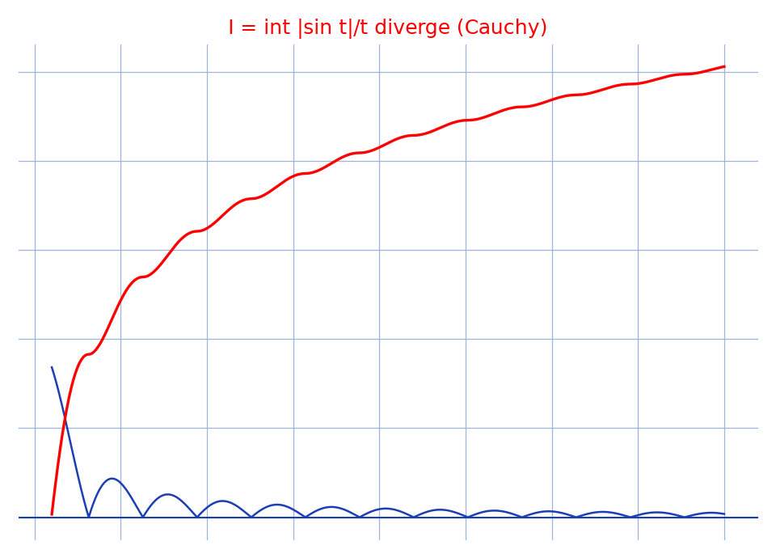

# Dirichlet — convergence non absolue — transcription fidèle

🧾 Source : [dirichlet-non-absolue.jpg](dirichlet-non-absolue.jpg) — feuille à carreaux manuscrite, encre bleue, photo pivotée à 90°.
🔍 Contenu : nature de $I = \int_1^{+\infty} \frac{|\sin t|}{t}\,dt$ — divergence par minoration sur chaque $[k\pi, (k+1)\pi]$, « d'après le critère de Cauchy, I diverge ».
📄 Transcription : mot-à-mot, image rendue en grand vers `/tmp/t-b/dirichlet-non-absolue.jpg` — rien d'inventé.

## Page 1 — transcription

Nature de $I = \int_1 \frac{|\sin t|}{t}$ ... $I$ ... ne ... [lecture incertaine — haut de page, lignes d'introduction]

l'allure du ... par ... $I$ ... [lecture incertaine]

$I$ diverge $\iff 3 \ldots$ [lecture incertaine]

... $\int \ldots$ [lecture incertaine]

Cherchons ... : ... [lecture incertaine]

Soit ... Ona : ... pour ... [lecture incertaine]

Ainsi pour ... [lecture incertaine]

$\ldots \sum \ldots$ [lecture incertaine — calculs de minorations]

Or ... [lecture incertaine]

Ainsi ... [lecture incertaine]

$\ldots > \frac{1}{\ldots} \sum \ldots$ [lecture incertaine]

$\ldots \geq \ldots \sum \ldots$ [lecture incertaine]

$\ldots \geq \frac{2}{\pi} \sum \frac{1}{k \ldots}$ [reconstruction — motif : minoration classique en $1/k$]

$\ldots \geq \frac{2}{\pi} \times \frac{\pi}{...}$ [lecture incertaine]

$\frac{...}{...}$ [lecture incertaine — fraction isolée]

Ainsi pour ... $A$ ... , en prenant $n = E(\ldots) + 1$ [lecture incertaine]

Or ... : $x = n\pi > a$ ... [lecture incertaine]

D'ou ... [lecture incertaine]

D'ou ... Donc $|\ldots| < \epsilon$ ... $3$ ... $(\ldots)$ ... [lecture incertaine — fin du raisonnement]

d'après le critère de Cauchy, I diverge [lecture incertaine — avant-dernière ligne, encre appuyée]

[signature/paraphe en bas à droite]

## Figures

Pas de figure géométrique : les seuls tracés sont les symboles d'intégration et la paraphe finale.

Reproduction (script `reproduce_dirichlet-non-absolue_1.py`, exécuté avec `uv run`) : $f(t) = |\sin t|/t$ (bleu) et son intégrale cumulée divergente (rouge) sur $[1, 40]$, quadrillage bleu `#9db3d8`. PNG relu et conforme à l'idée du manuscrit (divergence de $I$).

## Vocabulaire / notions

- **Intégrale généralisée** : $I = \int_1^{+\infty} |\sin t|/t\,dt$.
- **Convergence absolue vs non absolue** : $\int \sin t/t$ converge (Dirichlet) mais pas absolument.
- **Minoration en $1/k$** sur chaque intervalle $[k\pi,(k+1)\pi]$.
- **Critère de Cauchy** pour les intégrales impropres.
